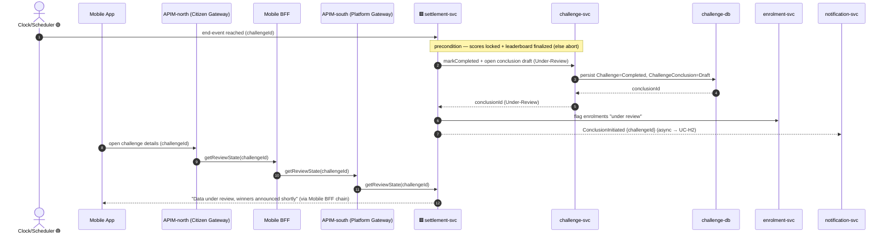
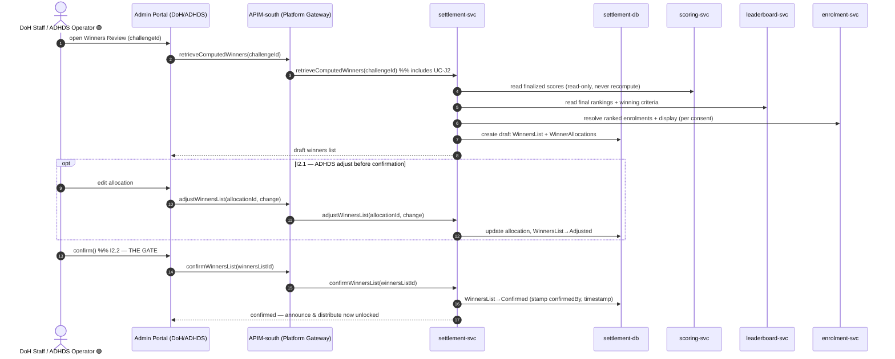
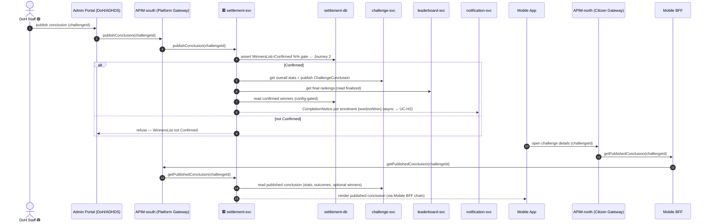
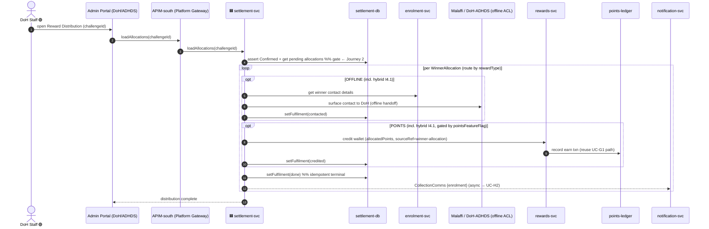
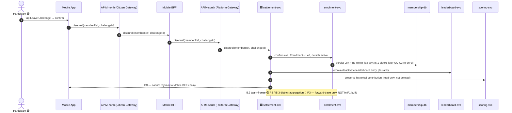

# Application-Level Sequences — **Settlement & Conclusion** package (`settlement`, P1)

**Altitude**: APPLICATION. Participants are *applications and stores* (surfaces, microservices, datastores, external systems) — **not** the low-level ICONIX boundary/control/entity objects. Each low-level interaction from `04-sequences/settlement.md` is collapsed into a coarse application-to-application call.

**Phase scope**: 🟢 **P1 = UC-I1…UC-I5 (individual settlement)**. Team-freeze (I5.2 🟡 P2) and District-aggregation (I5.3 🔵 P3) branches are drawn for forward-traceability only, tagged, **not** in the P1 build set.

**Layer routing** (per `LAYERING-SPEC.md` — Sequence layering contract): no actor reaches a GP microservice directly.
- **Citizen / mobile** reads (challenge details, leave-challenge command) ride the gameplay chain `Mobile App → APIM-north (Citizen Gateway) → Mobile BFF → APIM-south (Platform Gateway) → settlement-svc`.
- **Admin / staff (DoH · ADHDS)** authoring/review/distribute flows ride `Admin Portal (DoH/ADHDS) → APIM-south (Platform Gateway) → settlement-svc` — **NO BFF, NO north gateway** (Admin Portal is inside the GP boundary, workforce Entra SSO).
- **Scheduler / time-actor** fires `Clock/Scheduler → settlement-svc` directly; microservice ↔ microservice is sync read or async via `domain-event-log`; microservice → its own datastore is sync; external via ACL.

**Abstraction map** (low-level ⇒ application):
`Challenge-End Trigger API` / Clock-Scheduler ⇒ **Clock/Scheduler** firing **settlement-svc** directly (scheduled trigger, no gateway); `ConclusionController` / `AnnouncementController` / `WinnersReviewController` / `RewardDistributionController` / `DisenrollmentController` ⇒ **settlement-svc**; `Challenge` / `ChallengeConclusion (N3)` finalize/publish ⇒ **challenge-svc** → **challenge-db**; `WinnersList (N1)` / `WinnerAllocation (N2)` / `WinningCriteria` ⇒ **settlement-svc** → **settlement-db**; `WellnessScore` read-only ⇒ **scoring-svc** → **scoring-db**; `Leaderboard` final rankings ⇒ **leaderboard-svc** → **leaderboard-snapshots**; `Enrollment` / `Member` (display, contact, no-rejoin) ⇒ **enrolment-svc** → **membership-db**; `Wallet` / `PointTransaction` points credit ⇒ **rewards-svc** → **points-ledger**; `Reporting Dashboard / Winners Review / Adjust` screens ⇒ **Admin Portal (DoH/ADHDS)** (south gateway only); citizen challenge-details / leave-challenge screens ⇒ **Mobile App** via **Mobile BFF**; `Notification Trigger API (→ UC-H2)` ⇒ **notification-svc** (async). Offline reward-image + winner contact + confirm gate cross the **Malaffi / DoH-ADHDS** ACL.

**Convergence gate**: `WinnersList.confirm()` (UC-I2) is the single settlement gate. Journeys 3 & 4 (Announce, Distribute) refuse to act on a non-`Confirmed` list — shown as an explicit guard at the head of each.

---

## Journey 1 — Conclude Challenge (auto end-event) 🟢 P1

Covers **UC-I1**. The scheduler fires the challenge end-event; `settlement-svc` marks the challenge completed, opens a draft `ChallengeConclusion` in *Under-Review* state, flags enrolments, and hands off a conclusion-initiation event to `notification-svc`. Participants reading the challenge see an "under review" banner.

> 🟥 svc receives from outside GP · 🟦 svc writes to outside GP (microservices only)

> **UC trace**: UC-I1. Scheduler fires `settlement-svc` directly (time-actor, no gateway). The citizen "challenge details" read rides the gameplay chain `Mobile App → APIM-north → Mobile BFF → APIM-south → settlement-svc`. Precondition guard = UC-D6 (score lock) + UC-E1.2 (leaderboard finalize) — read-only, no recompute. Cross-context async seam: `settlement-svc → notification-svc` (UC-H2). Conclusion record of truth lives in `challenge-db`.

---

## Journey 2 — Review & Confirm Winners (the gate) 🟢 P1

Covers **UC-I2** (basic + I2.1 ADHDS adjust + I2.2 confirm) and includes **UC-J2** (retrieve computed winners). DoH staff retrieve the system-computed ranking (read-only finalized scores + criteria), `settlement-svc` builds the draft `WinnersList`/`WinnerAllocation` roster; ADHDS may adjust pre-confirmation; DoH confirms — the **convergence gate**.

> **UC trace**: UC-I2 ⊃ UC-J2; I2.1 (ADHDS adjust) and I2.2 (confirm gate). Admin/staff path = `Admin Portal → APIM-south (Platform Gateway) → settlement-svc` (no BFF, no north gateway — workforce Entra SSO). `scoring-svc`/`leaderboard-svc` are read-only — settlement never recomputes. `WinnersList=Confirmed` is the single gate guarding Journeys 3 & 4.

---

## Journey 3 — Announce Winners & Publish Conclusion 🟢 P1

Covers **UC-I3**. Gate-guarded: refuses a non-`Confirmed` list. `settlement-svc` assembles stats (challenge), final rankings (leaderboard) and confirmed winners, publishes the `ChallengeConclusion`, then fans won/not-won completion notices to `notification-svc`. The public details page re-reads the published conclusion.

> **UC trace**: UC-I3 → UC-H2. Admin publish = `Admin Portal → APIM-south → settlement-svc` (no BFF). Citizen details re-read rides `Mobile App → APIM-north → Mobile BFF → APIM-south → settlement-svc`. Gate `alt` re-references UC-I2 invariant. Won/not-won branch is per-enrolment, deep-linked via `notification-svc`. Optional winners block is config-gated. Published conclusion record of truth in `challenge-db` (via `challenge-svc`).

---

## Journey 4 — Distribute Rewards (offline / points / hybrid) 🟢 P1

Covers **UC-I4** (+ I4.1 hybrid). Gate-guarded again. `settlement-svc` loads confirmed allocations and routes per reward type: **offline** surfaces winner contact details to DoH across the Malaffi/DoH-ADHDS ACL; **points** credits the wallet via `rewards-svc` (reusing the UC-G1 ledger fragment, `sourceRef=winner-allocation`); **hybrid** runs both. Each allocation is marked fulfilled (idempotent) and collection comms fire to `notification-svc`.

> **UC trace**: UC-I4 + I4.1 hybrid → UC-H2. Admin distribute = `Admin Portal → APIM-south → settlement-svc` (no BFF). Points leg reuses the UC-G1 `Wallet`/`PointTransaction` fragment (`rewards-svc`/`points-ledger`) distinguished only by `sourceRef`. Offline leg crosses the Malaffi/DoH-ADHDS ACL. `setFulfilment(done)` makes distribution idempotent/auditable.

---

## Journey 5 — Disenroll / Leave Challenge 🟢 P1

Covers **UC-I5** (+ I5.1 no-rejoin). Participant confirms leave; `settlement-svc` sets the enrolment `Left`, detaches it as active, de-ranks the leaderboard entry, preserves historical score contribution (read-only, not deleted), and flags no-rejoin. Team-freeze (I5.2 🟡 P2) and District-aggregation (I5.3 🔵 P3) branches are tagged forward-trace only.

> **UC trace**: UC-I5 + I5.1 (no-rejoin). Citizen leave-challenge command rides the gameplay chain `Mobile App → APIM-north → Mobile BFF → APIM-south → settlement-svc`. I5.2 (🟡 P2 team-freeze) and I5.3 (🔵 P3 district) depend on Team/District entities absent from the P1 build set — tagged, out of scope. Historical score kept via `scoring-svc` (archive, not delete).

---

## Sanity check (golden thread)
- **Forward**: every P1 low-level interaction in `04-sequences/settlement.md` (conclude/draft, retrieve+build winners, adjust, confirm gate, announce/publish, route offline/points/hybrid, disenroll/de-rank/archive/no-rejoin) is collapsed into application-to-application calls across Journeys 1–5. ✅
- **Backward**: each journey carries a one-line UC map (UC-I1…UC-I5, incl. UC-J2 include and UC-H2 seams). ✅
- **Phase guard**: UC-I1…UC-I5 + I5.1 in the P1 build set; I5.2 (P2) / I5.3 (P3) tagged forward-traceability only. ✅
- **Altitude guard**: participants are surfaces, microservices, datastores, external/async producers — no `«B»/«C»/«E»` objects. ✅
- **Layer guard** (`LAYERING-SPEC.md` Sequence layering contract): citizen reads/commands (J1 details, J3 details, J5 leave) route `Mobile App → APIM-north (Citizen Gateway) → Mobile BFF → APIM-south (Platform Gateway) → settlement-svc`; admin/staff flows (J2, J3 publish, J4) route `Admin Portal → APIM-south → settlement-svc` (no BFF, no north); scheduler fires `Clock/Scheduler → settlement-svc` directly. No bare `API Gateway`, no actor reaching a microservice directly. ✅
- **Gate guard**: `WinnersList=Confirmed` (Journey 2) is asserted at the head of Journeys 3 & 4. ✅
- **Cross-context**: sync (`challenge-svc`, `scoring-svc`, `leaderboard-svc`, `enrolment-svc`, `rewards-svc`), async (`ConclusionInitiated`, `CompletionNotice`, `CollectionComms` → `notification-svc`), and ACL (`Malaffi / DoH-ADHDS` offline handoff) calls shown. ✅
