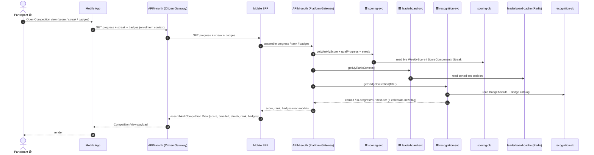
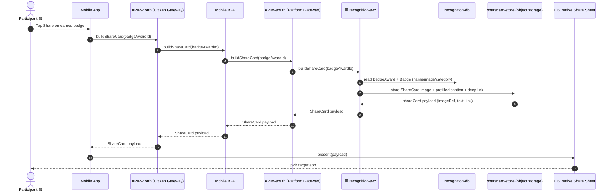
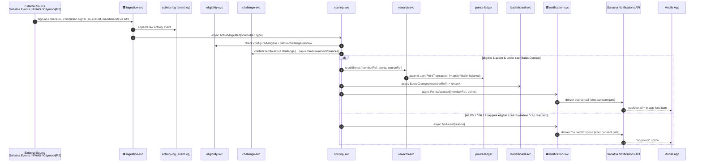

# Application-Level Sequences — Track & Engage (Competition View) (`track-engage`, P1)

**Altitude**: TOP-DOWN solution structure abstracted from the bottom-up ICONIX interactions in
[`../../04-sequences/track-engage.md`](../../04-sequences/track-engage.md). Participants here are
**applications and stores** (Mobile App, APIM-north, BFFs, APIM-south, named microservices, named
datastores, external systems) — NOT the low-level `«C» controllers` / `«E» entities` of the robustness
step. Each low-level controller round-trip is collapsed into one coarse application-to-application call,
and cross-context bonus-point earns are shown as **async events** between microservices.

**Layering**: citizen/mobile reads and commands route `Mobile App → APIM-north (Citizen Gateway) → <BFF>
→ APIM-south (Platform Gateway) → <GP microservice>` per the sequence layering contract — never a bare
`API Gateway`. Gameplay reads/commands use the **Mobile BFF**; the citizen-facing notification push/feed
leg uses the **Sahatna Notifications API**. Reference routing: `earn-scoring.md`, `notification.md`.

**Phase discipline**: UC-F1…F6 are 🟢 **P1** (individual scope). UC-F7 (Citymoov Quest) is 🟡 **P2** —
folded into Journey C as a tagged dotted source for forward-traceability only; the path itself
(ingest → score → ledger → leaderboard → notify) is the same shared P1 machinery.

**Allocation mapping (low-level → application)**:
- `ProgressViewController` / `StreakViewController` / `BadgeCollectionController` (reads) → **scoring-svc**,
  **leaderboard-svc**, **recognition-svc** read-models, fronted by **Mobile BFF** (via APIM-north / APIM-south).
- `BadgeShareController` + `ShareCard` build → **recognition-svc** + **sharecard-store**.
- `PointAwardService` (single writer of bonus `PointTransaction` + `Wallet`) → **scoring-svc** writes the
  earn, **rewards-svc** owns the `points-ledger`; eligibility/cap gates → **eligibility-svc** + **challenge-svc**.

---

## Journey A — View Competition Progress (Score · Streak · Badges)
*covers UC-F1 (Weekly Score & Goal Progress), UC-F2 (Streak Builder), UC-F3 (Badge Collection) — read-only assemblies*

> Maps to **UC-F1 + UC-F2 + UC-F3** (read paths). The **Mobile BFF** composes the three read-models behind
> APIM-north / APIM-south. Time-left-in-week, days-remaining/tier-target, and next-tier% are derived inside
> scoring-svc / recognition-svc (low-level controller logic), not stored. `opt Alt F1.1` (personalized goal)
> and `celebrate-new` are 🟡 P2 / transient UI flags carried in the payload.

> 🟥 svc receives from outside GP · 🟦 svc writes to outside GP (microservices only)

---

## Journey B — Share a Badge
*covers UC-F4 (Share Badge) — build ShareCard, hand off to native OS share sheet*

> Maps to **UC-F4**. The badge-share command rides the citizen path `Mobile App → APIM-north → Mobile BFF
> → APIM-south → recognition-svc`. The `ShareCard` (NEW «E» in the robustness model) is materialized in
> **sharecard-store**, recognition-svc owns the build, the device-native share sheet is the external boundary.

---

## Journey C — Earn Bonus Points (Event · Screening · Quest)
*covers UC-F5 (Sahatna Event sign-up/check-in), UC-F6 (IFHAS Screening), UC-F7 (Citymoov Quest 🟡 P2) — write paths through the shared earn pipeline*

> Maps to **UC-F5 + UC-F6 + UC-F7 (🟡 P2)**. External sources reach `ingestion-svc` through the ACL adapter
> path (same as `earn-scoring.md` Journey D). The robustness `PointAwardService` (single writer) splits at
> application level: **scoring-svc** orchestrates the earn + cap enforcement, **rewards-svc** owns the
> append-only `points-ledger` (PointTransaction + Wallet). Eligibility/window/cap gates resolve to
> **eligibility-svc** + **challenge-svc**. The citizen-facing notify leg is owned by the **Sahatna
> Notifications API** (BFF) — outbound delivery + in-app feed — per `notification.md`. Alt-courses F5.1 (not
> configured-eligible), F5.2 (cancelled -> earned points preserved = ledger is append-only), and F6.1
> (outside window) collapse into the single `else` no-award branch. Cross-context `ScoreChanged` /
> `PointsAwarded` are async events, Citymoov is the only P2 source — the pipeline itself is shared P1.
