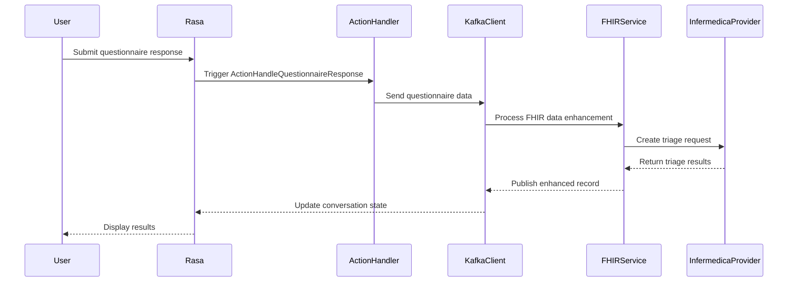

# Rasa Proxy

## To run locally

### Setup

```bash
poetry install
# If you get dependency conflicts, run:
poetry lock --no-update
poetry install

source .venv/bin/activate
```

### Dependencies

Key dependencies:
- Rasa 3.7.10
- fhir.resources 7.0.0
- Pydantic <1.10.10

### Troubleshooting Dependency Conflicts

If you encounter dependency conflicts:
1. Remove existing virtual environment:
```bash
rm -rf .venv/
```

2. Clear poetry cache:
```bash
poetry cache clear pypi --all
```

3. Install with clean environment:
```bash
poetry install
```

4. Verify installation:
```bash
poetry run python -c "from fhir.resources import __version__; print(__version__)"
# Should output: 7.0.0
```

usefull commands:

```bash
poetry cache clear pypi --all
rm -rf .venv/
rasa --version
pip show rasa
pip uninstall rasa
pip cache purge
deactivate
```
### Run Rasa

```bash
rasa train
rasa interactive --skip-visualization
rasa shell
rasa run --enable-api --cors "*"
```
# Note! requires python 3.10


### Docker Compose to run locally (expects identity-service to be running locally)

# Note! you hardly ever need to build the base image unless license changes for example. make sure to add licence as env variable locally then run

```bash

az login
az acr login --name heathhealthregistry 
docker buildx build \
    --platform linux/amd64,linux/arm64 \
    --build-arg RASA_PRO_LICENSE="$RASA_PRO_LICENSE" \
    -t heathhealthregistry.azurecr.io/rasa-base:3.7.10 \
    -f docker/Dockerfile \
    --push .
```

this will build and push base rasa image which is reference by rasa and rasa-actions. need this base image since no rasa native base image for this version exists. also easiest to build once and reference than to build each time, very resource intensive.


```bash

docker build --no-cache -t socrates12345/rasa-actions:latest -f docker/rasa-actions/Dockerfile .

docker build --no-cache -t socrates12345/rasa:latest -f docker/rasa/Dockerfile .

docker-compose down --volumes --remove-orphans && docker-compose build --no-cache && docker-compose up --force-recreate
```

### Run Rasa Actions in a different window

```bash
rasa run actions --debug
```

## Architecture

### Questionnaire & Triage Data Flow

1. **Data Flow Overview**


2. **Detailed Processing Steps**

   a. **Response Collection (ActionHandleQuestionnaireResponse)**
   - Validates user responses against questionnaire constraints
   - Accumulates responses in `questionnaire_responses` slot
   - When questionnaire completes, triggers Kafka event

   b. **Data Enhancement (FHIRDataEnhancementService)**
   - Receives raw questionnaire data via Kafka
   - Creates/updates FHIR patient record
   - Combines questionnaire with patient data
   - Adds metadata and processing timestamp
   - Publishes enhanced record to Kafka

   c. **Medical Knowledge Processing**
   - InfermedicaProvider processes enhanced data
   - Creates structured request with:
    - Patient demographics
    - Symptoms and responses
    - Medical history
   - Returns triage assessment

3. **Key Components**

   - **ActionHandleQuestionnaireResponse**
     - Entry point for questionnaire processing
     - Manages response validation and flow
     - Triggers Kafka events on completion

   - **FHIRDataEnhancementService**
     - Handles FHIR data transformation
     - Manages patient record creation/updates
     - Enriches data with medical context

   - **KafkaClient**
     - Manages async message flow
     - Handles event publishing/subscription
     - Ensures reliable message delivery

4. **Data Transformation Flow**
```
Raw Questionnaire Response
↓
FHIR Patient Record
↓
Enhanced Medical Context
↓
Triage Assessment
↓
Conversation State Update
```

5. **Key Files & Responsibilities**

   - `actions/fhir/actions.py`
     - Questionnaire response handling
     - Initial data processing
     - Kafka event triggering

   - `actions/services/kafka_client.py`
     - Message routing
     - Event publishing
     - Error handling

   - `actions/fhir/fhir_services.py`
     - FHIR data enhancement
     - Medical record management
     - Data enrichment

   - `actions/providers/infermedica_provider.py`
     - Triage decision making
     - Medical assessment
     - Recommendation generation

6. **Error Handling**
   - Failed validations repeat questions
   - Processing errors reset questionnaire state
   - Network issues trigger fallback responses
   - All errors logged for monitoring

### Overview
This system is a multi-channel conversational platform supporting Web Chat, WhatsApp (Twilio), Telegram, and Instagram, providing real-time (WebSockets) and request/response communication. Powered by Rasa for advanced Natural Language Understanding (NLU) and chatbot orchestration, it integrates with external services for patient records, scheduling, and medical assessments.

### Key highlights:

AI-driven by Rasa for NLU and advanced analytics.
Multi-tenant architecture, isolating and tailoring deployments to meet regional data and compliance requirements.
GitOps-based operations with Argo and GitHub Actions.
CRM integration for customer support workflows.


### Create Azure Credential File

```bash
az login

export SUBSCRIPTION_ID=$(az account show --query id -o tsv)

az ad sp create-for-rbac --sdk-auth --name heathsa --role Owner --scopes /subscriptions/$SUBSCRIPTION_ID | tee azure-creds.json
```

### For Argo Workflow

Secrets:
- Make sure AZURE_CREDENTIALS secret and ACR env key is in github of this repo
- AZURE_CREDENTIALS = ./azure-creds.json as is without any base64

Variable key value pairs:
- ACR heathhealthregistry
- ACR_URL heathhealthregistry.azurecr.io

## Setup & Running Options

### Option 1: Local Development
1. Create a virtual environment:
```bash
python -m venv venv
source venv/bin/activate  # On Windows: venv\Scripts\activate
```

2. Install dependencies:
```bash
cd chat-service
pip install -r requirements.txt
```

3. Create `.env` file:
```bash
cp .env.example .env
```
Then edit `.env` with your specific configuration.

4. Start the server locally:
```bash
uvicorn main:app --reload --host 0.0.0.0 --port 8000
```

### Option 2: Docker Compose (Recommended for Production)
1. Start all services:
```bash
docker-compose up -d
```

2. Stop all services:
```bash
docker-compose down
```

## Architecture & Data Flow

### Component URLs and Ports

#### External Access (Browser)
- Web Interface: `http://localhost:80/chat/`
- WebSocket: `ws://localhost:80/chat/socket.io/`
- Static Files: `http://localhost:80/chat/static/*`

#### Internal Services
1. **Chat Service (Proxy)**
   - External Port: 80
   - Internal Port: 8000
   - Internal URL: `http://chat-service:8000`
   - WebSocket Path: `/chat/socket.io/`

2. **Rasa Server**
   - Port: 5005 (internal only)
   - URL: `http://rasa:5005`
   - WebSocket: `ws://rasa:5005/socket.io/`
   - Not exposed externally

3. **Rasa Actions**
   - Port: 8000 (internal only)
   - URL: `http://rasa-actions:8000`
   - Not exposed externally

### Communication Flow

1. **Initial Page Load**
```
Browser -> http://localhost:80/chat/ 
-> Docker forwards to chat-service:8000
-> chat-service serves index.html
```

2. **WebSocket Connection**
```
Browser WebSocket -> ws://localhost:80/chat/socket.io/
-> Docker forwards to chat-service:8000
-> chat-service Socket.IO server
-> chat-service connects to rasa:5005
```

3. **Message Flow**
```
Browser -> chat-service:8000/chat/socket.io/
-> chat-service internal processing
-> rasa:5005/socket.io/
-> Response follows reverse path
```

### Environment Configuration

Key environment variables (from .env.example):
```bash
# Rasa settings
RASA_URL=http://rasa:5005
RASA_WEBHOOK_URL=http://rasa:5005/webhooks/rest/webhook

# Server settings
HOST=0.0.0.0
PORT=8000

# Rasa specific settings
RASA_MODEL_PATH=/app/models
RASA_DATA_PATH=/app/data
```

### Docker Network Configuration

```yaml
services:
  chat-service:
    ports: 
      - "80:8000"  # External:Internal
    environment:
      RASA_URL: http://rasa:5005
      HOST: 0.0.0.0
      PORT: 8000

  rasa:
    ports: 
      - "5005:5005"  # Only needed for development
    networks:
      - rasa_network

  rasa-actions:
    ports: 
      - "8000:8000"  # Only needed for development
    networks:
      - rasa_network
```

### Security Notes

- Only chat-service is exposed externally (port 80)
- Rasa and Rasa Actions servers are only accessible within the Docker network
- All external WebSocket connections are handled by chat-service proxy
- CORS is configured to allow specific origins only

## Environment Variables
Key environment variables (see .env.example):
- RASA_URL: Internal Rasa server URL
- RASA_WEBHOOK_URL: Webhook endpoint for Rasa
- HOST: Server host binding
- PORT: Server port binding

## Available Endpoints
- Web interface: http://localhost:8000
- API documentation: http://localhost:8000/docs  
- OpenAPI specification: http://localhost:8000/openapi.json

When running with Docker:
- Web interface: http://localhost/chat/
- API documentation: http://localhost/docs
- OpenAPI specification: http://localhost/openapi.json

## Environment Variables
Key environment variables (see .env.example):
- RASA_URL: Internal Rasa server URL
- RASA_WEBHOOK_URL: Webhook endpoint for Rasa
- HOST: Server host binding
- PORT: Server port binding