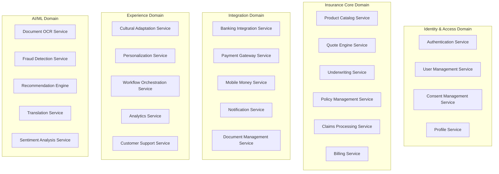
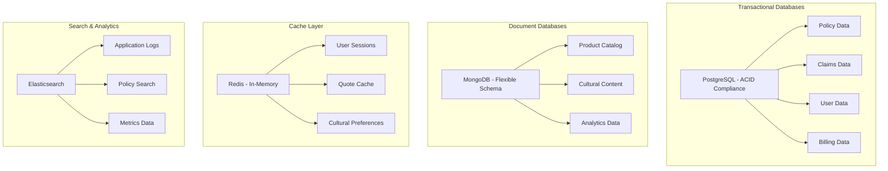

# Sub-Saharan African Bancassurance Platform - Comprehensive Application Architecture

## Executive Summary

This document presents a comprehensive application architecture design for a Sub-Saharan African Bancassurance Platform, addressing the unique technical challenges of serving diverse African markets through innovative cloud-native microservices architecture, offline-first mobile experiences, and culturally intelligent design patterns.

The platform is designed to enable financial inclusion for 50+ million uninsured adults across Sub-Saharan Africa through mobile-first experiences, multi-language support, flexible payment systems, and deep cultural adaptation while maintaining enterprise-grade security and compliance.

## 1. System Architecture Overview

### 1.1 High-Level Architecture

```mermaid
graph TB
    subgraph "User Channels"
        PWA[Progressive Web App]
        SDK[White-Label SDK]
        AGENT[Agent Portal]
        BRANCH[Branch Interface]
        USSD[USSD Gateway]
    end

    subgraph "API Gateway Layer"
        KONG[Kong API Gateway]
        AUTH[Authentication Service]
        RATE[Rate Limiting]
        TRANS[Request Translation]
    end

    subgraph "Microservices Core"
        USER[User Management]
        PROD[Product Engine]
        QUOTE[Quote Engine]
        UNDER[Underwriting]
        POLICY[Policy Management]
        CLAIMS[Claims Processing]
        PAYMENT[Payment Gateway]
        NOTIFY[Notification Hub]
        DOC[Document Service]
        CULTURE[Cultural Engine]
    end

    subgraph "Integration Layer"
        BANK[Banking Integration]
        MOBILE[Mobile Money APIs]
        KYC[Identity Services]
        AUDIT[Audatex/GT Motive]
        VENDOR[Vendor Management]
    end

    subgraph "Data Layer"
        POSTGRES[(PostgreSQL)]
        MONGO[(MongoDB)]
        REDIS[(Redis Cache)]
        KAFKA[Event Streaming]
        ELASTIC[(Elasticsearch)]
    end

    subgraph "AI/ML Services"
        OCR[Document OCR]
        FRAUD[Fraud Detection]
        RECOMMEND[Recommendation Engine]
        TRANSLATE[Translation Service]
    end

    PWA --> KONG
    SDK --> KONG
    AGENT --> KONG
    BRANCH --> KONG
    USSD --> KONG

    KONG --> AUTH
    KONG --> USER
    KONG --> PROD
    KONG --> QUOTE
    KONG --> UNDER
    KONG --> POLICY
    KONG --> CLAIMS
    KONG --> PAYMENT
    KONG --> NOTIFY
    KONG --> DOC
    KONG --> CULTURE

    USER --> POSTGRES
    PROD --> MONGO
    QUOTE --> REDIS
    UNDER --> POSTGRES
    POLICY --> POSTGRES
    CLAIMS --> POSTGRES
    PAYMENT --> POSTGRES

    CLAIMS --> KAFKA
    POLICY --> KAFKA
    PAYMENT --> KAFKA

    KAFKA --> ELASTIC
    KAFKA --> OCR
    KAFKA --> FRAUD
    KAFKA --> RECOMMEND

    BANK --> KONG
    MOBILE --> PAYMENT
    KYC --> USER
    AUDIT --> CLAIMS
    VENDOR --> CLAIMS
```



### 1.2 Core Architectural Principles

#### Cloud-Native Foundation
- **Microservices Architecture**: Domain-driven service decomposition
- **Container-First**: Kubernetes orchestration with Istio service mesh
- **Event-Driven**: Apache Kafka for real-time data propagation
- **API-First**: OpenAPI 3.0 specifications for all services
- **Observability**: Distributed tracing, metrics, and logging

#### African Market Adaptations
- **Offline-First**: Progressive Web App with intelligent sync
- **Low-Bandwidth Optimization**: Adaptive data compression and caching
- **Multi-Language Support**: 6+ African languages with cultural context
- **Mobile Money Integration**: 15+ payment providers across regions
- **Cultural Intelligence**: Context-aware content adaptation engine

#### Scalability & Resilience
- **Horizontal Scaling**: Auto-scaling microservices based on demand
- **Circuit Breakers**: Resilient service communication patterns
- **Data Partitioning**: Geographic and tenant-based data isolation
- **Disaster Recovery**: Multi-region deployment with automated failover

## 2. Microservices Domain Architecture

### 2.1 Domain Boundaries and Services



### 2.2 Service Specifications

#### User Management Service
```yaml
service_name: user-management-service
responsibilities:
  - User registration and authentication
  - Profile management and KYC processing
  - Multi-factor authentication
  - Session management across channels
  
technologies:
  runtime: Node.js/TypeScript
  framework: Fastify
  database: PostgreSQL
  cache: Redis
  
apis:
  - POST /users/register
  - POST /users/authenticate
  - GET /users/{id}/profile
  - PUT /users/{id}/profile
  - POST /users/{id}/kyc/verify
  
integrations:
  - Banking system for customer data
  - National ID verification services
  - Biometric authentication systems
```

#### Product Catalog Service
```yaml
service_name: product-catalog-service
responsibilities:
  - Insurance product configuration
  - Regional product variations
  - Coverage options and limits
  - Pricing parameters and rules
  
technologies:
  runtime: Java/Spring Boot
  database: MongoDB
  cache: Redis
  
apis:
  - GET /products
  - GET /products/{id}
  - POST /products/{id}/configure
  - GET /products/region/{region}
  
features:
  - Dynamic product configuration
  - Multi-language product descriptions
  - Regional compliance rules
  - A/B testing for product variants
```

#### Quote Engine Service
```yaml
service_name: quote-engine-service
responsibilities:
  - Real-time premium calculations
  - Risk-based pricing
  - Quote generation and management
  - Multi-product bundling
  
technologies:
  runtime: Python/FastAPI
  database: PostgreSQL
  cache: Redis
  ml_framework: scikit-learn
  
apis:
  - POST /quotes/calculate
  - GET /quotes/{id}
  - PUT /quotes/{id}/update
  - POST /quotes/{id}/bind
  
features:
  - ML-powered risk scoring
  - Dynamic pricing algorithms
  - IoT/telematics data integration
  - Real-time quote generation
```

#### Claims Processing Service
```yaml
service_name: claims-processing-service
responsibilities:
  - Claims intake and triage
  - Workflow orchestration
  - Settlement processing
  - Fraud detection integration
  
technologies:
  runtime: Node.js/TypeScript
  database: PostgreSQL
  workflow_engine: Temporal
  
apis:
  - POST /claims/submit
  - GET /claims/{id}/status
  - PUT /claims/{id}/assess
  - POST /claims/{id}/settle
  
integrations:
  - Audatex for vehicle damage assessment
  - GT Motive for parts pricing
  - Codeplex for vendor management
  - AI services for document processing
```

#### Cultural Adaptation Service
```yaml
service_name: cultural-adaptation-service
responsibilities:
  - Content localization and translation
  - Cultural context adaptation
  - Regional customization
  - Communication style adjustment
  
technologies:
  runtime: Python/FastAPI
  database: MongoDB
  ai_services: OpenAI GPT-4, Google Translate
  
apis:
  - POST /culture/adapt-content
  - GET /culture/preferences/{region}
  - POST /culture/translate
  - GET /culture/metadata/{culture}
  
features:
  - 6+ African language support
  - Cultural metaphor adaptation
  - Religious sensitivity handling
  - Visual content localization
```

## 3. API Design Strategy

### 3.1 RESTful API Design Patterns

#### API Gateway Architecture
```yaml
api_gateway: Kong
features:
  - Request/response transformation
  - Rate limiting and throttling
  - Authentication and authorization
  - Request routing and load balancing
  - API versioning
  - Monitoring and analytics

plugins:
  - JWT authentication
  - Rate limiting
  - CORS handling
  - Request/response logging
  - Circuit breaker
  - Request transformation
```

#### Standardized API Response Format
```json
{
  "success": true,
  "data": {
    "id": "quote_123",
    "premium": 1200.00,
    "currency": "NGN",
    "coverage": {
      "type": "comprehensive",
      "limit": 1000000
    }
  },
  "metadata": {
    "request_id": "req_456",
    "timestamp": "2024-01-15T10:30:00Z",
    "version": "v1"
  },
  "cultural_context": {
    "language": "en-NG",
    "currency_display": "₦1,200",
    "cultural_messaging": "Your family will be protected"
  }
}
```

### 3.2 GraphQL Implementation for Mobile Clients

#### Schema Design
```graphql
type User {
  id: ID!
  profile: UserProfile!
  policies: [Policy!]!
  claims: [Claim!]!
  preferences: UserPreferences!
}

type Policy {
  id: ID!
  productType: ProductType!
  premium: Money!
  coverage: Coverage!
  status: PolicyStatus!
  documents: [Document!]!
}

type Query {
  user(id: ID!): User
  policies(userId: ID!): [Policy!]!
  quotes(filters: QuoteFilters): [Quote!]!
  culturalContent(region: String!, language: String!): CulturalContent!
}

type Mutation {
  createQuote(input: QuoteInput!): Quote!
  submitClaim(input: ClaimInput!): Claim!
  updateProfile(input: UserProfileInput!): User!
}

type Subscription {
  claimStatusUpdates(claimId: ID!): ClaimUpdate!
  policyNotifications(userId: ID!): PolicyNotification!
}
```

### 3.3 Event-Driven Architecture Patterns

#### Event Schema Design
```yaml
events:
  user_registered:
    schema:
      user_id: string
      registration_channel: string
      kyc_status: string
      region: string
      timestamp: string
    
  quote_generated:
    schema:
      quote_id: string
      user_id: string
      product_type: string
      premium: number
      currency: string
      timestamp: string
  
  policy_purchased:
    schema:
      policy_id: string
      user_id: string
      product_type: string
      premium: number
      payment_method: string
      timestamp: string
  
  claim_submitted:
    schema:
      claim_id: string
      policy_id: string
      claim_type: string
      estimated_amount: number
      timestamp: string
```

## 4. Data Architecture

### 4.1 Database Design Strategy

#### Multi-Database Approach


#### Data Models

**User Profile Model**
```json
{
  "user_id": "usr_123456",
  "profile": {
    "first_name": "Sarah",
    "last_name": "Mwangi",
    "date_of_birth": "1990-05-15",
    "phone_number": "+254712345678",
    "email": "sarah.mwangi@email.com",
    "address": {
      "street": "Kimathi Street",
      "city": "Nairobi",
      "country": "KE",
      "postal_code": "00100"
    }
  },
  "kyc_status": "verified",
  "cultural_preferences": {
    "language": "sw-KE",
    "communication_style": "formal",
    "family_decision_making": true
  },
  "financial_profile": {
    "income_level": "middle",
    "payment_preference": "mobile_money",
    "risk_tolerance": "moderate"
  },
  "created_at": "2024-01-15T10:30:00Z",
  "updated_at": "2024-01-20T14:22:00Z"
}
```

**Policy Model**
```json
{
  "policy_id": "pol_789012",
  "user_id": "usr_123456",
  "product": {
    "type": "auto_insurance",
    "variant": "comprehensive",
    "region": "KE"
  },
  "coverage": {
    "vehicle_value": 2000000,
    "third_party_limit": 1000000,
    "excess": 50000
  },
  "premium": {
    "amount": 60000,
    "currency": "KES",
    "frequency": "monthly",
    "payment_method": "m_pesa"
  },
  "status": "active",
  "effective_date": "2024-02-01T00:00:00Z",
  "expiry_date": "2025-02-01T00:00:00Z",
  "documents": [
    {
      "type": "policy_schedule",
      "url": "/documents/pol_789012_schedule.pdf",
      "language": "sw-KE"
    }
  ]
}
```

### 4.2 Event Sourcing and CQRS Implementation

#### Event Store Design
```yaml
event_store:
  technology: PostgreSQL with JSONB
  partitioning: By aggregate_id and timestamp
  retention: 7 years for compliance
  
  event_structure:
    event_id: UUID
    aggregate_id: String
    aggregate_type: String
    event_type: String
    event_data: JSONB
    metadata: JSONB
    version: Integer
    timestamp: Timestamp
    
  indexes:
    - aggregate_id, version
    - aggregate_type, timestamp
    - event_type, timestamp
```

#### Read Model Projections
```javascript
// Policy Summary Projection
class PolicySummaryProjection {
  async handle(event) {
    switch (event.event_type) {
      case 'PolicyCreated':
        await this.createPolicySummary(event);
        break;
      case 'PremiumPaid':
        await this.updatePaymentStatus(event);
        break;
      case 'PolicyRenewed':
        await this.updateRenewalInfo(event);
        break;
    }
  }
  
  async createPolicySummary(event) {
    const summary = {
      policy_id: event.aggregate_id,
      user_id: event.event_data.user_id,
      product_type: event.event_data.product_type,
      status: 'active',
      premium_amount: event.event_data.premium.amount,
      next_payment_due: this.calculateNextPayment(event.event_data)
    };
    
    await this.repository.save(summary);
  }
}
```

### 4.3 Data Synchronization and Conflict Resolution

#### Offline Data Sync Strategy
```typescript
interface SyncStrategy {
  priority: 'high' | 'medium' | 'low';
  conflictResolution: 'last_write_wins' | 'merge' | 'user_choice';
  syncFrequency: number; // seconds
  batchSize: number;
}

const dataSyncConfig: Record<string, SyncStrategy> = {
  user_profile: {
    priority: 'high',
    conflictResolution: 'user_choice',
    syncFrequency: 30,
    batchSize: 10
  },
  policies: {
    priority: 'high',
    conflictResolution: 'last_write_wins',
    syncFrequency: 60,
    batchSize: 20
  },
  claims: {
    priority: 'high',
    conflictResolution: 'merge',
    syncFrequency: 30,
    batchSize: 5
  },
  cultural_content: {
    priority: 'medium',
    conflictResolution: 'last_write_wins',
    syncFrequency: 3600,
    batchSize: 100
  }
};
```

## 5. Integration Architecture

### 5.1 Banking System Integration

#### Core Banking API Adapter
```typescript
interface BankingAPIAdapter {
  getCustomerProfile(customerId: string): Promise<CustomerProfile>;
  getAccountBalance(accountId: string): Promise<AccountBalance>;
  processPayment(paymentRequest: PaymentRequest): Promise<PaymentResult>;
  getTransactionHistory(accountId: string, period: DateRange): Promise<Transaction[]>;
}

class StandardBankAdapter implements BankingAPIAdapter {
  constructor(
    private apiClient: HTTPClient,
    private config: BankConfig,
    private cryptoService: CryptoService
  ) {}

  async getCustomerProfile(customerId: string): Promise<CustomerProfile> {
    const response = await this.apiClient.get(
      `/customers/${customerId}`,
      {
        headers: {
          'Authorization': `Bearer ${await this.getAccessToken()}`,
          'X-Bank-ID': this.config.bankId,
          'Content-Type': 'application/json'
        }
      }
    );

    return this.transformBankCustomerData(response.data);
  }

  private transformBankCustomerData(bankData: any): CustomerProfile {
    return {
      id: bankData.customer_id,
      firstName: bankData.first_name,
      lastName: bankData.last_name,
      dateOfBirth: new Date(bankData.date_of_birth),
      phoneNumber: bankData.mobile_number,
      email: bankData.email_address,
      address: {
        street: bankData.address.street_address,
        city: bankData.address.city,
        country: bankData.address.country_code,
        postalCode: bankData.address.postal_code
      },
      kycStatus: this.mapKYCStatus(bankData.kyc_status),
      riskProfile: bankData.risk_assessment_score
    };
  }
}
```

### 5.2 Mobile Money Integration

#### Multi-Provider Payment Gateway
```typescript
interface MobileMoneyProvider {
  name: string;
  regions: string[];
  processPayment(request: MobilePaymentRequest): Promise<PaymentResult>;
  checkPaymentStatus(transactionId: string): Promise<PaymentStatus>;
  refundPayment(transactionId: string, amount: number): Promise<RefundResult>;
}

class MPesaProvider implements MobileMoneyProvider {
  name = 'M-Pesa';
  regions = ['KE', 'TZ', 'UG'];

  async processPayment(request: MobilePaymentRequest): Promise<PaymentResult> {
    const mpesaRequest = {
      BusinessShortCode: this.config.shortCode,
      Password: this.generatePassword(),
      Timestamp: this.generateTimestamp(),
      TransactionType: 'CustomerPayBillOnline',
      Amount: request.amount,
      PartyA: request.phoneNumber,
      PartyB: this.config.shortCode,
      PhoneNumber: request.phoneNumber,
      CallBackURL: this.config.callbackUrl,
      AccountReference: request.reference,
      TransactionDesc: request.description
    };

    const response = await this.apiClient.post('/stkpush', mpesaRequest);
    
    return {
      success: response.ResponseCode === '0',
      transactionId: response.CheckoutRequestID,
      reference: request.reference,
      status: 'pending',
      message: response.ResponseDescription
    };
  }
}

class MobileMoneyGateway {
  private providers: Map<string, MobileMoneyProvider> = new Map();

  constructor() {
    this.providers.set('M-Pesa', new MPesaProvider());
    this.providers.set('MTN-MoMo', new MTNMoMoProvider());
    this.providers.set('Airtel-Money', new AirtelMoneyProvider());
    this.providers.set('Orange-Money', new OrangeMoneyProvider());
  }

  async processPayment(request: MobilePaymentRequest): Promise<PaymentResult> {
    const provider = this.selectProvider(request.phoneNumber, request.region);
    
    if (!provider) {
      throw new Error(`No mobile money provider available for ${request.region}`);
    }

    try {
      const result = await provider.processPayment(request);
      await this.logTransaction(request, result, provider.name);
      return result;
    } catch (error) {
      await this.logError(request, error, provider.name);
      throw error;
    }
  }

  private selectProvider(phoneNumber: string, region: string): MobileMoneyProvider | null {
    // Logic to select provider based on phone number prefix and region
    const phonePrefix = phoneNumber.substring(0, 4);
    
    for (const [name, provider] of this.providers) {
      if (provider.regions.includes(region) && this.supportsPhonePrefix(provider, phonePrefix)) {
        return provider;
      }
    }
    
    return null;
  }
}
```

### 5.3 Document Management and OCR Integration

#### AI-Powered Document Processing
```typescript
interface DocumentProcessor {
  processDocument(documentId: string, type: DocumentType): Promise<ProcessingResult>;
  extractData(imageData: Buffer, type: DocumentType): Promise<ExtractedData>;
  verifyDocument(extractedData: ExtractedData): Promise<VerificationResult>;
}

class AIDocumentProcessor implements DocumentProcessor {
  constructor(
    private ocrService: OCRService,
    private verificationService: VerificationService,
    private mlService: MLService
  ) {}

  async processDocument(documentId: string, type: DocumentType): Promise<ProcessingResult> {
    const document = await this.documentRepository.findById(documentId);
    
    if (!document) {
      throw new Error(`Document ${documentId} not found`);
    }

    // Extract text and structured data using OCR
    const ocrResult = await this.ocrService.extractText(document.imageData, {
      language: document.language || 'en',
      documentType: type
    });

    // Apply ML models for data extraction and validation
    const extractedData = await this.mlService.extractStructuredData(
      ocrResult.text,
      type
    );

    // Verify document authenticity and data consistency
    const verification = await this.verificationService.verifyDocument(
      extractedData,
      document.metadata
    );

    return {
      documentId,
      extractedData,
      confidence: ocrResult.confidence,
      verification: verification.result,
      requiredActions: verification.requiredActions,
      processingTime: Date.now() - document.uploadedAt.getTime()
    };
  }

  async extractData(imageData: Buffer, type: DocumentType): Promise<ExtractedData> {
    switch (type) {
      case 'national_id':
        return this.extractNationalIdData(imageData);
      case 'driving_license':
        return this.extractDrivingLicenseData(imageData);
      case 'vehicle_registration':
        return this.extractVehicleRegistrationData(imageData);
      default:
        throw new Error(`Unsupported document type: ${type}`);
    }
  }

  private async extractNationalIdData(imageData: Buffer): Promise<ExtractedData> {
    const ocrResult = await this.ocrService.extractText(imageData, {
      language: 'en',
      documentType: 'national_id'
    });

    // Use regex patterns and ML models to extract structured data
    const patterns = {
      idNumber: /ID\s*:?\s*(\d{8})/i,
      name: /Name\s*:?\s*([A-Z\s]+)/i,
      dateOfBirth: /DOB\s*:?\s*(\d{2}\/\d{2}\/\d{4})/i
    };

    const extractedData: ExtractedData = {
      type: 'national_id',
      fields: {},
      confidence: ocrResult.confidence
    };

    for (const [field, pattern] of Object.entries(patterns)) {
      const match = ocrResult.text.match(pattern);
      if (match) {
        extractedData.fields[field] = match[1].trim();
      }
    }

    return extractedData;
  }
}
```

## 6. Security Architecture

### 6.1 Authentication and Authorization

#### Multi-Factor Authentication System
```typescript
interface AuthenticationService {
  authenticate(credentials: AuthCredentials): Promise<AuthResult>;
  enableMFA(userId: string, method: MFAMethod): Promise<MFASetup>;
  verifyMFA(userId: string, token: string): Promise<VerificationResult>;
  refreshToken(refreshToken: string): Promise<TokenResult>;
}

class ComprehensiveAuthService implements AuthenticationService {
  constructor(
    private jwtService: JWTService,
    private smsService: SMSService,
    private biometricService: BiometricService,
    private cryptoService: CryptoService
  ) {}

  async authenticate(credentials: AuthCredentials): Promise<AuthResult> {
    // Step 1: Primary authentication (password, PIN, or biometric)
    const primaryAuth = await this.verifyPrimaryCredentials(credentials);
    
    if (!primaryAuth.success) {
      return { success: false, error: 'Invalid credentials' };
    }

    const user = primaryAuth.user;
    
    // Step 2: Check if MFA is enabled
    if (user.mfaEnabled) {
      const mfaChallenge = await this.initiateMFAChallenge(user);
      
      return {
        success: false,
        requiresMFA: true,
        mfaChallenge,
        temporaryToken: await this.generateTemporaryToken(user.id)
      };
    }

    // Step 3: Generate full access tokens
    const tokens = await this.generateTokens(user);
    
    return {
      success: true,
      user,
      accessToken: tokens.accessToken,
      refreshToken: tokens.refreshToken,
      expiresIn: tokens.expiresIn
    };
  }

  async verifyMFA(userId: string, token: string): Promise<VerificationResult> {
    const user = await this.userRepository.findById(userId);
    
    if (!user) {
      return { success: false, error: 'User not found' };
    }

    const verification = await this.verifyMFAToken(user, token);
    
    if (verification.success) {
      const tokens = await this.generateTokens(user);
      
      return {
        success: true,
        accessToken: tokens.accessToken,
        refreshToken: tokens.refreshToken,
        expiresIn: tokens.expiresIn
      };
    }

    return verification;
  }

  private async verifyMFAToken(user: User, token: string): Promise<VerificationResult> {
    switch (user.mfaMethod) {
      case 'sms':
        return this.verifySMSOTP(user.phoneNumber, token);
      case 'totp':
        return this.verifyTOTP(user.totpSecret, token);
      case 'biometric':
        return this.verifyBiometric(user.id, token);
      default:
        return { success: false, error: 'Invalid MFA method' };
    }
  }
}
```

### 6.2 Data Protection and Privacy

#### Encryption Strategy
```typescript
interface EncryptionService {
  encryptPII(data: PersonalData): Promise<EncryptedData>;
  decryptPII(encryptedData: EncryptedData): Promise<PersonalData>;
  hashSensitiveData(data: string): Promise<string>;
  generateKey(): Promise<CryptoKey>;
}

class AdvancedEncryptionService implements EncryptionService {
  private readonly algorithm = 'AES-GCM';
  private readonly keyLength = 256;

  async encryptPII(data: PersonalData): Promise<EncryptedData> {
    const key = await this.getEncryptionKey(data.userId);
    const iv = crypto.getRandomValues(new Uint8Array(12));
    
    const encoder = new TextEncoder();
    const dataBuffer = encoder.encode(JSON.stringify(data));
    
    const encryptedBuffer = await crypto.subtle.encrypt(
      { name: this.algorithm, iv },
      key,
      dataBuffer
    );
    
    return {
      encryptedData: Array.from(new Uint8Array(encryptedBuffer)),
      iv: Array.from(iv),
      algorithm: this.algorithm,
      keyId: await this.getKeyId(key)
    };
  }

  async decryptPII(encryptedData: EncryptedData): Promise<PersonalData> {
    const key = await this.getEncryptionKeyById(encryptedData.keyId);
    const iv = new Uint8Array(encryptedData.iv);
    const data = new Uint8Array(encryptedData.encryptedData);
    
    const decryptedBuffer = await crypto.subtle.decrypt(
      { name: this.algorithm, iv },
      key,
      data
    );
    
    const decoder = new TextDecoder();
    const decryptedText = decoder.decode(decryptedBuffer);
    
    return JSON.parse(decryptedText);
  }

  async hashSensitiveData(data: string): Promise<string> {
    const encoder = new TextEncoder();
    const dataBuffer = encoder.encode(data);
    
    const hashBuffer = await crypto.subtle.digest('SHA-256', dataBuffer);
    const hashArray = Array.from(new Uint8Array(hashBuffer));
    
    return hashArray.map(b => b.toString(16).padStart(2, '0')).join('');
  }
}
```

### 6.3 Compliance Framework

#### GDPR/POPIA Compliance Implementation
```typescript
interface PrivacyManager {
  requestConsent(purposes: ConsentPurpose[]): Promise<ConsentResult>;
  updateConsent(consentId: string, preferences: ConsentPreferences): Promise<void>;
  exportUserData(userId: string): Promise<UserDataExport>;
  deleteUserData(userId: string): Promise<DeletionResult>;
  anonymizeData(data: PersonalData): Promise<AnonymizedData>;
}

class ComprehensivePrivacyManager implements PrivacyManager {
  constructor(
    private consentRepository: ConsentRepository,
    private dataRepository: DataRepository,
    private anonymizationService: AnonymizationService
  ) {}

  async requestConsent(purposes: ConsentPurpose[]): Promise<ConsentResult> {
    const consentRequest = {
      id: this.generateConsentId(),
      purposes,
      timestamp: new Date(),
      version: this.getCurrentPrivacyPolicyVersion()
    };

    // Present consent UI with clear explanations
    const userResponse = await this.presentConsentInterface(consentRequest);
    
    if (userResponse.granted) {
      await this.consentRepository.save({
        ...consentRequest,
        userResponse,
        status: 'granted'
      });
    }

    return {
      consentId: consentRequest.id,
      granted: userResponse.granted,
      purposes: purposes.filter(p => userResponse.grantedPurposes.includes(p.id))
    };
  }

  async exportUserData(userId: string): Promise<UserDataExport> {
    const userData = await this.dataRepository.getAllUserData(userId);
    
    const exportData: UserDataExport = {
      userId,
      exportDate: new Date(),
      categories: {
        profile: userData.profile,
        policies: userData.policies,
        claims: userData.claims,
        payments: userData.payments,
        communications: userData.communications
      },
      metadata: {
        dataRetentionPolicies: this.getRetentionPolicies(),
        processingPurposes: userData.processingPurposes,
        thirdPartySharing: userData.thirdPartySharing
      }
    };

    // Remove sensitive internal identifiers
    return this.sanitizeExportData(exportData);
  }

  async deleteUserData(userId: string): Promise<DeletionResult> {
    const deletionPlan = await this.createDeletionPlan(userId);
    
    // Execute deletion in phases to maintain referential integrity
    const results = await Promise.allSettled([
      this.deleteProfileData(userId),
      this.anonymizePolicyData(userId),
      this.deleteMarketingData(userId),
      this.removePersonalIdentifiers(userId)
    ]);

    const failures = results.filter(r => r.status === 'rejected');
    
    if (failures.length > 0) {
      throw new Error(`Partial deletion failure: ${failures.length} operations failed`);
    }

    return {
      userId,
      deletionDate: new Date(),
      categoriesDeleted: deletionPlan.categories,
      dataRetained: deletionPlan.retainedForCompliance,
      verificationHash: await this.generateDeletionHash(userId)
    };
  }
}
```

## 7. Scalability Design

### 7.1 Auto-Scaling Architecture

#### Kubernetes Horizontal Pod Autoscaler Configuration
```yaml
apiVersion: autoscaling/v2
kind: HorizontalPodAutoscaler
metadata:
  name: quote-engine-hpa
spec:
  scaleTargetRef:
    apiVersion: apps/v1
    kind: Deployment
    name: quote-engine
  minReplicas: 3
  maxReplicas: 50
  metrics:
  - type: Resource
    resource:
      name: cpu
      target:
        type: Utilization
        averageUtilization: 70
  - type: Resource
    resource:
      name: memory
      target:
        type: Utilization
        averageUtilization: 80
  - type: Pods
    pods:
      metric:
        name: requests_per_second
      target:
        type: AverageValue
        averageValue: "100"
  behavior:
    scaleDown:
      stabilizationWindowSeconds: 300
      policies:
      - type: Percent
        value: 50
        periodSeconds: 60
    scaleUp:
      stabilizationWindowSeconds: 60
      policies:
      - type: Percent
        value: 100
        periodSeconds: 30
```

#### Load Balancing Strategy
```typescript
interface LoadBalancer {
  distributeRequest(request: Request): Promise<ServiceInstance>;
  healthCheck(service: ServiceInstance): Promise<HealthStatus>;
  updateRouting(services: ServiceInstance[]): Promise<void>;
}

class IntelligentLoadBalancer implements LoadBalancer {
  private readonly strategies = new Map<string, LoadBalancingStrategy>();

  constructor() {
    this.strategies.set('round_robin', new RoundRobinStrategy());
    this.strategies.set('least_connections', new LeastConnectionsStrategy());
    this.strategies.set('weighted_response_time', new WeightedResponseTimeStrategy());
    this.strategies.set('geographic', new GeographicStrategy());
  }

  async distributeRequest(request: Request): Promise<ServiceInstance> {
    const strategy = this.selectStrategy(request);
    const availableServices = await this.getHealthyServices(request.serviceName);
    
    if (availableServices.length === 0) {
      throw new Error(`No healthy instances available for ${request.serviceName}`);
    }

    return strategy.selectService(availableServices, request);
  }

  private selectStrategy(request: Request): LoadBalancingStrategy {
    // Geographic routing for region-specific requests
    if (request.headers['x-user-region']) {
      return this.strategies.get('geographic')!;
    }
    
    // Weighted response time for performance-critical services
    if (['quote-engine', 'payment-gateway'].includes(request.serviceName)) {
      return this.strategies.get('weighted_response_time')!;
    }
    
    // Default to least connections
    return this.strategies.get('least_connections')!;
  }
}
```

### 7.2 Database Scaling Patterns

#### Read Replica Configuration
```typescript
interface DatabaseCluster {
  primary: DatabaseConnection;
  readReplicas: DatabaseConnection[];
  routeQuery(query: DatabaseQuery): Promise<QueryResult>;
}

class PostgreSQLCluster implements DatabaseCluster {
  constructor(
    public primary: PostgreSQLConnection,
    public readReplicas: PostgreSQLConnection[]
  ) {}

  async routeQuery(query: DatabaseQuery): Promise<QueryResult> {
    if (query.type === 'SELECT' && !query.requiresConsistency) {
      // Route read queries to replicas with load balancing
      const replica = this.selectReadReplica();
      return replica.execute(query);
    } else {
      // Route write queries and consistent reads to primary
      return this.primary.execute(query);
    }
  }

  private selectReadReplica(): PostgreSQLConnection {
    // Select replica based on load and geographic proximity
    const availableReplicas = this.readReplicas.filter(r => r.isHealthy());
    
    if (availableReplicas.length === 0) {
      // Fallback to primary if no replicas available
      return this.primary;
    }

    // Select replica with lowest current load
    return availableReplicas.reduce((best, current) => 
      current.getCurrentLoad() < best.getCurrentLoad() ? current : best
    );
  }
}
```

#### Sharding Strategy
```typescript
interface ShardingStrategy {
  selectShard(key: string): string;
  getAllShards(): string[];
  rebalanceShards(): Promise<void>;
}

class GeographicShardingStrategy implements ShardingStrategy {
  private readonly shardMap = new Map<string, string>([
    ['NG', 'west-africa-shard'],
    ['GH', 'west-africa-shard'],
    ['KE', 'east-africa-shard'],
    ['TZ', 'east-africa-shard'],
    ['ZA', 'southern-africa-shard'],
    ['BW', 'southern-africa-shard']
  ]);

  selectShard(userRegion: string): string {
    const shard = this.shardMap.get(userRegion);
    
    if (!shard) {
      // Default shard for unsupported regions
      return 'default-shard';
    }
    
    return shard;
  }

  getAllShards(): string[] {
    return Array.from(new Set(this.shardMap.values()));
  }

  async rebalanceShards(): Promise<void> {
    // Implement shard rebalancing logic based on data distribution
    const shardStatistics = await this.getShardStatistics();
    
    for (const [shard, stats] of shardStatistics) {
      if (stats.dataSize > this.getMaxShardSize() || stats.load > this.getMaxShardLoad()) {
        await this.splitShard(shard);
      }
    }
  }
}
```

## 8. Offline-First Architecture

### 8.1 Progressive Web App Implementation

#### Service Worker Strategy
```javascript
// service-worker.js
const CACHE_NAME = 'bancassurance-v1.2.0';
const OFFLINE_VERSION = 1;

const PRECACHE_URLS = [
  '/',
  '/static/css/main.css',
  '/static/js/main.js',
  '/static/images/icons/',
  '/offline.html',
  '/api/config/app-shell'
];

const DYNAMIC_CACHE_URLS = [
  '/api/user/profile',
  '/api/policies',
  '/api/quotes',
  '/api/cultural/content'
];

// Install event - precache essential resources
self.addEventListener('install', event => {
  event.waitUntil(
    caches.open(CACHE_NAME)
      .then(cache => cache.addAll(PRECACHE_URLS))
      .then(() => self.skipWaiting())
  );
});

// Activate event - clean up old caches
self.addEventListener('activate', event => {
  event.waitUntil(
    caches.keys()
      .then(cacheNames => {
        return Promise.all(
          cacheNames.map(cacheName => {
            if (cacheName !== CACHE_NAME) {
              return caches.delete(cacheName);
            }
          })
        );
      })
      .then(() => self.clients.claim())
  );
});

// Fetch event - implement network strategies
self.addEventListener('fetch', event => {
  const { request } = event;
  const url = new URL(request.url);

  // Handle different types of requests with appropriate strategies
  if (request.method === 'GET') {
    if (PRECACHE_URLS.includes(url.pathname)) {
      // Cache first for app shell
      event.respondWith(cacheFirst(request));
    } else if (url.pathname.startsWith('/api/')) {
      // Network first with cache fallback for API calls
      event.respondWith(networkFirstWithCacheFallback(request));
    } else if (request.destination === 'image') {
      // Cache first for images with network fallback
      event.respondWith(cacheFirstWithNetworkFallback(request));
    } else {
      // Network first for other resources
      event.respondWith(networkFirst(request));
    }
  } else if (request.method === 'POST') {
    // Handle offline form submissions
    event.respondWith(handleOfflinePost(request));
  }
});

async function cacheFirst(request) {
  const cachedResponse = await caches.match(request);
  if (cachedResponse) {
    // Update cache in background
    fetchAndCache(request);
    return cachedResponse;
  }
  return fetchAndCache(request);
}

async function networkFirstWithCacheFallback(request) {
  try {
    const networkResponse = await fetch(request);
    if (networkResponse.ok) {
      // Cache successful responses
      const cache = await caches.open(CACHE_NAME);
      cache.put(request, networkResponse.clone());
    }
    return networkResponse;
  } catch (error) {
    // Network failed, try cache
    const cachedResponse = await caches.match(request);
    if (cachedResponse) {
      return cachedResponse;
    }
    
    // Return offline fallback
    return new Response(
      JSON.stringify({ 
        error: 'Offline', 
        message: 'This feature requires internet connection' 
      }),
      { 
        status: 503,
        headers: { 'Content-Type': 'application/json' }
      }
    );
  }
}

async function handleOfflinePost(request) {
  try {
    // Try network first
    return await fetch(request);
  } catch (error) {
    // Store for later sync
    const offlineQueue = await getOfflineQueue();
    const requestData = {
      url: request.url,
      method: request.method,
      headers: Object.fromEntries(request.headers.entries()),
      body: await request.text(),
      timestamp: Date.now()
    };
    
    offlineQueue.push(requestData);
    await setOfflineQueue(offlineQueue);
    
    return new Response(
      JSON.stringify({ 
        success: true, 
        offline: true,
        message: 'Request saved. Will sync when online.' 
      }),
      { 
        status: 202,
        headers: { 'Content-Type': 'application/json' }
      }
    );
  }
}
```

### 8.2 Data Synchronization Engine

#### Intelligent Sync Manager
```typescript
interface SyncManager {
  queueAction(action: OfflineAction): Promise<void>;
  syncPendingActions(): Promise<SyncResult>;
  resolveConflicts(conflicts: DataConflict[]): Promise<Resolution[]>;
  prioritizeSync(actions: OfflineAction[]): OfflineAction[];
}

class IntelligentSyncManager implements SyncManager {
  private syncQueue: OfflineAction[] = [];
  private isSync = false;
  
  constructor(
    private storage: OfflineStorage,
    private networkMonitor: NetworkMonitor,
    private conflictResolver: ConflictResolver
  ) {
    this.networkMonitor.onOnline(() => this.syncPendingActions());
  }

  async queueAction(action: OfflineAction): Promise<void> {
    // Add to local queue
    this.syncQueue.push(action);
    
    // Persist to IndexedDB
    await this.storage.saveAction(action);
    
    // Try immediate sync if online
    if (this.networkMonitor.isOnline() && !this.isSyncing) {
      this.syncPendingActions();
    }
  }

  async syncPendingActions(): Promise<SyncResult> {
    if (this.isSyncing) {
      return { results: [], totalProcessed: 0 };
    }

    this.isSyncing = true;
    
    try {
      // Load persisted actions
      const persistedActions = await this.storage.getPendingActions();
      const allActions = [...this.syncQueue, ...persistedActions];
      
      // Remove duplicates and prioritize
      const uniqueActions = this.deduplicateActions(allActions);
      const prioritizedActions = this.prioritizeSync(uniqueActions);
      
      const results: ActionResult[] = [];
      
      for (const action of prioritizedActions) {
        try {
          const result = await this.executeAction(action);
          results.push({ action, result, success: true });
          
          // Remove from queue and storage
          await this.removeFromQueue(action);
          
        } catch (error) {
          if (this.isConflictError(error)) {
            // Handle conflicts
            const conflict = this.createConflict(action, error);
            const resolution = await this.conflictResolver.resolve(conflict);
            
            if (resolution.resolved) {
              const resolvedAction = this.applyResolution(action, resolution);
              const result = await this.executeAction(resolvedAction);
              results.push({ action: resolvedAction, result, success: true });
              await this.removeFromQueue(action);
            } else {
              // Keep in queue for manual resolution
              results.push({ action, error, success: false });
            }
          } else if (this.isRetryableError(error)) {
            // Schedule retry
            await this.scheduleRetry(action);
            results.push({ action, error, success: false, willRetry: true });
          } else {
            // Permanent failure
            await this.removeFromQueue(action);
            results.push({ action, error, success: false });
          }
        }
      }
      
      return { results, totalProcessed: results.length };
      
    } finally {
      this.isSyncing = false;
    }
  }

  prioritizeSync(actions: OfflineAction[]): OfflineAction[] {
    return actions.sort((a, b) => {
      // Priority order: claims > payments > profile updates > other
      const priorityMap = {
        'submit_claim': 1,
        'make_payment': 2,
        'update_profile': 3,
        'save_quote': 4,
        'update_preferences': 5
      };
      
      const aPriority = priorityMap[a.type] || 10;
      const bPriority = priorityMap[b.type] || 10;
      
      if (aPriority !== bPriority) {
        return aPriority - bPriority;
      }
      
      // Secondary sort by timestamp (older first)
      return a.timestamp - b.timestamp;
    });
  }

  private async executeAction(action: OfflineAction): Promise<any> {
    const apiClient = this.getApiClient();
    
    switch (action.type) {
      case 'submit_claim':
        return apiClient.post('/claims/submit', action.data);
      case 'make_payment':
        return apiClient.post('/payments/process', action.data);
      case 'update_profile':
        return apiClient.put(`/users/${action.userId}/profile`, action.data);
      case 'save_quote':
        return apiClient.post('/quotes/save', action.data);
      default:
        throw new Error(`Unknown action type: ${action.type}`);
    }
  }
}
```

### 8.3 Conflict Resolution System

#### Multi-Strategy Conflict Resolver
```typescript
interface ConflictResolver {
  resolve(conflict: DataConflict): Promise<ConflictResolution>;
  getResolutionStrategies(): ConflictStrategy[];
  registerStrategy(strategy: ConflictStrategy): void;
}

class MultiStrategyConflictResolver implements ConflictResolver {
  private strategies = new Map<string, ConflictStrategy>();

  constructor() {
    this.registerStrategy(new LastWriteWinsStrategy());
    this.registerStrategy(new UserChoiceStrategy());
    this.registerStrategy(new MergeStrategy());
    this.registerStrategy(new ServerWinsStrategy());
  }

  async resolve(conflict: DataConflict): Promise<ConflictResolution> {
    const strategyName = this.selectStrategy(conflict);
    const strategy = this.strategies.get(strategyName);
    
    if (!strategy) {
      throw new Error(`No strategy found for conflict type: ${conflict.type}`);
    }

    return strategy.resolve(conflict);
  }

  private selectStrategy(conflict: DataConflict): string {
    // Strategy selection based on data type and conflict severity
    switch (conflict.dataType) {
      case 'user_profile':
        return conflict.severity === 'high' ? 'user_choice' : 'merge';
      case 'policy_data':
        return 'server_wins'; // Server always wins for policy data
      case 'payment_data':
        return 'server_wins'; // Server always wins for financial data
      case 'preferences':
        return 'last_write_wins';
      case 'claims_data':
        return 'user_choice'; // Let user decide on claims
      default:
        return 'last_write_wins';
    }
  }

  registerStrategy(strategy: ConflictStrategy): void {
    this.strategies.set(strategy.name, strategy);
  }
}

class UserChoiceStrategy implements ConflictStrategy {
  name = 'user_choice';

  async resolve(conflict: DataConflict): Promise<ConflictResolution> {
    // Present conflict to user for resolution
    const userChoice = await this.presentConflictToUser(conflict);
    
    return {
      resolved: true,
      strategy: this.name,
      resolution: userChoice.selectedVersion,
      metadata: {
        userDecision: userChoice.decision,
        timestamp: Date.now()
      }
    };
  }

  private async presentConflictToUser(conflict: DataConflict): Promise<UserChoice> {
    // Implementation would show UI for user to choose between versions
    return new Promise((resolve) => {
      const conflictModal = new ConflictResolutionModal({
        localVersion: conflict.localVersion,
        serverVersion: conflict.serverVersion,
        onResolution: (choice: UserChoice) => resolve(choice)
      });
      
      conflictModal.show();
    });
  }
}

class MergeStrategy implements ConflictStrategy {
  name = 'merge';

  async resolve(conflict: DataConflict): Promise<ConflictResolution> {
    const merged = this.mergeVersions(conflict.localVersion, conflict.serverVersion);
    
    return {
      resolved: true,
      strategy: this.name,
      resolution: merged,
      metadata: {
        mergeAlgorithm: 'deep_merge',
        timestamp: Date.now()
      }
    };
  }

  private mergeVersions(local: any, server: any): any {
    // Deep merge algorithm that preserves non-conflicting changes
    if (this.isPrimitive(local) || this.isPrimitive(server)) {
      // For primitive values, prefer server version
      return server;
    }

    if (Array.isArray(local) && Array.isArray(server)) {
      // Merge arrays by combining unique items
      return [...new Set([...local, ...server])];
    }

    if (this.isObject(local) && this.isObject(server)) {
      const merged = { ...local };
      
      for (const key in server) {
        if (server.hasOwnProperty(key)) {
          if (local.hasOwnProperty(key)) {
            // Recursive merge for nested objects
            merged[key] = this.mergeVersions(local[key], server[key]);
          } else {
            // New property from server
            merged[key] = server[key];
          }
        }
      }
      
      return merged;
    }

    // Default to server version
    return server;
  }
}
```

## 9. Cultural Adaptation Engine

### 9.1 Multi-Language Content Management

#### Dynamic Localization System
```typescript
interface CulturalAdaptationEngine {
  adaptContent(content: Content, context: CulturalContext): Promise<AdaptedContent>;
  getLocalizedContent(key: string, region: string, language: string): Promise<LocalizedContent>;
  registerCulturalRules(region: string, rules: CulturalRules): Promise<void>;
  validateCulturalSensitivity(content: Content, region: string): Promise<ValidationResult>;
}

class ComprehensiveCulturalEngine implements CulturalAdaptationEngine {
  constructor(
    private translationService: TranslationService,
    private culturalRulesRepository: CulturalRulesRepository,
    private contentRepository: ContentRepository,
    private aiService: AIService
  ) {}

  async adaptContent(content: Content, context: CulturalContext): Promise<AdaptedContent> {
    // Step 1: Get cultural rules for the region
    const culturalRules = await this.culturalRulesRepository.getRules(context.region);
    
    // Step 2: Translate content if needed
    let translatedContent = content;
    if (context.language !== content.originalLanguage) {
      translatedContent = await this.translateContent(content, context.language);
    }
    
    // Step 3: Apply cultural adaptations
    const culturallyAdapted = await this.applyCulturalRules(translatedContent, culturalRules);
    
    // Step 4: Adapt communication style
    const styleAdapted = await this.adaptCommunicationStyle(culturallyAdapted, context);
    
    // Step 5: Apply visual adaptations
    const visuallyAdapted = await this.adaptVisualElements(styleAdapted, culturalRules);
    
    return visuallyAdapted;
  }

  private async translateContent(content: Content, targetLanguage: string): Promise<Content> {
    const translationTasks = [];
    
    // Translate text content
    if (content.text) {
      translationTasks.push(
        this.translationService.translate(content.text, targetLanguage)
          .then(translated => ({ field: 'text', value: translated }))
      );
    }
    
    // Translate metadata
    if (content.metadata?.description) {
      translationTasks.push(
        this.translationService.translate(content.metadata.description, targetLanguage)
          .then(translated => ({ field: 'metadata.description', value: translated }))
      );
    }
    
    const translations = await Promise.all(translationTasks);
    
    // Apply translations to content
    const translatedContent = { ...content };
    translations.forEach(({ field, value }) => {
      this.setNestedProperty(translatedContent, field, value);
    });
    
    return translatedContent;
  }

  private async applyCulturalRules(content: Content, rules: CulturalRules): Promise<Content> {
    let adaptedContent = { ...content };
    
    // Apply terminology adaptations
    if (rules.terminology) {
      for (const [original, adapted] of Object.entries(rules.terminology)) {
        adaptedContent.text = adaptedContent.text.replace(
          new RegExp(original, 'gi'), 
          adapted
        );
      }
    }
    
    // Apply conceptual adaptations
    if (rules.concepts) {
      for (const concept of rules.concepts) {
        if (adaptedContent.text.includes(concept.western_concept)) {
          adaptedContent.text = adaptedContent.text.replace(
            concept.western_concept,
            concept.local_equivalent
          );
          
          // Add cultural explanation if needed
          if (concept.explanation) {
            adaptedContent.culturalNotes = adaptedContent.culturalNotes || [];
            adaptedContent.culturalNotes.push(concept.explanation);
          }
        }
      }
    }
    
    // Apply religious considerations
    if (rules.religious) {
      adaptedContent = await this.applyReligiousAdaptations(adaptedContent, rules.religious);
    }
    
    return adaptedContent;
  }

  private async adaptCommunicationStyle(content: Content, context: CulturalContext): Promise<Content> {
    const stylePrompt = this.buildStyleAdaptationPrompt(content, context);
    
    const adaptedText = await this.aiService.generateText({
      prompt: stylePrompt,
      maxTokens: 500,
      temperature: 0.3
    });
    
    return {
      ...content,
      text: adaptedText,
      adaptationMetadata: {
        originalStyle: content.style || 'default',
        adaptedStyle: context.communicationStyle,
        adaptationReason: `Adapted for ${context.region} cultural preferences`
      }
    };
  }

  private buildStyleAdaptationPrompt(content: Content, context: CulturalContext): string {
    const culturalGuidelines = {
      'west-africa': 'Use respectful, community-focused language. Include references to family and collective benefit. Use proverbs or storytelling elements where appropriate.',
      'east-africa': 'Use formal, respectful tone. Emphasize family protection and community responsibility. Include references to harambee (collective work) concepts.',
      'southern-africa': 'Use Ubuntu philosophy - emphasize interconnectedness and mutual support. Respectful tone with emphasis on dignity and community welfare.'
    };
    
    return `
Adapt the following insurance content for ${context.region} cultural context:

Original content: "${content.text}"

Cultural guidelines: ${culturalGuidelines[context.region] || 'Use respectful, culturally appropriate language'}
Target language: ${context.language}
Communication style: ${context.communicationStyle}

Provide culturally adapted version that maintains the core message while being culturally appropriate and engaging for the target audience.
`;
  }
}
```

### 9.2 Regional Customization Framework

#### Culture-Specific Configuration
```yaml
# West Africa Cultural Configuration
west_africa:
  languages:
    primary: ["english", "french"]
    secondary: ["yoruba", "hausa", "twi", "wolof"]
  
  cultural_values:
    decision_making: "collective"
    authority_respect: "high"
    family_orientation: "extended"
    risk_tolerance: "conservative"
  
  communication_style:
    formality: "high"
    directness: "moderate"
    storytelling: "preferred"
    proverbs: "appreciated"
  
  financial_patterns:
    payment_preference: "mobile_money"
    saving_style: "ajo_group_savings"
    insurance_concept: "community_protection_pool"
  
  religious_considerations:
    islam_presence: "high"
    christianity_presence: "high"
    traditional_beliefs: "moderate"
    sharia_compliance: "required_in_some_areas"
  
  visual_preferences:
    colors:
      positive: ["green", "gold", "blue"]
      negative: ["black_alone", "red_dominant"]
    imagery:
      family_structure: "extended_family"
      economic_activities: ["farming", "trading", "crafts"]
      aspirational: ["education", "home_ownership", "business_growth"]

# East Africa Cultural Configuration  
east_africa:
  languages:
    primary: ["english", "swahili"]
    secondary: ["amharic", "luganda", "kikuyu"]
  
  cultural_values:
    decision_making: "consensus_building"
    authority_respect: "very_high"
    family_orientation: "nuclear_and_extended"
    risk_tolerance: "moderate"
  
  communication_style:
    formality: "very_high"
    directness: "low"
    respect_terms: "required"
    age_deference: "important"
  
  financial_patterns:
    payment_preference: "mobile_money"
    saving_style: "harambee_contributions"
    insurance_concept: "mutual_aid_society"
  
  concepts:
    insurance_metaphors:
      premium: "harambee_contribution"
      claim: "community_support_in_need"
      policy: "community_agreement"
```

### 9.3 Intelligent Content Adaptation

#### AI-Powered Cultural Intelligence
```typescript
class CulturalIntelligenceService {
  constructor(
    private llmService: LLMService,
    private culturalDatabase: CulturalDatabase,
    private feedbackService: FeedbackService
  ) {}

  async adaptInsuranceTerminology(
    content: string, 
    sourceRegion: string, 
    targetRegion: string
  ): Promise<AdaptedTerminology> {
    const culturalMapping = await this.culturalDatabase.getTerminologyMapping(
      sourceRegion, 
      targetRegion
    );

    const adaptationPrompt = `
Adapt these insurance terms for ${targetRegion} cultural context:

Content: "${content}"

Cultural mappings:
${JSON.stringify(culturalMapping, null, 2)}

Requirements:
1. Use local concepts and metaphors
2. Maintain technical accuracy
3. Ensure cultural appropriateness
4. Keep the same meaning and legal implications

Provide adapted version with explanations for changes made.
`;

    const adaptation = await this.llmService.generateStructuredResponse({
      prompt: adaptationPrompt,
      schema: {
        adapted_content: "string",
        terminology_changes: [
          {
            original: "string",
            adapted: "string",
            reason: "string"
          }
        ],
        cultural_notes: ["string"]
      }
    });

    // Track adaptation for continuous learning
    await this.feedbackService.trackAdaptation({
      sourceContent: content,
      adaptedContent: adaptation.adapted_content,
      region: targetRegion,
      changes: adaptation.terminology_changes
    });

    return adaptation;
  }

  async generateCulturallyAppropriateExamples(
    insuranceType: string,
    region: string,
    language: string
  ): Promise<CulturalExamples> {
    const regionalContext = await this.culturalDatabase.getRegionalContext(region);
    
    const examplePrompt = `
Generate culturally appropriate examples for ${insuranceType} insurance in ${region}:

Regional context:
- Primary economic activities: ${regionalContext.economicActivities.join(', ')}
- Family structure: ${regionalContext.familyStructure}
- Common risks: ${regionalContext.commonRisks.join(', ')}
- Local language: ${language}

Create 3 realistic scenarios that would resonate with people in this region:
1. A relatable situation where insurance would be needed
2. How the insurance would help
3. The positive outcome

Make examples specific to local context, using local names, places, and situations.
`;

    const examples = await this.llmService.generateStructuredResponse({
      prompt: examplePrompt,
      schema: {
        scenarios: [
          {
            situation: "string",
            insurance_help: "string",
            positive_outcome: "string",
            local_context: "string"
          }
        ]
      }
    });

    return examples;
  }

  async validateCulturalSensitivity(
    content: string,
    region: string
  ): Promise<SensitivityValidation> {
    const culturalGuidelines = await this.culturalDatabase.getSensitivityGuidelines(region);
    
    const validationPrompt = `
Review this content for cultural sensitivity in ${region}:

Content: "${content}"

Cultural guidelines:
${JSON.stringify(culturalGuidelines, null, 2)}

Check for:
1. Religious sensitivity
2. Gender appropriateness  
3. Age and authority respect
4. Economic sensitivity
5. Language appropriateness

Provide validation results with specific recommendations.
`;

    const validation = await this.llmService.generateStructuredResponse({
      prompt: validationPrompt,
      schema: {
        is_appropriate: "boolean",
        sensitivity_score: "number",
        issues: [
          {
            type: "string",
            severity: "string",
            description: "string",
            recommendation: "string"
          }
        ],
        overall_assessment: "string"
      }
    });

    return validation;
  }
}
```

## 10. White-Label SDK Architecture

### 10.1 Modular SDK Design

#### Component Architecture
```typescript
// Core SDK Structure
interface BancassuranceSDK {
  // Configuration
  configure(config: SDKConfig): Promise<void>;
  
  // UI Components  
  components: {
    QuoteWidget: React.ComponentType<QuoteWidgetProps>;
    PolicyDashboard: React.ComponentType<PolicyDashboardProps>; 
    ClaimsForm: React.ComponentType<ClaimsFormProps>;
    PaymentWidget: React.ComponentType<PaymentWidgetProps>;
  };
  
  // Services
  services: {
    authentication: AuthenticationService;
    products: ProductService;
    quotes: QuoteService;
    policies: PolicyService;
    claims: ClaimsService;
    payments: PaymentService;
  };
  
  // Utilities
  utils: {
    cultural: CulturalUtils;
    offline: OfflineUtils;
    validation: ValidationUtils;
  };
}

class BancassuranceSDKImpl implements BancassuranceSDK {
  private config: SDKConfig;
  private themeManager: ThemeManager;
  private localizationManager: LocalizationManager;
  
  constructor() {
    this.components = {
      QuoteWidget: this.createQuoteWidget.bind(this),
      PolicyDashboard: this.createPolicyDashboard.bind(this),
      ClaimsForm: this.createClaimsForm.bind(this),
      PaymentWidget: this.createPaymentWidget.bind(this)
    };
    
    this.services = {
      authentication: new AuthenticationService(),
      products: new ProductService(), 
      quotes: new QuoteService(),
      policies: new PolicyService(),
      claims: new ClaimsService(),
      payments: new PaymentService()
    };
  }

  async configure(config: SDKConfig): Promise<void> {
    this.config = config;
    
    // Initialize theme
    await this.themeManager.loadTheme(config.theme);
    
    // Initialize localization
    await this.localizationManager.loadLocalization(
      config.region, 
      config.language
    );
    
    // Configure services
    await this.configureServices(config);
    
    // Initialize offline capabilities
    await this.initializeOfflineCapabilities(config);
  }

  private createQuoteWidget(props: QuoteWidgetProps): React.ComponentType {
    return (
      <ThemeProvider theme={this.themeManager.getTheme()}>
        <LocalizationProvider manager={this.localizationManager}>
          <QuoteWidgetComponent 
            {...props}
            services={this.services}
            config={this.config}
          />
        </LocalizationProvider>
      </ThemeProvider>
    );
  }
}
```

### 10.2 Theme System Implementation

#### Dynamic Theming Engine
```typescript
interface ThemeConfig {
  brand: BrandConfig;
  colors: ColorPalette;
  typography: TypographyConfig;
  spacing: SpacingConfig;
  components: ComponentThemeConfig;
  cultural: CulturalThemeConfig;
}

class ThemeManager {
  private currentTheme: ThemeConfig;
  private baseTheme: ThemeConfig;
  
  async loadTheme(bankId: string): Promise<void> {
    // Load base theme
    this.baseTheme = await this.loadBaseTheme();
    
    // Load bank-specific customizations
    const bankTheme = await this.loadBankTheme(bankId);
    
    // Merge themes
    this.currentTheme = this.mergeThemes(this.baseTheme, bankTheme);
    
    // Apply CSS custom properties
    this.applyCSSCustomProperties();
    
    // Validate theme accessibility
    await this.validateAccessibility();
  }

  private async loadBankTheme(bankId: string): Promise<Partial<ThemeConfig>> {
    const response = await fetch(`/api/themes/${bankId}`);
    return response.json();
  }

  private mergeThemes(base: ThemeConfig, custom: Partial<ThemeConfig>): ThemeConfig {
    return {
      brand: { ...base.brand, ...custom.brand },
      colors: { ...base.colors, ...custom.colors },
      typography: { ...base.typography, ...custom.typography },
      spacing: { ...base.spacing, ...custom.spacing },
      components: this.mergeComponentThemes(base.components, custom.components),
      cultural: { ...base.cultural, ...custom.cultural }
    };
  }

  private applyCSSCustomProperties(): void {
    const root = document.documentElement;
    
    // Apply color variables
    Object.entries(this.currentTheme.colors).forEach(([key, value]) => {
      root.style.setProperty(`--color-${key}`, value);
    });
    
    // Apply typography variables
    Object.entries(this.currentTheme.typography).forEach(([key, config]) => {
      root.style.setProperty(`--font-${key}-size`, config.fontSize);
      root.style.setProperty(`--font-${key}-weight`, config.fontWeight.toString());
      root.style.setProperty(`--font-${key}-height`, config.lineHeight.toString());
    });
    
    // Apply spacing variables
    Object.entries(this.currentTheme.spacing).forEach(([key, value]) => {
      root.style.setProperty(`--spacing-${key}`, `${value}px`);
    });
  }

  async validateAccessibility(): Promise<void> {
    const issues = [];
    
    // Check color contrast
    const contrastIssues = await this.checkColorContrast();
    issues.push(...contrastIssues);
    
    // Check font sizes
    const fontIssues = await this.checkFontSizes();
    issues.push(...fontIssues);
    
    // Check touch target sizes
    const touchIssues = await this.checkTouchTargets();
    issues.push(...touchIssues);
    
    if (issues.length > 0) {
      console.warn('Theme accessibility issues found:', issues);
      
      // Auto-fix critical issues
      await this.autoFixAccessibilityIssues(issues);
    }
  }
}
```

### 10.3 Integration APIs

#### Banking Integration Interface
```typescript
interface BankingIntegration {
  // Authentication integration
  authenticateUser(bankCredentials: BankCredentials): Promise<AuthResult>;
  refreshSession(refreshToken: string): Promise<SessionResult>;
  
  // Customer data integration
  getCustomerProfile(customerId: string): Promise<CustomerProfile>;
  updateCustomerProfile(customerId: string, updates: ProfileUpdates): Promise<void>;
  
  // Account integration
  getLinkedAccounts(customerId: string): Promise<Account[]>;
  getAccountBalance(accountId: string): Promise<Balance>;
  
  // Payment integration
  initiatePayment(paymentRequest: PaymentRequest): Promise<PaymentResult>;
  getPaymentHistory(accountId: string, period: DateRange): Promise<Payment[]>;
  
  // Notification integration
  sendNotification(notification: NotificationRequest): Promise<void>;
  subscribeToNotifications(callback: NotificationCallback): Promise<void>;
}

class StandardBankingIntegration implements BankingIntegration {
  constructor(
    private bankConfig: BankConfig,
    private apiClient: APIClient,
    private tokenManager: TokenManager
  ) {}

  async authenticateUser(bankCredentials: BankCredentials): Promise<AuthResult> {
    try {
      // Step 1: Authenticate with bank's OAuth service
      const oauthResponse = await this.apiClient.post('/oauth/token', {
        grant_type: 'password',
        username: bankCredentials.username,
        password: bankCredentials.password,
        client_id: this.bankConfig.clientId,
        client_secret: this.bankConfig.clientSecret
      });

      if (!oauthResponse.access_token) {
        return { success: false, error: 'Authentication failed' };
      }

      // Step 2: Get customer profile
      const profile = await this.getCustomerProfile(oauthResponse.user_id);

      // Step 3: Generate internal session token
      const sessionToken = await this.tokenManager.generateSessionToken({
        userId: profile.id,
        bankUserId: oauthResponse.user_id,
        bankAccessToken: oauthResponse.access_token,
        bankRefreshToken: oauthResponse.refresh_token
      });

      return {
        success: true,
        sessionToken,
        customerProfile: profile,
        expiresIn: oauthResponse.expires_in
      };

    } catch (error) {
      return { 
        success: false, 
        error: error.message,
        errorCode: error.code 
      };
    }
  }

  async initiatePayment(paymentRequest: PaymentRequest): Promise<PaymentResult> {
    const bankPaymentRequest = {
      from_account: paymentRequest.fromAccount,
      to_account: this.bankConfig.insuranceAccount,
      amount: paymentRequest.amount,
      currency: paymentRequest.currency,
      reference: paymentRequest.reference,
      description: `Insurance premium payment - ${paymentRequest.policyId}`,
      callback_url: this.bankConfig.paymentCallbackUrl
    };

    try {
      const response = await this.apiClient.post('/payments/initiate', bankPaymentRequest);
      
      return {
        success: true,
        transactionId: response.transaction_id,
        status: response.status,
        approvalUrl: response.approval_url, // For 3D Secure or similar
        expectedSettlement: response.expected_settlement
      };

    } catch (error) {
      return {
        success: false,
        error: error.message,
        errorCode: error.code
      };
    }
  }
}
```

## 11. Deployment Architecture

### 11.1 Multi-Region Kubernetes Deployment

#### Infrastructure as Code
```yaml
# terraform/main.tf
provider "azurerm" {
  features {}
}

# Resource Groups per region
resource "azurerm_resource_group" "west_africa" {
  name     = "bancassurance-west-africa"
  location = "South Africa North"
}

resource "azurerm_resource_group" "east_africa" {
  name     = "bancassurance-east-africa"  
  location = "South Africa North"
}

# AKS Clusters
resource "azurerm_kubernetes_cluster" "west_africa" {
  name                = "bancassurance-aks-west"
  location           = azurerm_resource_group.west_africa.location
  resource_group_name = azurerm_resource_group.west_africa.name
  dns_prefix         = "bancassurance-west"
  
  default_node_pool {
    name       = "default"
    node_count = 3
    vm_size    = "Standard_D4s_v3"
    
    upgrade_settings {
      max_surge = "10%"
    }
  }
  
  identity {
    type = "SystemAssigned"
  }
  
  network_profile {
    network_plugin = "azure"
    network_policy = "calico"
  }
  
  oms_agent {
    log_analytics_workspace_id = azurerm_log_analytics_workspace.west_africa.id
  }
}

# Cosmos DB for global data replication
resource "azurerm_cosmosdb_account" "global" {
  name                = "bancassurance-cosmos"
  resource_group_name = azurerm_resource_group.west_africa.name
  location           = azurerm_resource_group.west_africa.location
  offer_type         = "Standard"
  kind               = "GlobalDocumentDB"
  
  consistency_policy {
    consistency_level = "BoundedStaleness"
    max_interval_in_seconds = 300
    max_staleness_prefix = 100000
  }
  
  geo_location {
    location          = "South Africa North"
    failover_priority = 0
  }
  
  geo_location {
    location          = "West Europe"
    failover_priority = 1
  }
}
```

#### Kubernetes Manifests
```yaml
# k8s/quote-engine-deployment.yaml
apiVersion: apps/v1
kind: Deployment
metadata:
  name: quote-engine
  namespace: bancassurance
  labels:
    app: quote-engine
    version: v1.2.0
spec:
  replicas: 3
  selector:
    matchLabels:
      app: quote-engine
  template:
    metadata:
      labels:
        app: quote-engine
        version: v1.2.0
    spec:
      containers:
      - name: quote-engine
        image: bancassurance/quote-engine:v1.2.0
        ports:
        - containerPort: 8080
        env:
        - name: DATABASE_URL
          valueFrom:
            secretKeyRef:
              name: database-credentials
              key: url
        - name: REDIS_URL
          valueFrom:
            secretKeyRef:
              name: redis-credentials
              key: url
        - name: REGION
          value: "west-africa"
        resources:
          requests:
            memory: "256Mi"
            cpu: "200m"
          limits:
            memory: "512Mi" 
            cpu: "500m"
        livenessProbe:
          httpGet:
            path: /health
            port: 8080
          initialDelaySeconds: 30
          periodSeconds: 10
        readinessProbe:
          httpGet:
            path: /ready
            port: 8080
          initialDelaySeconds: 5
          periodSeconds: 5
      nodeSelector:
        workload: compute
      tolerations:
      - key: "compute"
        operator: "Equal"
        value: "true"  
        effect: "NoSchedule"

---
apiVersion: v1
kind: Service
metadata:
  name: quote-engine-service
  namespace: bancassurance
spec:
  selector:
    app: quote-engine
  ports:
  - port: 8080
    targetPort: 8080
  type: ClusterIP

---
apiVersion: networking.istio.io/v1beta1
kind: VirtualService
metadata:
  name: quote-engine-vs
  namespace: bancassurance
spec:
  http:
  - match:
    - uri:
        prefix: /api/quotes
    route:
    - destination:
        host: quote-engine-service
        port:
          number: 8080
    fault:
      delay:
        percentage:
          value: 0.1
        fixedDelay: 5s
    retries:
      attempts: 3
      perTryTimeout: 2s
```

### 11.2 GitOps Pipeline

#### ArgoCD Application Configuration
```yaml
# argocd/applications/quote-engine.yaml
apiVersion: argoproj.io/v1alpha1
kind: Application
metadata:
  name: quote-engine-west-africa
  namespace: argocd
spec:
  project: bancassurance
  source:
    repoURL: https://github.com/bancassurance/gitops-config
    targetRevision: HEAD
    path: environments/west-africa/quote-engine
  destination:
    server: https://kubernetes.default.svc
    namespace: bancassurance
  syncPolicy:
    automated:
      prune: true
      selfHeal: true
    syncOptions:
    - CreateNamespace=true
    retry:
      limit: 5
      backoff:
        duration: 5s
        factor: 2
        maxDuration: 3m
```

#### GitHub Actions CI/CD
```yaml
# .github/workflows/deploy.yml
name: Build and Deploy

on:
  push:
    branches: [main]
  pull_request:
    branches: [main]

jobs:
  test:
    runs-on: ubuntu-latest
    steps:
    - uses: actions/checkout@v3
    
    - name: Setup Node.js
      uses: actions/setup-node@v3
      with:
        node-version: '18'
        cache: 'npm'
    
    - name: Install dependencies
      run: npm ci
    
    - name: Run tests
      run: npm run test:coverage
    
    - name: Run security audit
      run: npm audit --audit-level high
    
    - name: Upload coverage to Codecov
      uses: codecov/codecov-action@v3

  build:
    needs: test
    runs-on: ubuntu-latest
    if: github.ref == 'refs/heads/main'
    
    steps:
    - uses: actions/checkout@v3
    
    - name: Login to Container Registry
      uses: docker/login-action@v2
      with:
        registry: bancassurance.azurecr.io
        username: ${{ secrets.ACR_USERNAME }}
        password: ${{ secrets.ACR_PASSWORD }}
    
    - name: Build and push Docker image
      uses: docker/build-push-action@v4
      with:
        context: .
        push: true
        tags: |
          bancassurance.azurecr.io/quote-engine:${{ github.sha }}
          bancassurance.azurecr.io/quote-engine:latest
        cache-from: type=gha
        cache-to: type=gha,mode=max

  deploy:
    needs: build
    runs-on: ubuntu-latest
    
    steps:
    - name: Trigger ArgoCD Sync
      run: |
        curl -X POST \
          -H "Authorization: Bearer ${{ secrets.ARGOCD_TOKEN }}" \
          -H "Content-Type: application/json" \
          "${{ secrets.ARGOCD_SERVER }}/api/v1/applications/quote-engine-west-africa/sync" \
          -d '{
            "prune": true,
            "dryRun": false,
            "strategy": {
              "apply": {
                "force": false
              }
            }
          }'
```

### 11.3 Observability Stack

#### Monitoring Configuration
```yaml
# monitoring/prometheus-config.yaml
apiVersion: v1
kind: ConfigMap
metadata:
  name: prometheus-config
  namespace: monitoring
data:
  prometheus.yml: |
    global:
      scrape_interval: 15s
      evaluation_interval: 15s
    
    rule_files:
      - "alert_rules.yml"
    
    alerting:
      alertmanagers:
        - static_configs:
            - targets:
              - alertmanager:9093
    
    scrape_configs:
      - job_name: 'bancassurance-services'
        kubernetes_sd_configs:
          - role: endpoints
            namespaces:
              names:
                - bancassurance
        relabel_configs:
          - source_labels: [__meta_kubernetes_service_annotation_prometheus_io_scrape]
            action: keep
            regex: true
          - source_labels: [__meta_kubernetes_service_annotation_prometheus_io_path]
            action: replace
            target_label: __metrics_path__
            regex: (.+)
          - source_labels: [__address__, __meta_kubernetes_service_annotation_prometheus_io_port]
            action: replace
            regex: ([^:]+)(?::\d+)?;(\d+)
            replacement: $1:$2
            target_label: __address__
      
      - job_name: 'cultural-adaptation-metrics'
        static_configs:
          - targets: ['cultural-engine:8080']
        metrics_path: /metrics
        scrape_interval: 30s
        
      - job_name: 'mobile-performance-metrics'
        static_configs:
          - targets: ['performance-collector:8080']
        metrics_path: /mobile-metrics
        scrape_interval: 60s

  alert_rules.yml: |
    groups:
      - name: bancassurance.rules
        rules:
          - alert: HighErrorRate
            expr: rate(http_requests_total{status=~"5.."}[5m]) > 0.1
            for: 5m
            labels:
              severity: critical
            annotations:
              summary: "High error rate detected"
              description: "Error rate is {{ $value }} errors per second"
          
          - alert: CulturalAdaptationFailure
            expr: cultural_adaptation_failures_total > 10
            for: 2m
            labels:
              severity: warning
            annotations:
              summary: "Cultural adaptation failing"
              description: "{{ $value }} cultural adaptation failures in the last 2 minutes"
          
          - alert: OfflineSyncBacklog
            expr: offline_sync_queue_size > 1000
            for: 10m
            labels:
              severity: warning
            annotations:
              summary: "Large offline sync backlog"
              description: "{{ $value }} items in offline sync queue"
```

#### Grafana Dashboard Configuration
```json
{
  "dashboard": {
    "title": "Bancassurance Platform Overview",
    "panels": [
      {
        "title": "Request Rate by Service",
        "type": "graph",
        "targets": [
          {
            "expr": "sum(rate(http_requests_total[5m])) by (service)",
            "legendFormat": "{{ service }}"
          }
        ]
      },
      {
        "title": "Cultural Adaptation Success Rate",
        "type": "stat",
        "targets": [
          {
            "expr": "rate(cultural_adaptations_successful_total[5m]) / rate(cultural_adaptations_total[5m]) * 100",
            "legendFormat": "Success Rate %"
          }
        ]
      },
      {
        "title": "Mobile Performance Metrics",
        "type": "table",
        "targets": [
          {
            "expr": "mobile_page_load_time",
            "format": "table"
          }
        ]
      },
      {
        "title": "Payment Success Rate by Region",
        "type": "heatmap", 
        "targets": [
          {
            "expr": "rate(payments_successful_total[5m]) by (region, payment_method)",
            "legendFormat": "{{ region }} - {{ payment_method }}"
          }
        ]
      },
      {
        "title": "Offline Sync Performance",
        "type": "graph",
        "targets": [
          {
            "expr": "offline_sync_queue_size",
            "legendFormat": "Queue Size"
          },
          {
            "expr": "rate(offline_sync_successful_total[5m])",
            "legendFormat": "Sync Rate"
          }
        ]
      }
    ]
  }
}
```

## 12. Conclusion

This comprehensive application architecture design for the Sub-Saharan African Bancassurance Platform addresses the unique challenges of serving diverse African markets through:

### Key Architectural Innovations

1. **Offline-First Mobile Architecture**: Progressive Web App with intelligent synchronization enables insurance access in low-connectivity environments
2. **Cultural Intelligence Engine**: AI-powered content adaptation ensures cultural resonance across 6+ African languages and diverse cultural contexts
3. **Flexible Payment Ecosystem**: Integration with 15+ mobile money providers and micro-payment capabilities enables financial inclusion
4. **Microservices with Domain-Driven Design**: Scalable, maintainable architecture aligned to business capabilities
5. **Multi-Region Deployment**: Geographic data residency and compliance with local regulations

### Technical Excellence

- **Performance Optimization**: <2s load times on 2G networks with aggressive caching and compression
- **Accessibility Compliance**: WCAG 2.1 AA compliance with low-literacy support through visual and audio interfaces
- **Security Framework**: Enterprise-grade encryption, multi-factor authentication, and privacy compliance
- **Observability**: Comprehensive monitoring with cultural adaptation and mobile performance metrics

### Business Impact

The architecture enables:
- **Financial Inclusion**: Serving 50+ million previously uninsured adults across Sub-Saharan Africa
- **Cultural Resonance**: Authentic local experiences through intelligent cultural adaptation
- **Operational Efficiency**: Automated claims processing and intelligent underwriting
- **Scalable Growth**: Multi-tenant architecture supporting expansion across 15+ African countries

### Implementation Roadmap

The phased implementation approach ensures:
- **Foundation Phase** (Months 1-6): Core platform with offline capabilities and cultural adaptation
- **Enhancement Phase** (Months 7-12): Advanced AI features and multi-market expansion
- **Scale Phase** (Months 13-18): Full regional deployment with white-label SDK

This architecture positions the platform as the definitive solution for inclusive bancassurance in African markets, combining technical innovation with deep cultural understanding to deliver genuine financial inclusion impact.

The design balances complexity with pragmatism, providing a clear path to market leadership while maintaining the highest standards of user experience, security, and regulatory compliance across diverse Sub-Saharan African markets.