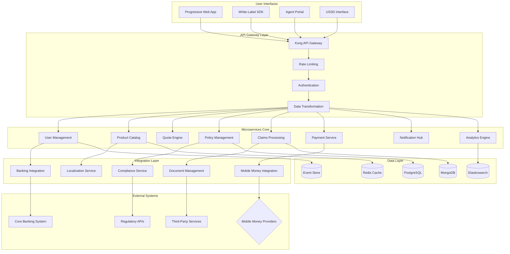
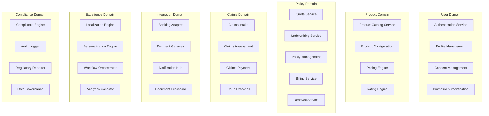
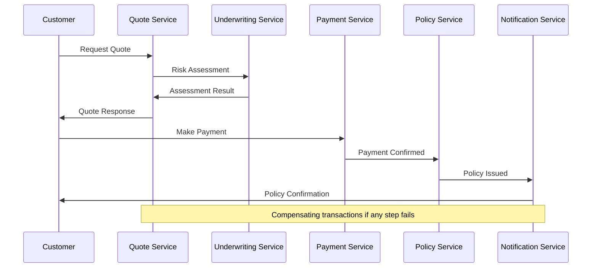
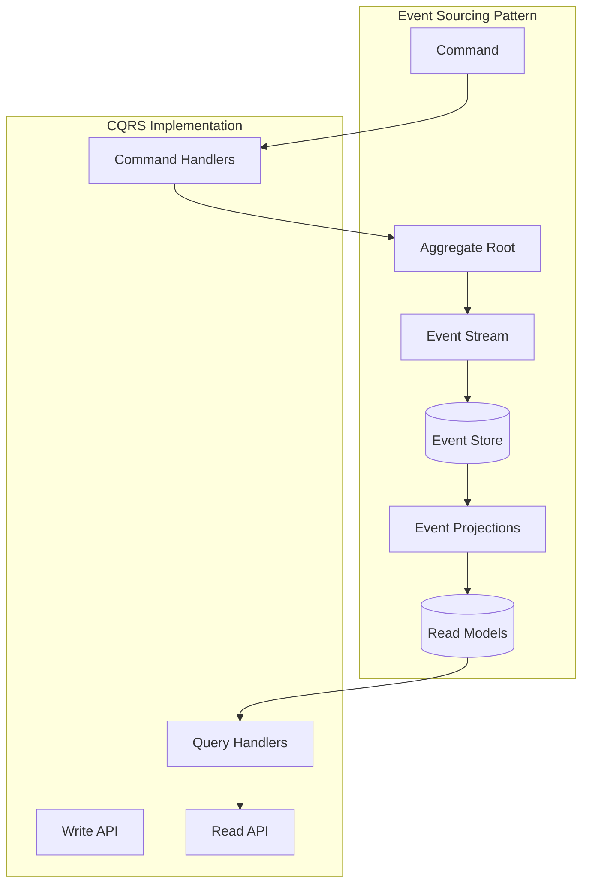
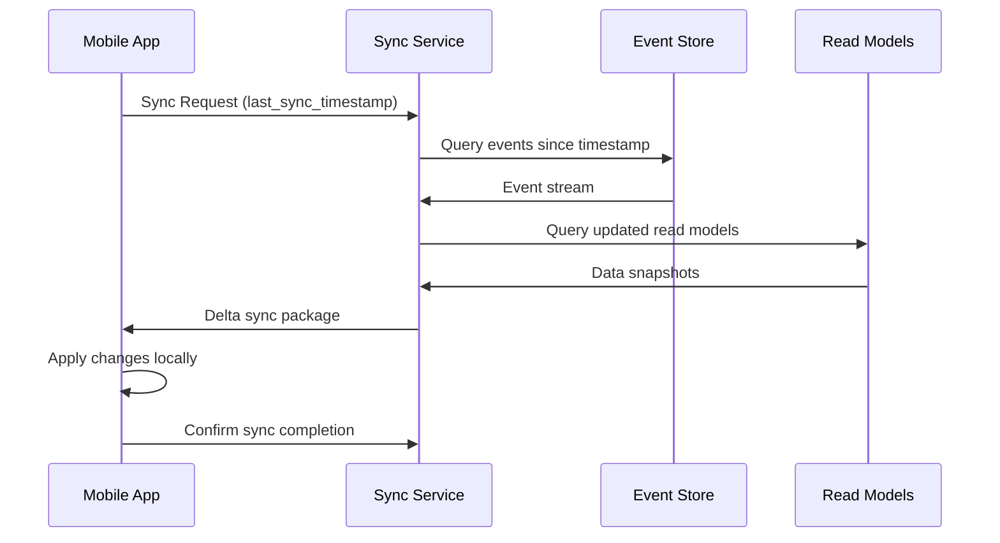
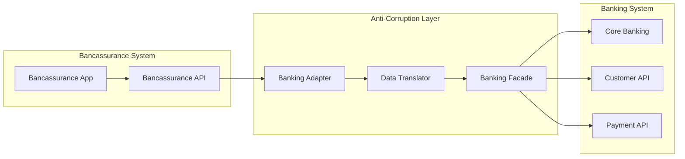
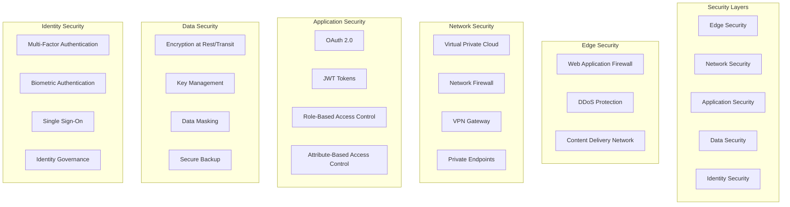
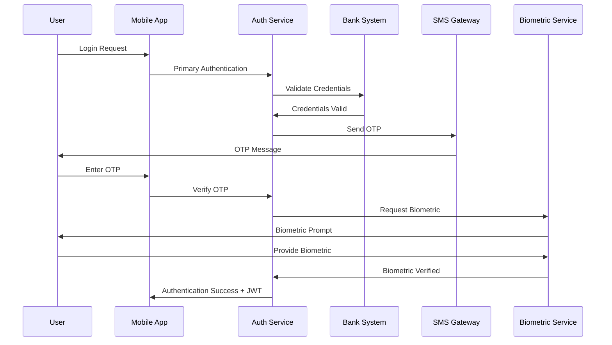

# Sub-Saharan African Bancassurance Platform - Core Architecture Design

## Executive Summary

This document presents the comprehensive core architecture design for a Sub-Saharan African Bancassurance Platform, addressing the unique challenges of financial inclusion, cultural diversity, offline-first mobile experiences, and regulatory compliance across multiple African markets. The architecture leverages cloud-native microservices, event-driven patterns, and progressive web technologies to deliver a culturally intelligent, accessible, and scalable insurance ecosystem.

**Key Architecture Principles:**
- **Offline-First**: Core functionality available without internet connectivity
- **Cultural Intelligence**: Dynamic adaptation to local languages, customs, and preferences
- **Financial Inclusion**: Micro-payment support and flexible payment scheduling
- **Trust-Centered**: Transparent, secure, and regulatory-compliant design
- **Mobile-Native**: Optimized for low-end Android devices on 2G/3G networks

## 1. System Architecture Overview

### 1.1 High-Level Architecture Diagram



### 1.2 Architecture Layers

#### Presentation Layer
- **Progressive Web App**: Primary user interface optimized for mobile-first experience
- **White-Label SDK**: Embeddable components for banking app integration
- **Agent Portal**: Field agent tools for assisted customer onboarding
- **USSD Interface**: Basic feature phone access for maximum reach

#### API Gateway Layer
- **Kong API Gateway**: Request routing, authentication, and rate limiting
- **Authentication Service**: Multi-factor authentication with banking SSO integration
- **Data Transformation**: Protocol adaptation and data format standardization
- **Rate Limiting**: Protection against abuse and ensuring fair usage

#### Business Logic Layer
- **Domain-driven microservices**: Independent, scalable business capabilities
- **Event-driven communication**: Asynchronous, resilient inter-service messaging
- **Cultural adaptation engine**: Dynamic content and workflow localization
- **Compliance orchestration**: Automated regulatory requirement enforcement

#### Integration Layer
- **Banking system adapters**: Core banking integration with anti-corruption patterns
- **Payment gateway abstraction**: Multi-provider mobile money integration
- **Document processing**: AI-powered document analysis and verification
- **Localization service**: Multi-language and cultural context management

#### Data Layer
- **Event sourcing**: Immutable event stream for audit and replay capabilities
- **Polyglot persistence**: Optimal data storage for different use cases
- **Caching strategy**: Multi-layer caching for performance optimization
- **Search and analytics**: Real-time insights and reporting capabilities

## 2. Microservices Architecture

### 2.1 Domain Boundaries and Services



### 2.2 Service Specifications

#### User Management Services

**Authentication Service**
```yaml
service_name: authentication-service
responsibilities:
  - Multi-factor authentication
  - Banking system SSO integration
  - Biometric authentication
  - Session management
  - Token validation
  
tech_stack:
  language: Node.js/TypeScript
  framework: Fastify
  database: PostgreSQL + Redis
  
api_endpoints:
  - POST /auth/login
  - POST /auth/mfa/verify
  - POST /auth/biometric/enroll
  - GET /auth/session/validate
  - DELETE /auth/logout
```

**Profile Management Service**
```yaml
service_name: profile-management-service
responsibilities:
  - Customer profile CRUD operations
  - KYC data management
  - Preference management
  - Family/beneficiary management
  - Cultural profile adaptation
  
data_model:
  customer_profile:
    - personal_information
    - kyc_status
    - cultural_preferences
    - language_preferences
    - communication_preferences
```

#### Insurance Core Services

**Product Catalog Service**
```yaml
service_name: product-catalog-service
responsibilities:
  - Insurance product definition
  - Feature and benefit management
  - Coverage configuration
  - Market-specific product variations
  - Multi-language product descriptions
  
data_model:
  insurance_product:
    - product_id
    - product_type (auto, health, life, property)
    - coverage_options
    - market_availability
    - localized_content
    - pricing_parameters
```

**Quote Engine Service**
```yaml
service_name: quote-engine-service
responsibilities:
  - Real-time premium calculation
  - Risk assessment integration
  - Multi-product quotation
  - Discount and promotion application
  - Quote comparison tools
  
calculation_factors:
  - customer_demographics
  - risk_assessment_data
  - coverage_selections
  - market_conditions
  - promotional_offers
```

### 2.3 Inter-Service Communication Patterns

#### Event-Driven Architecture
```yaml
event_patterns:
  policy_lifecycle:
    - quote_requested
    - quote_generated
    - application_submitted
    - underwriting_completed
    - policy_issued
    - premium_paid
    - policy_activated
    
  claims_lifecycle:
    - claim_reported
    - claim_validated
    - assessment_scheduled
    - assessment_completed
    - settlement_approved
    - payment_processed
    - claim_closed
```

#### Saga Pattern for Distributed Transactions


## 3. API Design Strategy

### 3.1 RESTful API Architecture

#### API Gateway Configuration
```yaml
api_gateway:
  platform: Kong
  features:
    - request_routing
    - authentication
    - rate_limiting
    - request_transformation
    - response_caching
    - api_versioning
    
  plugins:
    - oauth2
    - rate-limiting
    - cors
    - request-transformer
    - response-transformer
    - prometheus
```

#### API Versioning Strategy
```yaml
versioning_strategy:
  approach: URL_path_versioning
  format: /api/v{major}/v{minor}/{resource}
  
  version_lifecycle:
    - v1.0: Initial release
    - v1.1: Backward compatible additions
    - v2.0: Breaking changes (with deprecation period)
    
  deprecation_policy:
    - 12_months_notice
    - gradual_feature_removal
    - migration_guides_provided
```

### 3.2 Core API Specifications

#### User Management APIs
```yaml
authentication_api:
  base_path: /api/v1/auth
  endpoints:
    login:
      method: POST
      path: /login
      request_body:
        phone_number: string
        password: string
        remember_me: boolean
      response:
        access_token: string
        refresh_token: string
        expires_in: number
        user_profile: object
        
    mfa_verify:
      method: POST
      path: /mfa/verify
      request_body:
        token: string
        verification_code: string
      response:
        verified: boolean
        session_token: string
```

#### Insurance Product APIs
```yaml
product_api:
  base_path: /api/v1/products
  endpoints:
    list_products:
      method: GET
      path: /
      query_params:
        category: string (optional)
        market: string (required)
        language: string (optional)
      response:
        products: array
        total_count: number
        pagination: object
        
    get_product_details:
      method: GET
      path: /{product_id}
      path_params:
        product_id: string
      query_params:
        language: string (optional)
        include_pricing: boolean
      response:
        product: object
        coverage_options: array
        pricing_tiers: array
```

#### Quote and Policy APIs
```yaml
quote_api:
  base_path: /api/v1/quotes
  endpoints:
    generate_quote:
      method: POST
      path: /
      request_body:
        product_id: string
        customer_data: object
        coverage_selections: object
        risk_factors: object
      response:
        quote_id: string
        premium_amount: number
        coverage_summary: object
        valid_until: datetime
        
policy_api:
  base_path: /api/v1/policies
  endpoints:
    create_policy:
      method: POST
      path: /
      request_body:
        quote_id: string
        payment_method: string
        beneficiaries: array
      response:
        policy_id: string
        policy_number: string
        effective_date: datetime
        documents: array
```

### 3.3 GraphQL API for Complex Queries

```graphql
type Query {
  customer(id: ID!): Customer
  policies(customerId: ID!, status: PolicyStatus): [Policy]
  quotes(customerId: ID!, active: Boolean): [Quote]
  claims(customerId: ID!, status: ClaimStatus): [Claim]
}

type Customer {
  id: ID!
  profile: CustomerProfile
  policies: [Policy]
  claims: [Claim]
  paymentMethods: [PaymentMethod]
  preferences: CustomerPreferences
}

type Policy {
  id: ID!
  policyNumber: String!
  product: InsuranceProduct
  coverage: Coverage
  premiums: [Premium]
  status: PolicyStatus
  documents: [Document]
}

type Mutation {
  submitApplication(input: ApplicationInput!): ApplicationResult
  makePayment(input: PaymentInput!): PaymentResult
  submitClaim(input: ClaimInput!): ClaimResult
  updatePreferences(input: PreferencesInput!): PreferencesResult
}
```

### 3.4 API Security and Rate Limiting

#### Security Headers and Standards
```yaml
security_configuration:
  authentication: OAuth2 + JWT
  authorization: RBAC with ABAC extensions
  
  headers:
    - "X-Frame-Options: DENY"
    - "X-Content-Type-Options: nosniff"
    - "Strict-Transport-Security: max-age=31536000"
    - "Content-Security-Policy: default-src 'self'"
    
  cors_policy:
    allowed_origins: 
      - "https://*.bancassurance.com"
      - "https://*.partner-bank.com"
    allowed_methods: ["GET", "POST", "PUT", "DELETE"]
    allowed_headers: ["Authorization", "Content-Type"]
```

#### Rate Limiting Strategy
```yaml
rate_limiting:
  tiers:
    basic_user:
      requests_per_minute: 60
      burst_capacity: 100
      
    premium_user:
      requests_per_minute: 120
      burst_capacity: 200
      
    api_partner:
      requests_per_minute: 1000
      burst_capacity: 2000
      
  escalation_policy:
    - warning_at_80_percent
    - throttling_at_100_percent
    - temporary_block_at_150_percent
```

## 4. Data Architecture with Event Sourcing

### 4.1 Event Sourcing Implementation

#### Event Store Architecture


#### Core Events Schema
```yaml
event_schema:
  base_event:
    event_id: uuid
    aggregate_id: uuid
    aggregate_version: integer
    event_type: string
    event_data: json
    metadata: json
    timestamp: datetime
    correlation_id: uuid
    causation_id: uuid
    
  policy_events:
    - PolicyQuoteRequested
    - PolicyQuoteGenerated
    - PolicyApplicationSubmitted
    - PolicyUnderwritingCompleted
    - PolicyIssued
    - PolicyActivated
    - PolicyRenewed
    - PolicyCancelled
    
  claims_events:
    - ClaimReported
    - ClaimDocumentsUploaded
    - ClaimAssessmentScheduled
    - ClaimAssessmentCompleted
    - ClaimApproved
    - ClaimRejected
    - ClaimPaymentProcessed
    - ClaimClosed
```

### 4.2 Data Storage Strategy

#### Polyglot Persistence
```yaml
database_strategy:
  event_store:
    technology: EventStore DB
    use_case: Event sourcing and audit trail
    retention: Infinite (with archival)
    
  transactional_data:
    technology: PostgreSQL
    use_case: User profiles, policy management
    scaling: Master-slave replication
    backup: Point-in-time recovery
    
  document_data:
    technology: MongoDB
    use_case: Claims documents, flexible schemas
    scaling: Sharded clusters
    indexing: Text search and geo-spatial
    
  cache_layer:
    technology: Redis Cluster
    use_case: Session data, frequently accessed data
    persistence: AOF + RDB snapshots
    eviction: LRU policy
    
  search_and_analytics:
    technology: Elasticsearch
    use_case: Full-text search, analytics
    scaling: Multi-node cluster
    monitoring: X-Pack monitoring
```

#### Data Modeling Examples
```json
// Customer Aggregate Events
{
  "eventType": "CustomerRegistered",
  "aggregateId": "customer-12345",
  "eventData": {
    "customerId": "customer-12345",
    "personalInfo": {
      "firstName": "Sarah",
      "lastName": "Mwangi",
      "dateOfBirth": "1990-05-15",
      "phoneNumber": "+254722123456"
    },
    "preferences": {
      "language": "sw",
      "currency": "KES",
      "communicationChannel": "sms"
    },
    "kycStatus": "pending"
  },
  "metadata": {
    "source": "mobile-app",
    "userAgent": "Mozilla/5.0...",
    "ipAddress": "192.168.1.1"
  }
}

// Policy Aggregate Events
{
  "eventType": "PolicyIssued",
  "aggregateId": "policy-67890",
  "eventData": {
    "policyId": "policy-67890",
    "customerId": "customer-12345",
    "productId": "auto-insurance-basic",
    "policyNumber": "POL-2024-001234",
    "effectiveDate": "2024-01-01T00:00:00Z",
    "expiryDate": "2024-12-31T23:59:59Z",
    "premiumAmount": 50000,
    "currency": "KES",
    "paymentFrequency": "monthly"
  }
}
```

### 4.3 Data Synchronization and Consistency

#### Eventual Consistency Model
```yaml
consistency_patterns:
  strong_consistency:
    - user_authentication
    - payment_transactions
    - policy_issuance
    
  eventual_consistency:
    - analytics_data
    - recommendation_engines
    - marketing_preferences
    
  compensation_patterns:
    - saga_orchestration
    - event_replay_mechanisms
    - conflict_resolution_strategies
```

#### Data Synchronization for Offline Support


## 5. Integration Architecture

### 5.1 Banking System Integration

#### Anti-Corruption Layer Pattern


#### Banking Integration Specifications
```yaml
banking_integration:
  customer_data:
    endpoint: /api/v1/customers/{customer_id}
    method: GET
    authentication: OAuth2 + mTLS
    data_mapping:
      bank_customer_id: bancassurance_customer_id
      bank_account_number: primary_account_reference
      kyc_status: customer_verification_status
    
  payment_processing:
    endpoint: /api/v1/payments
    method: POST
    authentication: OAuth2 + digital_signature
    supported_methods:
      - bank_transfer
      - direct_debit
      - mobile_banking
    
  account_verification:
    endpoint: /api/v1/accounts/verify
    method: POST
    real_time: true
    validation_types:
      - account_existence
      - account_ownership
      - balance_verification
```

### 5.2 Mobile Money Integration

#### Multi-Provider Abstraction
```yaml
mobile_money_providers:
  west_africa:
    mtn_momo:
      api_version: v2.0
      authentication: api_key + oauth2
      supported_operations: [pay, collect, status]
      
    orange_money:
      api_version: v1.0
      authentication: basic + hmac
      supported_operations: [pay, collect, balance]
      
  east_africa:
    m_pesa:
      api_version: v1.0
      authentication: oauth2 + certificate
      supported_operations: [stk_push, b2c, c2b, status]
      
    airtel_money:
      api_version: v2.0
      authentication: bearer_token
      supported_operations: [payment, disbursement, inquiry]
```

#### Payment Abstraction Layer
```typescript
interface PaymentProvider {
  initiatePayment(request: PaymentRequest): Promise<PaymentResponse>;
  checkPaymentStatus(transactionId: string): Promise<PaymentStatus>;
  refundPayment(transactionId: string, amount: number): Promise<RefundResponse>;
  getBalance(accountId: string): Promise<BalanceResponse>;
}

class MobileMoneyManager {
  private providers: Map<string, PaymentProvider>;
  
  async processPayment(request: PaymentRequest): Promise<PaymentResponse> {
    const provider = this.selectProvider(request.country, request.provider);
    
    try {
      const response = await provider.initiatePayment(request);
      await this.logTransaction(request, response);
      return response;
    } catch (error) {
      return this.handlePaymentFailure(request, error);
    }
  }
  
  private selectProvider(country: string, preferredProvider?: string): PaymentProvider {
    const availableProviders = this.getProvidersForCountry(country);
    
    if (preferredProvider && availableProviders.has(preferredProvider)) {
      return availableProviders.get(preferredProvider);
    }
    
    return this.selectOptimalProvider(availableProviders);
  }
}
```

### 5.3 Document Management Integration

#### AI-Powered Document Processing
```yaml
document_processing:
  ocr_services:
    primary: Google Cloud Vision API
    fallback: Tesseract OCR
    languages: [en, fr, sw, ha, yo, zu, ar]
    
  document_types:
    identity_documents:
      - national_id
      - passport
      - driving_license
      
    insurance_documents:
      - policy_certificates
      - claims_forms
      - medical_reports
      - vehicle_registration
      
  processing_pipeline:
    1: document_upload
    2: format_detection
    3: ocr_processing
    4: data_extraction
    5: validation
    6: storage
    7: indexing
```

#### Document Storage Strategy
```yaml
storage_strategy:
  original_documents:
    storage: AWS S3 / Azure Blob
    encryption: AES-256
    retention: 7_years
    backup: Cross-region replication
    
  processed_data:
    storage: MongoDB
    indexing: Full-text search
    versioning: Document version history
    
  temporary_processing:
    storage: Redis
    ttl: 24_hours
    cleanup: Automatic expiration
```

### 5.4 Regulatory Compliance Integration

#### Multi-Country Compliance Framework
```yaml
compliance_framework:
  data_residency:
    south_africa: Local storage required
    nigeria: Local processing allowed
    kenya: No restrictions
    ghana: Banking data local storage
    
  regulatory_apis:
    south_africa:
      fais_api: Financial services compliance
      popia_api: Data protection compliance
      
    nigeria:
      naicom_api: Insurance regulatory reporting
      ndpr_api: Data protection compliance
      
    kenya:
      ira_api: Insurance regulatory authority
      dpo_api: Data protection office
      
  automated_reporting:
    frequency: Monthly, quarterly, annually
    format: XML, JSON, CSV
    delivery: SFTP, API, email
    validation: Schema validation, business rules
```

## 6. Security Architecture Framework

### 6.1 Multi-Layer Security Model



### 6.2 Authentication and Authorization

#### Multi-Factor Authentication Flow


#### Role-Based Access Control Matrix
```yaml
rbac_configuration:
  roles:
    customer:
      permissions:
        - view_own_policies
        - submit_claims
        - make_payments
        - update_profile
        
    agent:
      permissions:
        - view_customer_policies
        - assist_applications
        - process_payments
        - access_customer_data
        
    underwriter:
      permissions:
        - review_applications
        - approve_policies
        - set_premiums
        - access_risk_data
        
    claims_assessor:
      permissions:
        - view_claims
        - approve_settlements
        - access_claim_documents
        - communicate_with_customers
        
    admin:
      permissions:
        - manage_users
        - configure_products
        - access_all_data
        - system_administration
```

### 6.3 Data Protection and Privacy

#### Encryption Strategy
```yaml
encryption_configuration:
  data_at_rest:
    algorithm: AES-256-GCM
    key_management: AWS KMS / Azure Key Vault
    rotation: Automatic 90-day rotation
    
  data_in_transit:
    protocol: TLS 1.3
    certificate_management: Let's Encrypt + commercial certs
    perfect_forward_secrecy: enabled
    
  application_level:
    sensitive_fields: AES-256 column encryption
    pii_data: Format-preserving encryption
    search_capability: Encrypted search indices
    
  key_management:
    hardware_security_modules: FIPS 140-2 Level 3
    key_escrow: Multi-party approval required
    audit_trail: Complete key lifecycle logging
```

#### Privacy by Design Implementation
```yaml
privacy_framework:
  data_minimization:
    - collect_only_necessary_data
    - purpose_limitation_enforcement
    - retention_period_automation
    - automatic_data_deletion
    
  consent_management:
    - granular_consent_options
    - consent_withdrawal_mechanisms
    - consent_history_tracking
    - purpose_binding_enforcement
    
  data_subject_rights:
    - automated_data_export
    - right_to_rectification
    - right_to_erasure
    - data_portability_apis
    
  privacy_impact_assessments:
    - automated_pia_triggers
    - risk_assessment_workflows
    - compliance_verification
    - remediation_tracking
```

### 6.4 Security Monitoring and Incident Response

#### Security Information and Event Management (SIEM)
```yaml
siem_configuration:
  log_sources:
    - application_logs
    - access_logs
    - database_audit_logs
    - network_traffic_logs
    - security_device_logs
    
  threat_detection:
    - behavioral_analytics
    - machine_learning_anomaly_detection
    - signature_based_detection
    - threat_intelligence_integration
    
  incident_response:
    - automated_alert_generation
    - incident_classification
    - response_playbooks
    - forensic_data_collection
    
  compliance_monitoring:
    - regulatory_compliance_dashboards
    - automated_compliance_reporting
    - audit_trail_maintenance
    - evidence_collection
```

## Conclusion

This core architecture design provides a comprehensive foundation for the Sub-Saharan African Bancassurance Platform, addressing the unique challenges of the African market through innovative technical solutions. The architecture emphasizes:

1. **Cultural Intelligence**: Dynamic adaptation to local languages, customs, and business practices
2. **Offline-First Design**: Robust functionality without reliable internet connectivity
3. **Financial Inclusion**: Micro-payment support and flexible payment scheduling
4. **Security and Compliance**: Multi-layered security with regulatory compliance across multiple countries
5. **Scalability**: Cloud-native microservices architecture supporting millions of users

The microservices architecture with event sourcing provides the flexibility and scalability needed to serve diverse African markets while maintaining data consistency and audit capabilities. The integration architecture enables seamless connectivity with banking systems and mobile money providers across the continent.

This architecture serves as the technical foundation for Part 2, which will detail the implementation strategy, deployment architecture, and operational considerations for bringing this platform to market across Sub-Saharan Africa.