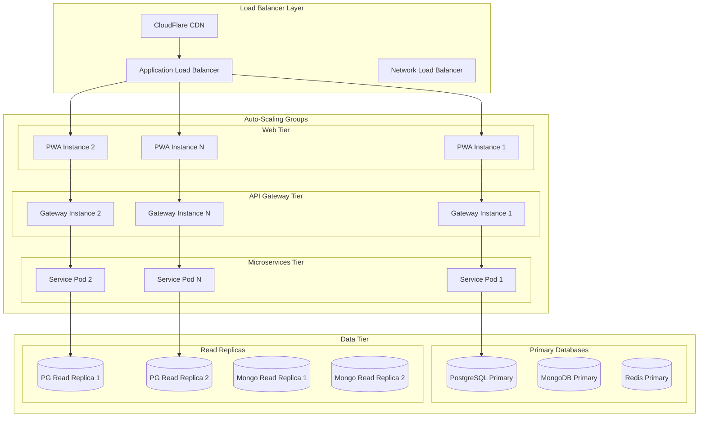
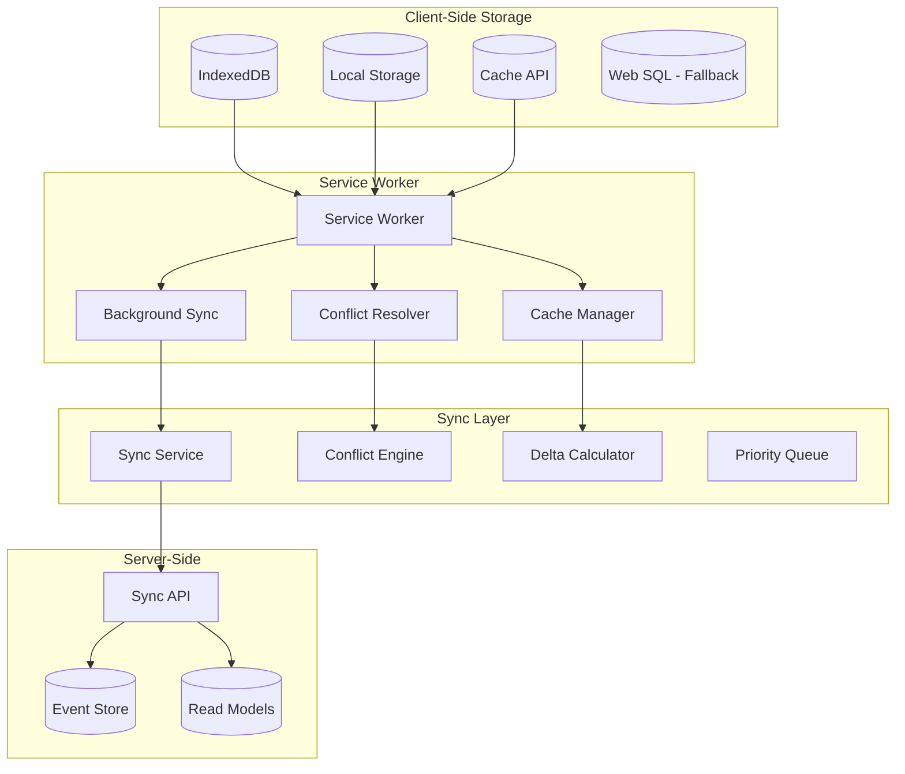
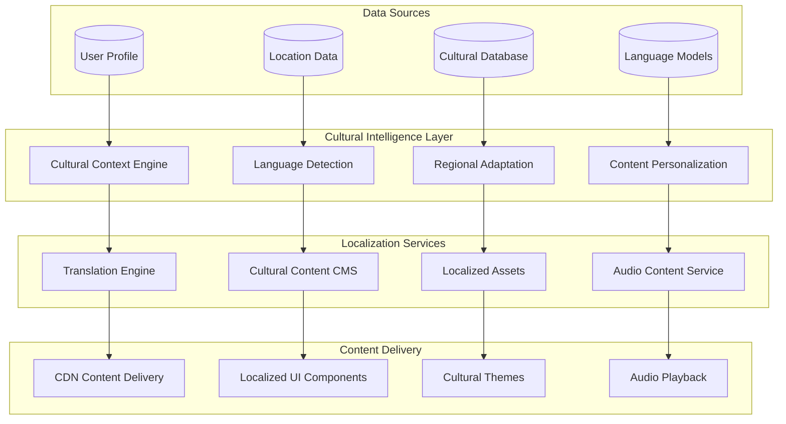
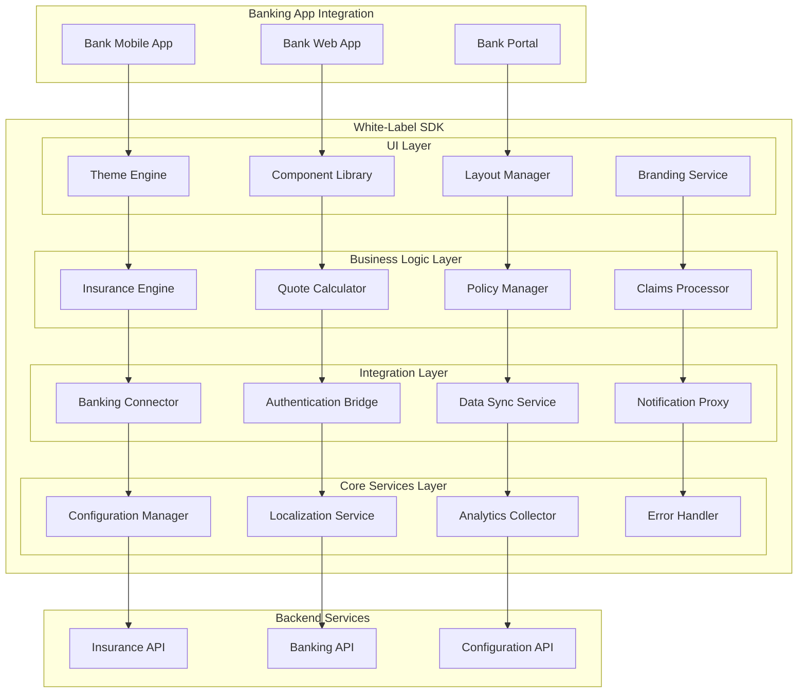
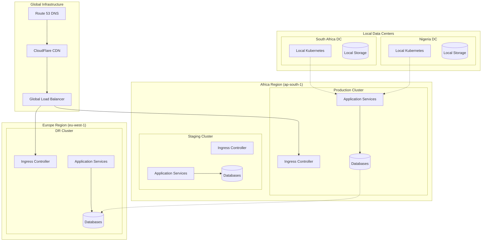

# Sub-Saharan African Bancassurance Platform - Implementation & Operations

## Executive Summary

This document presents the comprehensive implementation and operational strategy for the Sub-Saharan African Bancassurance Platform, building upon the core architecture design. It addresses scalability requirements, offline-first implementation, cultural adaptation engine, white-label SDK architecture, deployment strategy, and performance optimization for the unique challenges of African markets.

**Key Implementation Focus Areas:**
- **Scalability Design**: Auto-scaling microservices supporting millions of concurrent users
- **Offline-First Architecture**: Intelligent synchronization strategies for poor connectivity
- **Cultural Adaptation Engine**: Dynamic localization and cultural context awareness
- **White-Label SDK**: Seamless banking app integration with brand customization
- **Performance Optimization**: Sub-3-second load times on 2G networks with entry-level devices
- **Deployment Architecture**: Multi-region Kubernetes deployment with disaster recovery

## 1. Scalability Design and Auto-Scaling

### 1.1 Horizontal Scaling Architecture



### 1.2 Auto-Scaling Configuration

#### Kubernetes Horizontal Pod Autoscaler (HPA)
```yaml
apiVersion: autoscaling/v2
kind: HorizontalPodAutoscaler
metadata:
  name: quote-engine-hpa
spec:
  scaleTargetRef:
    apiVersion: apps/v1
    kind: Deployment
    name: quote-engine
  minReplicas: 3
  maxReplicas: 50
  metrics:
  - type: Resource
    resource:
      name: cpu
      target:
        type: Utilization
        averageUtilization: 70
  - type: Resource
    resource:
      name: memory
      target:
        type: Utilization
        averageUtilization: 80
  - type: Pods
    pods:
      metric:
        name: requests_per_second
      target:
        type: AverageValue
        averageValue: "100"
  behavior:
    scaleUp:
      stabilizationWindowSeconds: 60
      policies:
      - type: Percent
        value: 100
        periodSeconds: 60
    scaleDown:
      stabilizationWindowSeconds: 300
      policies:
      - type: Percent
        value: 10
        periodSeconds: 60
```

#### Custom Metrics for Business Logic Scaling
```yaml
custom_metrics:
  quote_processing_time:
    threshold: 2_seconds
    scale_up_trigger: average > 2s for 2 minutes
    scale_down_trigger: average < 1s for 10 minutes
    
  active_user_sessions:
    threshold: 1000_per_pod
    scale_up_trigger: sessions > 1000 per pod
    scale_down_trigger: sessions < 500 per pod
    
  payment_queue_depth:
    threshold: 100_pending_payments
    scale_up_trigger: queue > 100 for 1 minute
    scale_down_trigger: queue < 10 for 5 minutes
    
  claims_processing_backlog:
    threshold: 50_pending_claims
    scale_up_trigger: backlog > 50 for 5 minutes
    scale_down_trigger: backlog < 10 for 15 minutes
```

### 1.3 Database Scaling Strategy

#### PostgreSQL Scaling Configuration
```yaml
postgresql_scaling:
  primary_database:
    instance_type: db.r6g.2xlarge
    storage: 1TB SSD
    max_connections: 2000
    connection_pooling: PgBouncer
    
  read_replicas:
    count: 3
    distribution: [us-east-1a, us-east-1b, us-east-1c]
    lag_monitoring: <100ms
    automatic_failover: enabled
    
  connection_pooling:
    pgbouncer_config:
      pool_mode: transaction
      max_client_conn: 2000
      default_pool_size: 100
      reserve_pool_size: 20
      
  sharding_strategy:
    partition_key: customer_id
    shard_count: 16
    rebalancing: automatic
```

#### MongoDB Scaling Configuration
```yaml
mongodb_scaling:
  sharded_cluster:
    config_servers: 3
    shard_count: 4
    replica_set_size: 3
    
  sharding_strategy:
    shard_key: {customer_id: 1, created_at: 1}
    chunks_per_shard: 1000
    balancer_window: "01:00-05:00"
    
  indexing_strategy:
    compound_indexes:
      - {customer_id: 1, document_type: 1, created_at: -1}
      - {claim_id: 1, status: 1, updated_at: -1}
    text_indexes:
      - {document_content: "text", title: "text"}
    geospatial_indexes:
      - {location: "2dsphere"}
```

### 1.4 Load Balancing and Traffic Management

#### Istio Service Mesh Configuration
```yaml
apiVersion: networking.istio.io/v1beta1
kind: VirtualService
metadata:
  name: quote-engine-routing
spec:
  hosts:
  - quote-engine
  http:
  - match:
    - headers:
        x-user-type:
          exact: premium
    route:
    - destination:
        host: quote-engine
        subset: high-performance
      weight: 100
  - match:
    - headers:
        x-region:
          exact: west-africa
    route:
    - destination:
        host: quote-engine
        subset: localized-wa
      weight: 100
  - route:
    - destination:
        host: quote-engine
        subset: standard
      weight: 100
  fault:
    delay:
      percentage:
        value: 0.1
      fixedDelay: 5s
  retries:
    attempts: 3
    perTryTimeout: 2s
```

## 2. Offline-First Architecture with Sync Strategies

### 2.1 Offline Data Storage Strategy



### 2.2 Progressive Sync Implementation

#### Sync Service Architecture
```typescript
interface SyncStrategy {
  priority: SyncPriority;
  conflictResolution: ConflictResolutionStrategy;
  retryPolicy: RetryPolicy;
  batchSize: number;
}

enum SyncPriority {
  CRITICAL = 1,    // User authentication, payments
  HIGH = 2,        // Policy data, claims
  MEDIUM = 3,      // Customer preferences, documents
  LOW = 4          // Analytics, marketing data
}

class OfflineSyncManager {
  private syncQueue: Map<SyncPriority, SyncItem[]> = new Map();
  private isOnline: boolean = navigator.onLine;
  private lastSyncTimestamp: number = 0;
  
  async initialize(): Promise<void> {
    this.registerServiceWorker();
    this.setupEventListeners();
    await this.loadPersistedQueue();
    
    if (this.isOnline) {
      this.startSyncProcess();
    }
  }
  
  async addToSyncQueue(item: SyncItem): Promise<void> {
    const priority = this.determinePriority(item);
    
    if (!this.syncQueue.has(priority)) {
      this.syncQueue.set(priority, []);
    }
    
    this.syncQueue.get(priority)!.push(item);
    await this.persistQueue();
    
    if (this.isOnline && priority === SyncPriority.CRITICAL) {
      this.processCriticalSync();
    }
  }
  
  private async processSyncQueue(): Promise<void> {
    const priorities = Array.from(this.syncQueue.keys()).sort();
    
    for (const priority of priorities) {
      const items = this.syncQueue.get(priority) || [];
      
      for (const item of items) {
        try {
          await this.syncItem(item);
          this.removeFromQueue(priority, item);
        } catch (error) {
          await this.handleSyncError(item, error);
        }
      }
    }
  }
  
  private async syncItem(item: SyncItem): Promise<void> {
    const endpoint = this.getSyncEndpoint(item.type);
    const payload = await this.prepareSyncPayload(item);
    
    const response = await fetch(endpoint, {
      method: 'POST',
      headers: {
        'Content-Type': 'application/json',
        'X-Sync-Token': await this.getSyncToken(),
        'X-Last-Sync': this.lastSyncTimestamp.toString()
      },
      body: JSON.stringify(payload)
    });
    
    if (!response.ok) {
      throw new SyncError(`Sync failed: ${response.status}`);
    }
    
    const result = await response.json();
    await this.applySyncResult(result);
  }
}
```

### 2.3 Conflict Resolution Strategy

#### Conflict Resolution Engine
```typescript
interface ConflictResolution {
  strategy: 'server_wins' | 'client_wins' | 'merge' | 'user_choice';
  mergeFunction?: (server: any, client: any) => any;
  userPrompt?: ConflictPrompt;
}

class ConflictResolver {
  private resolutionStrategies: Map<string, ConflictResolution> = new Map([
    ['user_profile', {
      strategy: 'merge',
      mergeFunction: this.mergeUserProfile
    }],
    ['policy_data', {
      strategy: 'server_wins'  // Financial data should be authoritative
    }],
    ['preferences', {
      strategy: 'client_wins'  // User preferences prioritize client
    }],
    ['claims_draft', {
      strategy: 'user_choice',
      userPrompt: {
        title: 'Conflict in Claim Draft',
        message: 'Your claim has been modified. Choose which version to keep.',
        options: ['Keep My Changes', 'Use Server Version', 'Merge Both']
      }
    }]
  ]);
  
  async resolveConflict(
    entity: string, 
    serverVersion: any, 
    clientVersion: any
  ): Promise<any> {
    const resolution = this.resolutionStrategies.get(entity);
    
    if (!resolution) {
      throw new Error(`No conflict resolution strategy for ${entity}`);
    }
    
    switch (resolution.strategy) {
      case 'server_wins':
        return serverVersion;
        
      case 'client_wins':
        return clientVersion;
        
      case 'merge':
        return resolution.mergeFunction!(serverVersion, clientVersion);
        
      case 'user_choice':
        return await this.promptUserForResolution(
          resolution.userPrompt!,
          serverVersion,
          clientVersion
        );
        
      default:
        throw new Error(`Unknown resolution strategy: ${resolution.strategy}`);
    }
  }
  
  private mergeUserProfile(server: UserProfile, client: UserProfile): UserProfile {
    return {
      ...server,
      ...client,
      // Server wins for critical data
      customerId: server.customerId,
      kycStatus: server.kycStatus,
      accountBalance: server.accountBalance,
      // Client wins for preferences
      language: client.language || server.language,
      communicationPreferences: client.communicationPreferences || server.communicationPreferences,
      // Merge arrays
      paymentMethods: this.mergeArrays(server.paymentMethods, client.paymentMethods),
      // Use latest timestamp for metadata
      lastUpdated: Math.max(server.lastUpdated, client.lastUpdated)
    };
  }
}
```

### 2.4 Offline Capabilities Implementation

#### Core Offline Features
```yaml
offline_features:
  policy_management:
    - view_active_policies
    - download_policy_documents
    - calculate_renewal_premiums
    - update_beneficiaries (queued)
    
  claims_processing:
    - initiate_claim_report
    - upload_supporting_documents
    - take_photos_for_evidence
    - track_claim_status (cached)
    
  payments:
    - view_payment_history
    - schedule_future_payments (queued)
    - calculate_premium_due
    - mobile_money_integration (limited)
    
  customer_service:
    - access_faq_content
    - contact_information
    - chat_history (cached)
    - callback_scheduling (queued)
```

#### Service Worker Implementation
```javascript
// sw.js - Service Worker for Offline Support
const CACHE_NAME = 'bancassurance-v2.1.0';
const CRITICAL_RESOURCES = [
  '/',
  '/static/js/main.js',
  '/static/css/main.css',
  '/static/images/icons/',
  '/offline.html'
];

const CACHE_STRATEGIES = {
  '/api/policies': 'stale-while-revalidate',
  '/api/claims': 'network-first',
  '/api/payments': 'network-only',
  '/api/content': 'cache-first'
};

self.addEventListener('install', event => {
  event.waitUntil(
    caches.open(CACHE_NAME)
      .then(cache => cache.addAll(CRITICAL_RESOURCES))
  );
});

self.addEventListener('fetch', event => {
  if (event.request.method !== 'GET') {
    // Handle POST requests for offline queue
    if (!navigator.onLine) {
      event.respondWith(handleOfflineRequest(event.request));
      return;
    }
  }
  
  const strategy = getCacheStrategy(event.request.url);
  event.respondWith(executeStrategy(strategy, event.request));
});

async function handleOfflineRequest(request) {
  const requestData = await request.clone().json();
  
  // Queue the request for later sync
  await queueOfflineRequest({
    url: request.url,
    method: request.method,
    headers: [...request.headers.entries()],
    body: requestData,
    timestamp: Date.now()
  });
  
  // Return optimistic response
  return new Response(JSON.stringify({
    success: true,
    queued: true,
    message: 'Request queued for sync when online'
  }), {
    headers: { 'Content-Type': 'application/json' }
  });
}

self.addEventListener('sync', event => {
  if (event.tag === 'background-sync') {
    event.waitUntil(processOfflineQueue());
  }
});
```

## 3. Cultural Adaptation Engine Design

### 3.1 Dynamic Localization Architecture



### 3.2 Multi-Language Content Management

#### Content Localization Framework
```typescript
interface LocalizationContext {
  language: string;
  country: string;
  region: string;
  culturalGroup: string;
  literacyLevel: 'low' | 'medium' | 'high';
  preferredContentType: 'text' | 'audio' | 'visual' | 'mixed';
}

interface LocalizedContent {
  id: string;
  baseContent: string;
  translations: Map<string, Translation>;
  culturalAdaptations: Map<string, CulturalAdaptation>;
  audioVersions: Map<string, AudioContent>;
  visualMetaphors: Map<string, VisualContent>;
}

class CulturalAdaptationEngine {
  private contentDatabase: Map<string, LocalizedContent> = new Map();
  private culturalRules: Map<string, CulturalRule[]> = new Map();
  private translationCache: Map<string, string> = new Map();
  
  async getLocalizedContent(
    contentId: string, 
    context: LocalizationContext
  ): Promise<LocalizedContent> {
    const baseContent = this.contentDatabase.get(contentId);
    if (!baseContent) {
      throw new Error(`Content not found: ${contentId}`);
    }
    
    const cacheKey = `${contentId}_${JSON.stringify(context)}`;
    
    if (this.translationCache.has(cacheKey)) {
      return JSON.parse(this.translationCache.get(cacheKey)!);
    }
    
    const adaptedContent = await this.adaptContent(baseContent, context);
    this.translationCache.set(cacheKey, JSON.stringify(adaptedContent));
    
    return adaptedContent;
  }
  
  private async adaptContent(
    content: LocalizedContent, 
    context: LocalizationContext
  ): Promise<LocalizedContent> {
    const culturalRules = this.getCulturalRules(context);
    let adaptedContent = { ...content };
    
    // Apply language translation
    adaptedContent = await this.translateContent(adaptedContent, context.language);
    
    // Apply cultural adaptations
    for (const rule of culturalRules) {
      adaptedContent = await this.applyCulturalRule(adaptedContent, rule, context);
    }
    
    // Adjust for literacy level
    adaptedContent = await this.adjustForLiteracy(adaptedContent, context.literacyLevel);
    
    // Add appropriate media
    adaptedContent = await this.addCulturalMedia(adaptedContent, context);
    
    return adaptedContent;
  }
  
  private async applyCulturalRule(
    content: LocalizedContent,
    rule: CulturalRule,
    context: LocalizationContext
  ): Promise<LocalizedContent> {
    switch (rule.type) {
      case 'greeting_formality':
        return this.adjustGreetingFormality(content, rule.parameters);
        
      case 'family_structure':
        return this.adaptFamilyReferences(content, rule.parameters);
        
      case 'religious_sensitivity':
        return this.applyReligiousSensitivity(content, rule.parameters);
        
      case 'economic_context':
        return this.adjustEconomicExamples(content, rule.parameters);
        
      case 'gender_roles':
        return this.adaptGenderReferences(content, rule.parameters);
        
      default:
        return content;
    }
  }
}
```

### 3.3 Cultural Context Database

#### Cultural Adaptation Rules
```yaml
cultural_adaptations:
  west_africa:
    languages: [english, french, yoruba, hausa, wolof]
    cultural_values:
      - community_over_individual
      - elder_respect
      - extended_family_importance
      - religious_integration
    
    communication_style:
      formality: high
      storytelling: preferred
      metaphors: agricultural_community_based
      colors:
        positive: [green, gold, blue]
        negative: [red_in_financial_context]
        
    insurance_concepts:
      insurance: "community_protection_fund"
      premium: "monthly_contribution"
      claim: "community_help_request"
      beneficiary: "family_support_recipient"
  
  east_africa:
    languages: [english, swahili, amharic, somali]
    cultural_values:
      - ubuntu_philosophy
      - harambee_cooperation
      - ancestral_respect
      - family_honor
    
    communication_style:
      formality: medium_high
      directness: moderate
      metaphors: livestock_agriculture_based
      colors:
        positive: [blue, green, white]
        negative: [black_in_mourning_context]
        
    insurance_concepts:
      insurance: "harambee_protection"
      premium: "group_contribution"
      claim: "community_assistance"
      beneficiary: "family_beneficiary"
  
  southern_africa:
    languages: [english, zulu, afrikaans, xhosa]
    cultural_values:
      - ubuntu_philosophy
      - collective_responsibility
      - traditional_authority_respect
      - mineral_wealth_awareness
    
    communication_style:
      formality: medium
      directness: high
      metaphors: mining_community_based
      colors:
        positive: [blue, gold, green]
        negative: [red_political_context]
```

### 3.4 Audio Content Generation

#### Text-to-Speech Integration
```typescript
interface AudioContentService {
  generateAudio(text: string, language: string, voice: VoiceProfile): Promise<AudioBuffer>;
  cacheAudioContent(contentId: string, audio: AudioBuffer): Promise<void>;
  getAudioContent(contentId: string, language: string): Promise<AudioBuffer | null>;
}

class MultilingualAudioService implements AudioContentService {
  private audioCache: Map<string, AudioBuffer> = new Map();
  private voiceProfiles: Map<string, VoiceProfile> = new Map();
  
  constructor() {
    this.initializeVoiceProfiles();
  }
  
  async generateAudio(
    text: string, 
    language: string, 
    voice: VoiceProfile
  ): Promise<AudioBuffer> {
    const cacheKey = `${this.hashText(text)}_${language}_${voice.id}`;
    
    if (this.audioCache.has(cacheKey)) {
      return this.audioCache.get(cacheKey)!;
    }
    
    const audioBuffer = await this.synthesizeSpeech(text, language, voice);
    this.audioCache.set(cacheKey, audioBuffer);
    
    return audioBuffer;
  }
  
  private async synthesizeSpeech(
    text: string,
    language: string,
    voice: VoiceProfile
  ): Promise<AudioBuffer> {
    // Use cloud TTS service (Google Cloud TTS, AWS Polly, or Azure Speech)
    const response = await fetch('/api/tts/synthesize', {
      method: 'POST',
      headers: { 'Content-Type': 'application/json' },
      body: JSON.stringify({
        text,
        language,
        voice: voice.cloudVoiceId,
        audioConfig: {
          audioEncoding: 'MP3',
          sampleRateHertz: 22050,
          pitch: voice.pitch,
          speakingRate: voice.speakingRate
        }
      })
    });
    
    const arrayBuffer = await response.arrayBuffer();
    return new AudioBuffer(arrayBuffer);
  }
  
  private initializeVoiceProfiles(): void {
    this.voiceProfiles.set('sw-female-natural', {
      id: 'sw-female-natural',
      language: 'sw',
      gender: 'female',
      cloudVoiceId: 'sw-KE-Standard-A',
      pitch: 0.0,
      speakingRate: 0.9,
      culturalContext: 'respectful_elder_addressing_youth'
    });
    
    this.voiceProfiles.set('ha-male-authoritative', {
      id: 'ha-male-authoritative',
      language: 'ha',
      gender: 'male',
      cloudVoiceId: 'ha-NG-Standard-A',
      pitch: -2.0,
      speakingRate: 0.85,
      culturalContext: 'traditional_authority_explaining'
    });
  }
}
```

## 4. White-Label SDK Architecture

### 4.1 SDK Component Architecture



### 4.2 SDK Implementation Framework

#### Core SDK Structure
```typescript
interface BancassuranceSDKConfig {
  bankId: string;
  apiEndpoint: string;
  theme: BrandTheme;
  features: FeatureConfiguration;
  localization: LocalizationConfig;
  authentication: AuthenticationConfig;
}

interface BrandTheme {
  primaryColor: string;
  secondaryColor: string;
  accentColor: string;
  logoUrl: string;
  fontFamily: string;
  borderRadius: number;
  spacing: SpacingScale;
  typography: TypographyScale;
}

class BancassuranceSDK {
  private config: BancassuranceSDKConfig;
  private themeEngine: ThemeEngine;
  private componentRegistry: ComponentRegistry;
  private eventBus: EventBus;
  
  constructor(config: BancassuranceSDKConfig) {
    this.config = config;
    this.themeEngine = new ThemeEngine(config.theme);
    this.componentRegistry = new ComponentRegistry();
    this.eventBus = new EventBus();
    
    this.initializeSDK();
  }
  
  async initialize(): Promise<void> {
    await this.loadConfiguration();
    await this.setupAuthentication();
    await this.initializeLocalization();
    await this.registerComponents();
    
    this.eventBus.emit('sdk:initialized', { bankId: this.config.bankId });
  }
  
  createInsuranceModule(containerId: string): InsuranceModule {
    return new InsuranceModule({
      containerId,
      theme: this.themeEngine.getTheme(),
      config: this.config,
      eventBus: this.eventBus
    });
  }
  
  createQuickQuoteWidget(config: QuickQuoteConfig): QuickQuoteWidget {
    return new QuickQuoteWidget({
      ...config,
      theme: this.themeEngine.getTheme(),
      eventBus: this.eventBus
    });
  }
  
  createPolicyDashboard(config: PolicyDashboardConfig): PolicyDashboard {
    return new PolicyDashboard({
      ...config,
      theme: this.themeEngine.getTheme(),
      eventBus: this.eventBus
    });
  }
}
```

#### Theme Engine Implementation
```typescript
class ThemeEngine {
  private baseTheme: BrandTheme;
  private compiledTheme: CompiledTheme;
  private cssVariables: Map<string, string> = new Map();
  
  constructor(theme: BrandTheme) {
    this.baseTheme = theme;
    this.compiledTheme = this.compileTheme(theme);
    this.generateCSSVariables();
  }
  
  private compileTheme(theme: BrandTheme): CompiledTheme {
    return {
      colors: {
        primary: theme.primaryColor,
        primaryHover: this.adjustColor(theme.primaryColor, -10),
        primaryActive: this.adjustColor(theme.primaryColor, -20),
        secondary: theme.secondaryColor,
        accent: theme.accentColor,
        success: '#10B981',
        warning: '#F59E0B',
        error: '#EF4444',
        surface: '#FFFFFF',
        background: '#F9FAFB'
      },
      typography: {
        h1: {
          fontSize: '2rem',
          fontWeight: 600,
          lineHeight: 1.2,
          fontFamily: theme.fontFamily
        },
        h2: {
          fontSize: '1.5rem',
          fontWeight: 600,
          lineHeight: 1.3,
          fontFamily: theme.fontFamily
        },
        body1: {
          fontSize: '1rem',
          fontWeight: 400,
          lineHeight: 1.5,
          fontFamily: theme.fontFamily
        }
      },
      spacing: theme.spacing,
      borderRadius: theme.borderRadius,
      shadows: this.generateShadows(),
      animations: this.generateAnimations()
    };
  }
  
  private generateCSSVariables(): void {
    this.cssVariables.set('--color-primary', this.compiledTheme.colors.primary);
    this.cssVariables.set('--color-secondary', this.compiledTheme.colors.secondary);
    this.cssVariables.set('--font-family', this.baseTheme.fontFamily);
    this.cssVariables.set('--border-radius', `${this.baseTheme.borderRadius}px`);
    
    // Apply to document root
    const root = document.documentElement;
    this.cssVariables.forEach((value, key) => {
      root.style.setProperty(key, value);
    });
  }
}
```

### 4.3 Component Library Implementation

#### Reusable Insurance Components
```typescript
interface InsuranceCardProps {
  product: InsuranceProduct;
  onQuoteRequest: (productId: string) => void;
  onLearnMore: (productId: string) => void;
  theme?: Partial<BrandTheme>;
  locale?: string;
}

class InsuranceCard extends Component<InsuranceCardProps> {
  render(): ReactElement {
    const { product, onQuoteRequest, onLearnMore, theme, locale } = this.props;
    const localizedContent = this.getLocalizedContent(product, locale);
    
    return (
      <Card className={this.getThemedClassName('insurance-card')} theme={theme}>
        <CardHeader>
          <ProductIcon type={product.type} />
          <Title level={3}>{localizedContent.title}</Title>
        </CardHeader>
        
        <CardContent>
          <Description>{localizedContent.description}</Description>
          
          <BenefitsList>
            {localizedContent.keyBenefits.map(benefit => (
              <BenefitItem key={benefit.id}>
                <CheckIcon />
                <span>{benefit.text}</span>
              </BenefitItem>
            ))}
          </BenefitsList>
          
          <PricingInfo>
            <StartingPrice>
              {this.formatCurrency(product.startingPrice, locale)}
              <PricingPeriod>/{localizedContent.pricingPeriod}</PricingPeriod>
            </StartingPrice>
          </PricingInfo>
        </CardContent>
        
        <CardActions>
          <SecondaryButton onClick={() => onLearnMore(product.id)}>
            {this.t('learnMore', locale)}
          </SecondaryButton>
          <PrimaryButton onClick={() => onQuoteRequest(product.id)}>
            {this.t('getQuote', locale)}
          </PrimaryButton>
        </CardActions>
      </Card>
    );
  }
  
  private getThemedClassName(baseClass: string): string {
    const theme = this.props.theme;
    return `${baseClass} ${theme?.variant || 'default'}`;
  }
}

interface QuickQuoteFormProps {
  productId: string;
  onQuoteGenerated: (quote: InsuranceQuote) => void;
  onError: (error: Error) => void;
  theme?: Partial<BrandTheme>;
  locale?: string;
}

class QuickQuoteForm extends Component<QuickQuoteFormProps> {
  private formState = new FormState();
  
  render(): ReactElement {
    const { productId, theme, locale } = this.props;
    const product = this.getProduct(productId);
    
    return (
      <Form onSubmit={this.handleSubmit} theme={theme}>
        <FormHeader>
          <Title level={2}>{this.t('quickQuote', locale)}</Title>
          <Subtitle>{product.name}</Subtitle>
        </FormHeader>
        
        <FormFields>
          {this.renderDynamicFields(product, locale)}
        </FormFields>
        
        <FormActions>
          <SecondaryButton type="button" onClick={this.handleCancel}>
            {this.t('cancel', locale)}
          </SecondaryButton>
          <PrimaryButton 
            type="submit" 
            loading={this.formState.isSubmitting}
            disabled={!this.formState.isValid}
          >
            {this.t('getQuote', locale)}
          </PrimaryButton>
        </FormActions>
      </Form>
    );
  }
  
  private renderDynamicFields(product: InsuranceProduct, locale: string): ReactElement[] {
    return product.quoteFields.map(field => {
      switch (field.type) {
        case 'text':
          return (
            <TextInput
              key={field.id}
              label={this.t(field.labelKey, locale)}
              required={field.required}
              validation={field.validation}
              onChange={(value) => this.formState.updateField(field.id, value)}
            />
          );
          
        case 'select':
          return (
            <SelectInput
              key={field.id}
              label={this.t(field.labelKey, locale)}
              options={this.getLocalizedOptions(field.options, locale)}
              required={field.required}
              onChange={(value) => this.formState.updateField(field.id, value)}
            />
          );
          
        case 'date':
          return (
            <DateInput
              key={field.id}
              label={this.t(field.labelKey, locale)}
              required={field.required}
              minDate={field.minDate}
              maxDate={field.maxDate}
              onChange={(value) => this.formState.updateField(field.id, value)}
            />
          );
          
        default:
          return null;
      }
    }).filter(Boolean);
  }
}
```

### 4.4 SDK Integration Patterns

#### Banking App Integration
```typescript
// Bank's mobile app integration
import { BancassuranceSDK } from '@bancassurance/sdk';

class BankingAppIntegration {
  private sdk: BancassuranceSDK;
  private isInitialized: boolean = false;
  
  async initializeInsuranceSDK(): Promise<void> {
    this.sdk = new BancassuranceSDK({
      bankId: 'first-bank-nigeria',
      apiEndpoint: 'https://api.bancassurance.ng',
      theme: {
        primaryColor: '#1B365D',  // Bank's primary color
        secondaryColor: '#FFD700', // Bank's secondary color
        accentColor: '#E74C3C',
        logoUrl: 'https://firstbank.ng/logo.png',
        fontFamily: 'Open Sans, Arial, sans-serif',
        borderRadius: 8,
        spacing: [4, 8, 16, 24, 32, 48],
        typography: {
          h1: { fontSize: '2rem', fontWeight: 600 },
          h2: { fontSize: '1.5rem', fontWeight: 600 },
          body1: { fontSize: '1rem', fontWeight: 400 }
        }
      },
      features: {
        quickQuote: true,
        policyManagement: true,
        claimsSubmission: true,
        paymentIntegration: true,
        documentUpload: true,
        offlineSupport: true
      },
      localization: {
        defaultLanguage: 'en',
        supportedLanguages: ['en', 'ha', 'yo', 'ig'],
        fallbackLanguage: 'en',
        dateFormat: 'DD/MM/YYYY',
        currency: 'NGN'
      },
      authentication: {
        ssoEnabled: true,
        bankingIntegration: true,
        biometricSupport: true
      }
    });
    
    await this.sdk.initialize();
    this.setupEventListeners();
    this.isInitialized = true;
  }
  
  createInsuranceSection(): void {
    if (!this.isInitialized) {
      throw new Error('SDK not initialized');
    }
    
    // Create main insurance module
    const insuranceModule = this.sdk.createInsuranceModule('insurance-section');
    
    // Add to bank's navigation
    this.addToNavigation({
      title: 'Insurance',
      icon: 'shield-check',
      route: '/insurance',
      component: insuranceModule
    });
  }
  
  addQuickQuoteWidget(): void {
    const quickQuoteWidget = this.sdk.createQuickQuoteWidget({
      position: 'dashboard-right',
      products: ['auto', 'health'],
      showPromotion: true,
      ctaText: 'Get Protected Today'
    });
    
    this.addToDashboard(quickQuoteWidget);
  }
  
  private setupEventListeners(): void {
    this.sdk.on('quote:generated', (quote) => {
      this.trackAnalytics('insurance_quote_generated', {
        product: quote.productType,
        premium: quote.premium,
        customer_segment: this.getCurrentCustomerSegment()
      });
    });
    
    this.sdk.on('policy:purchased', (policy) => {
      this.trackAnalytics('insurance_policy_purchased', {
        product: policy.productType,
        premium: policy.premium,
        payment_method: policy.paymentMethod
      });
      
      // Show success message in bank's UI
      this.showNotification({
        type: 'success',
        title: 'Policy Purchased Successfully',
        message: `Your ${policy.productName} policy is now active.`
      });
    });
    
    this.sdk.on('error', (error) => {
      this.handleError(error);
      this.trackAnalytics('insurance_error', {
        error_type: error.type,
        error_message: error.message
      });
    });
  }
}
```

## 5. Deployment Architecture with Kubernetes

### 5.1 Multi-Region Kubernetes Deployment



### 5.2 Kubernetes Cluster Configuration

#### Production Cluster Specification
```yaml
apiVersion: v1
kind: Namespace
metadata:
  name: bancassurance-prod
  labels:
    environment: production
    region: africa
    compliance: pci-dss
---
apiVersion: apps/v1
kind: Deployment
metadata:
  name: quote-engine
  namespace: bancassurance-prod
spec:
  replicas: 10
  strategy:
    type: RollingUpdate
    rollingUpdate:
      maxSurge: 3
      maxUnavailable: 1
  selector:
    matchLabels:
      app: quote-engine
  template:
    metadata:
      labels:
        app: quote-engine
        version: v2.1.0
    spec:
      affinity:
        podAntiAffinity:
          preferredDuringSchedulingIgnoredDuringExecution:
          - weight: 100
            podAffinityTerm:
              labelSelector:
                matchExpressions:
                - key: app
                  operator: In
                  values:
                  - quote-engine
              topologyKey: kubernetes.io/hostname
      containers:
      - name: quote-engine
        image: bancassurance/quote-engine:v2.1.0
        ports:
        - containerPort: 8080
        env:
        - name: NODE_ENV
          value: "production"
        - name: DATABASE_URL
          valueFrom:
            secretKeyRef:
              name: database-secret
              key: url
        - name: REDIS_URL
          valueFrom:
            secretKeyRef:
              name: redis-secret
              key: url
        resources:
          requests:
            memory: "512Mi"
            cpu: "250m"
          limits:
            memory: "1Gi"
            cpu: "500m"
        livenessProbe:
          httpGet:
            path: /health
            port: 8080
          initialDelaySeconds: 30
          periodSeconds: 10
        readinessProbe:
          httpGet:
            path: /ready
            port: 8080
          initialDelaySeconds: 5
          periodSeconds: 5
        volumeMounts:
        - name: config-volume
          mountPath: /app/config
          readOnly: true
      volumes:
      - name: config-volume
        configMap:
          name: quote-engine-config
```

#### Service Mesh Configuration (Istio)
```yaml
apiVersion: networking.istio.io/v1beta1
kind: VirtualService
metadata:
  name: bancassurance-routing
  namespace: bancassurance-prod
spec:
  hosts:
  - api.bancassurance.africa
  gateways:
  - bancassurance-gateway
  http:
  - match:
    - uri:
        prefix: /api/v1/quotes
    route:
    - destination:
        host: quote-engine
        port:
          number: 8080
    fault:
      delay:
        percentage:
          value: 0.1
        fixedDelay: 100ms
    retries:
      attempts: 3
      perTryTimeout: 2s
      retryOn: 5xx,reset,connect-failure,refused-stream
  - match:
    - uri:
        prefix: /api/v1/policies
    route:
    - destination:
        host: policy-management
        port:
          number: 8080
    timeout: 30s
---
apiVersion: networking.istio.io/v1beta1
kind: DestinationRule
metadata:
  name: quote-engine-destination
  namespace: bancassurance-prod
spec:
  host: quote-engine
  trafficPolicy:
    connectionPool:
      tcp:
        maxConnections: 100
      http:
        http1MaxPendingRequests: 50
        maxRequestsPerConnection: 10
    circuitBreaker:
      consecutiveErrors: 3
      interval: 30s
      baseEjectionTime: 30s
      maxEjectionPercent: 50
    outlierDetection:
      consecutive5xxErrors: 3
      interval: 30s
      baseEjectionTime: 30s
```

### 5.3 CI/CD Pipeline Configuration

#### GitOps Deployment Pipeline
```yaml
# .github/workflows/deploy-production.yml
name: Deploy to Production
on:
  push:
    branches: [main]
    tags: ['v*']

jobs:
  build-and-test:
    runs-on: ubuntu-latest
    steps:
    - uses: actions/checkout@v3
    
    - name: Setup Node.js
      uses: actions/setup-node@v3
      with:
        node-version: '18'
        cache: 'npm'
    
    - name: Install dependencies
      run: npm ci
    
    - name: Run tests
      run: |
        npm run test:unit
        npm run test:integration
        npm run test:e2e
    
    - name: Security scan
      run: |
        npm audit --audit-level=high
        npm run security:scan
    
    - name: Build application
      run: npm run build:production
    
    - name: Build Docker image
      run: |
        docker build -t bancassurance/quote-engine:${{ github.sha }} .
        docker build -t bancassurance/quote-engine:latest .
    
    - name: Security scan Docker image
      run: |
        docker run --rm -v /var/run/docker.sock:/var/run/docker.sock \
          aquasec/trivy image bancassurance/quote-engine:${{ github.sha }}
    
    - name: Push to registry
      run: |
        docker push bancassurance/quote-engine:${{ github.sha }}
        docker push bancassurance/quote-engine:latest

  deploy-staging:
    needs: build-and-test
    runs-on: ubuntu-latest
    environment: staging
    steps:
    - name: Deploy to staging
      run: |
        kubectl set image deployment/quote-engine \
          quote-engine=bancassurance/quote-engine:${{ github.sha }} \
          -n bancassurance-staging
        kubectl rollout status deployment/quote-engine -n bancassurance-staging
    
    - name: Run smoke tests
      run: npm run test:smoke -- --environment=staging

  deploy-production:
    needs: deploy-staging
    runs-on: ubuntu-latest
    environment: production
    if: startsWith(github.ref, 'refs/tags/v')
    steps:
    - name: Deploy to production
      run: |
        # Blue-green deployment
        kubectl apply -f k8s/production/ -n bancassurance-prod
        kubectl set image deployment/quote-engine \
          quote-engine=bancassurance/quote-engine:${{ github.sha }} \
          -n bancassurance-prod
        kubectl rollout status deployment/quote-engine -n bancassurance-prod --timeout=600s
    
    - name: Health check
      run: |
        sleep 60
        curl -f https://api.bancassurance.africa/health || exit 1
    
    - name: Rollback on failure
      if: failure()
      run: |
        kubectl rollout undo deployment/quote-engine -n bancassurance-prod
```

### 5.4 Monitoring and Observability

#### Prometheus Monitoring Configuration
```yaml
apiVersion: v1
kind: ConfigMap
metadata:
  name: prometheus-config
  namespace: monitoring
data:
  prometheus.yml: |
    global:
      scrape_interval: 15s
      evaluation_interval: 15s
    
    rule_files:
    - "/etc/prometheus/rules/*.yml"
    
    scrape_configs:
    - job_name: 'kubernetes-pods'
      kubernetes_sd_configs:
      - role: pod
      relabel_configs:
      - source_labels: [__meta_kubernetes_pod_annotation_prometheus_io_scrape]
        action: keep
        regex: true
      - source_labels: [__meta_kubernetes_pod_annotation_prometheus_io_path]
        action: replace
        target_label: __metrics_path__
        regex: (.+)
    
    - job_name: 'bancassurance-services'
      static_configs:
      - targets:
        - 'quote-engine:8080'
        - 'policy-management:8080'
        - 'claims-processing:8080'
        - 'payment-service:8080'
      metrics_path: /metrics
      scrape_interval: 10s
    
    - job_name: 'mobile-app-metrics'
      static_configs:
      - targets:
        - 'mobile-metrics-collector:8080'
      metrics_path: /metrics
      scrape_interval: 30s

---
apiVersion: monitoring.coreos.com/v1
kind: PrometheusRule
metadata:
  name: bancassurance-alerts
  namespace: monitoring
spec:
  groups:
  - name: bancassurance.rules
    rules:
    - alert: HighErrorRate
      expr: rate(http_requests_total{status=~"5.."}[5m]) > 0.1
      for: 5m
      labels:
        severity: critical
      annotations:
        summary: "High error rate detected"
        description: "Error rate is {{ $value }} for {{ $labels.service }}"
    
    - alert: HighLatency
      expr: histogram_quantile(0.95, rate(http_request_duration_seconds_bucket[5m])) > 2
      for: 10m
      labels:
        severity: warning
      annotations:
        summary: "High latency detected"
        description: "95th percentile latency is {{ $value }}s for {{ $labels.service }}"
    
    - alert: LowQuoteSuccess
      expr: rate(quotes_generated_total[5m]) / rate(quotes_requested_total[5m]) < 0.9
      for: 15m
      labels:
        severity: warning
      annotations:
        summary: "Low quote success rate"
        description: "Quote success rate is {{ $value }} which is below 90%"
```

## 6. Performance Optimization Strategies

### 6.1 Mobile Performance Optimization

#### Progressive Loading Strategy
```typescript
class PerformanceOptimizer {
  private performanceObserver: PerformanceObserver;
  private networkInformation: NetworkInformation;
  private deviceCapabilities: DeviceCapabilities;
  
  constructor() {
    this.initializePerformanceMonitoring();
    this.detectNetworkConditions();
    this.assessDeviceCapabilities();
  }
  
  async optimizeForDevice(): Promise<OptimizationConfig> {
    const config: OptimizationConfig = {
      imageQuality: this.getOptimalImageQuality(),
      bundleStrategy: this.getBundleStrategy(),
      cacheStrategy: this.getCacheStrategy(),
      networkStrategy: this.getNetworkStrategy()
    };
    
    await this.applyOptimizations(config);
    return config;
  }
  
  private getOptimalImageQuality(): ImageQuality {
    const connection = this.networkInformation;
    const device = this.deviceCapabilities;
    
    if (connection.effectiveType === '2g' || device.memory < 2) {
      return {
        format: 'webp',
        quality: 40,
        maxWidth: 800,
        progressive: true,
        placeholder: 'blur'
      };
    } else if (connection.effectiveType === '3g' || device.memory < 4) {
      return {
        format: 'webp',
        quality: 60,
        maxWidth: 1200,
        progressive: true,
        placeholder: 'blur'
      };
    } else {
      return {
        format: 'webp',
        quality: 80,
        maxWidth: 1920,
        progressive: false,
        placeholder: 'none'
      };
    }
  }
  
  private getBundleStrategy(): BundleStrategy {
    if (this.deviceCapabilities.memory < 2) {
      return {
        splitting: 'aggressive',
        chunkSize: 50, // KB
        preloading: 'critical-only',
        compression: 'gzip'
      };
    } else {
      return {
        splitting: 'moderate',
        chunkSize: 200, // KB
        preloading: 'next-page',
        compression: 'brotli'
      };
    }
  }
  
  private async applyOptimizations(config: OptimizationConfig): Promise<void> {
    // Apply image optimizations
    await this.setupImageOptimization(config.imageQuality);
    
    // Configure bundle loading
    await this.configureBundleLoading(config.bundleStrategy);
    
    // Setup caching
    await this.setupCaching(config.cacheStrategy);
    
    // Configure network optimization
    await this.setupNetworkOptimization(config.networkStrategy);
  }
}

// Critical path optimization
class CriticalPathOptimizer {
  async optimizeCriticalPath(): Promise<void> {
    // Inline critical CSS
    await this.inlineCriticalCSS();
    
    // Preload critical resources
    await this.preloadCriticalResources();
    
    // Defer non-critical JavaScript
    await this.deferNonCriticalJS();
    
    // Optimize font loading
    await this.optimizeFontLoading();
  }
  
  private async inlineCriticalCSS(): Promise<void> {
    const criticalCSS = await this.extractCriticalCSS();
    const styleElement = document.createElement('style');
    styleElement.textContent = criticalCSS;
    document.head.appendChild(styleElement);
  }
  
  private async preloadCriticalResources(): Promise<void> {
    const criticalResources = [
      '/api/user/profile',
      '/api/products/featured',
      '/assets/icons/critical.svg'
    ];
    
    criticalResources.forEach(resource => {
      const link = document.createElement('link');
      link.rel = 'preload';
      link.href = resource;
      link.as = this.getResourceType(resource);
      document.head.appendChild(link);
    });
  }
}
```

### 6.2 Database Performance Optimization

#### Query Optimization and Indexing
```yaml
postgresql_optimization:
  connection_pooling:
    max_connections: 200
    idle_timeout: 600
    statement_timeout: 30000
    
  query_optimization:
    shared_preload_libraries: 'pg_stat_statements'
    track_activities: on
    track_counts: on
    track_io_timing: on
    
  indexes:
    customer_profile:
      - CREATE INDEX CONCURRENTLY idx_customer_phone ON customers(phone_number)
      - CREATE INDEX CONCURRENTLY idx_customer_status ON customers(status, created_at)
      - CREATE INDEX CONCURRENTLY idx_customer_location ON customers USING GIST(location)
    
    policies:
      - CREATE INDEX CONCURRENTLY idx_policy_customer ON policies(customer_id, status)
      - CREATE INDEX CONCURRENTLY idx_policy_expiry ON policies(expiry_date) WHERE status = 'active'
      - CREATE INDEX CONCURRENTLY idx_policy_premium ON policies(premium_amount, currency)
    
    claims:
      - CREATE INDEX CONCURRENTLY idx_claims_status ON claims(status, created_at)
      - CREATE INDEX CONCURRENTLY idx_claims_customer ON claims(customer_id, claim_date)
      - CREATE INDEX CONCURRENTLY idx_claims_amount ON claims(claim_amount) WHERE status IN ('approved', 'paid')

mongodb_optimization:
  indexes:
    documents:
      - {customer_id: 1, document_type: 1, created_at: -1}
      - {claim_id: 1, verification_status: 1}
      - {content: "text", title: "text"}
      
  aggregation_optimization:
    allowDiskUse: true
    cursor: {batchSize: 100}
    maxTimeMS: 30000
    
  connection_pooling:
    maxPoolSize: 50
    minPoolSize: 5
    maxIdleTimeMS: 30000
    waitQueueTimeoutMS: 5000

redis_optimization:
  memory_policy: allkeys-lru
  maxmemory: 2gb
  tcp_keepalive: 300
  timeout: 0
  
  clustering:
    cluster_enabled: true
    cluster_node_timeout: 15000
    cluster_require_full_coverage: false
    
  persistence:
    save: "300 10 60 1000"
    rdbcompression: true
    rdbchecksum: true
```

### 6.3 CDN and Caching Strategy

#### Multi-Layer Caching Implementation
```yaml
caching_strategy:
  cdn_layer:
    provider: CloudFlare
    cache_levels:
      static_assets:
        ttl: 31536000  # 1 year
        cache_key: file_hash
        compression: brotli
        
      api_responses:
        ttl: 300      # 5 minutes
        cache_key: url + user_segment
        vary_headers: [Accept-Language, Authorization]
        
      user_content:
        ttl: 60       # 1 minute
        cache_key: user_id + content_type
        edge_side_includes: true
        
  application_cache:
    redis_config:
      default_ttl: 3600
      max_memory: 2GB
      eviction_policy: allkeys-lru
      
    cache_patterns:
      user_sessions:
        ttl: 86400    # 24 hours
        pattern: "session:{user_id}"
        
      product_catalog:
        ttl: 3600     # 1 hour
        pattern: "products:{market}:{language}"
        
      quote_results:
        ttl: 1800     # 30 minutes
        pattern: "quote:{customer_id}:{product_id}:{hash}"
        
  database_cache:
    query_cache:
      enabled: true
      size: 256MB
      ttl: 3600
      
    result_cache:
      enabled: true
      size: 512MB
      compression: lz4
```

## 7. Implementation Roadmap and Technical Specifications

### 7.1 Development Phases and Milestones

#### Phase 1: Foundation and Core Services (Months 1-6)
```yaml
phase_1_deliverables:
  infrastructure:
    - kubernetes_cluster_setup
    - ci_cd_pipeline_implementation
    - monitoring_and_alerting_setup
    - security_baseline_implementation
    
  core_services:
    - user_management_service
    - authentication_service
    - product_catalog_service
    - basic_quote_engine
    
  frontend:
    - pwa_foundation
    - basic_ui_components
    - offline_capability_mvp
    - mobile_responsiveness
    
  integration:
    - banking_system_integration_poc
    - basic_mobile_money_integration
    - document_upload_service
    
  success_criteria:
    - load_test: 1000_concurrent_users
    - performance: page_load_under_3s_on_3g
    - uptime: 99_5_percent
    - security: basic_penetration_test_passed
```

#### Phase 2: Enhanced Features and Localization (Months 7-12)
```yaml
phase_2_deliverables:
  advanced_services:
    - complete_policy_management
    - claims_processing_engine
    - ai_document_processing
    - fraud_detection_basic
    
  localization:
    - 6_african_languages_support
    - cultural_adaptation_engine
    - local_payment_methods
    - regulatory_compliance_framework
    
  white_label_sdk:
    - sdk_core_functionality
    - theme_customization
    - banking_app_integration
    - developer_documentation
    
  performance_optimization:
    - advanced_caching_strategy
    - database_optimization
    - mobile_performance_tuning
    - offline_sync_optimization
    
  success_criteria:
    - load_test: 10000_concurrent_users
    - performance: page_load_under_2s_on_3g
    - uptime: 99_9_percent
    - localization: 90_percent_cultural_acceptance
```

#### Phase 3: Scale and Advanced Features (Months 13-18)
```yaml
phase_3_deliverables:
  scalability:
    - multi_region_deployment
    - auto_scaling_implementation
    - disaster_recovery_setup
    - performance_monitoring_advanced
    
  advanced_features:
    - ai_powered_personalization
    - predictive_analytics
    - advanced_fraud_detection
    - blockchain_claims_verification
    
  market_expansion:
    - 5_additional_countries
    - local_regulatory_compliance
    - partnership_integrations
    - agent_network_support
    
  analytics_and_insights:
    - real_time_analytics_dashboard
    - customer_behavior_analysis
    - business_intelligence_platform
    - predictive_modeling
    
  success_criteria:
    - load_test: 100000_concurrent_users
    - performance: page_load_under_1_5s_on_3g
    - uptime: 99_95_percent
    - market_penetration: 1_percent_in_target_markets
```

### 7.2 Technical Team Structure and Requirements

#### Development Team Composition
```yaml
team_structure:
  total_team_size: 45-60_engineers
  
  frontend_team: # 12-15 engineers
    - senior_react_developers: 4
    - mobile_developers: 3
    - ux_engineers: 3
    - accessibility_specialists: 2
    - performance_optimization_engineers: 2
    
  backend_team: # 15-20 engineers
    - microservices_architects: 3
    - api_developers: 6
    - database_specialists: 3
    - integration_engineers: 4
    - security_engineers: 2
    
  platform_team: # 8-12 engineers
    - devops_engineers: 4
    - site_reliability_engineers: 3
    - cloud_infrastructure_specialists: 3
    - monitoring_specialists: 2
    
  data_team: # 6-8 engineers
    - data_engineers: 3
    - ml_engineers: 3
    - analytics_engineers: 2
    
  specialized_roles: # 4-5 engineers
    - localization_specialists: 2
    - insurance_domain_experts: 2
    - compliance_specialists: 1
```

#### Technology Expertise Requirements
```yaml
required_expertise:
  frontend_technologies:
    - react_nextjs: expert_level
    - typescript: expert_level
    - progressive_web_apps: advanced_level
    - mobile_optimization: advanced_level
    - accessibility_standards: intermediate_level
    
  backend_technologies:
    - nodejs_typescript: expert_level
    - microservices_architecture: expert_level
    - event_driven_systems: advanced_level
    - database_design: advanced_level
    - api_design: expert_level
    
  infrastructure_technologies:
    - kubernetes: expert_level
    - docker: expert_level
    - aws_azure: advanced_level
    - terraform: intermediate_level
    - monitoring_tools: advanced_level
    
  domain_knowledge:
    - insurance_industry: intermediate_level
    - african_markets: intermediate_level
    - regulatory_compliance: intermediate_level
    - mobile_money_systems: intermediate_level
    - cultural_adaptation: basic_level
```

### 7.3 Quality Assurance and Testing Strategy

#### Comprehensive Testing Framework
```yaml
testing_strategy:
  unit_testing:
    coverage_target: 90_percent
    frameworks: [jest, mocha, pytest]
    automation: ci_cd_pipeline
    
  integration_testing:
    api_testing: postman_newman
    database_testing: testcontainers
    external_service_testing: wiremock
    
  end_to_end_testing:
    web_testing: playwright_cypress
    mobile_testing: appium
    cross_browser_testing: browserstack
    
  performance_testing:
    load_testing: k6_artillery
    stress_testing: jmeter
    mobile_performance: lighthouse_ci
    
  security_testing:
    static_analysis: sonarqube_codeql
    dynamic_analysis: owasp_zap
    penetration_testing: quarterly_external
    
  accessibility_testing:
    automated_testing: axe_core
    manual_testing: screen_readers
    user_testing: disability_community
    
  localization_testing:
    translation_accuracy: native_speakers
    cultural_appropriateness: cultural_experts
    ui_layout_testing: all_supported_languages
```

### 7.4 Risk Mitigation and Contingency Planning

#### Technical Risk Management
```yaml
risk_mitigation:
  high_priority_risks:
    performance_on_low_end_devices:
      mitigation: aggressive_optimization_lite_version
      contingency: fallback_to_ussd_interface
      monitoring: real_user_monitoring
      
    integration_complexity:
      mitigation: anti_corruption_layers_circuit_breakers
      contingency: manual_fallback_processes
      monitoring: integration_health_checks
      
    data_sync_conflicts:
      mitigation: event_sourcing_conflict_resolution
      contingency: manual_conflict_resolution_ui
      monitoring: sync_failure_alerts
      
    regulatory_compliance:
      mitigation: legal_experts_automated_compliance
      contingency: market_specific_feature_toggles
      monitoring: compliance_audit_automation
      
    cultural_misalignment:
      mitigation: local_experts_continuous_feedback
      contingency: rapid_content_modification
      monitoring: user_satisfaction_surveys
      
  disaster_recovery:
    rto: 4_hours  # Recovery Time Objective
    rpo: 1_hour   # Recovery Point Objective
    
    backup_strategy:
      database_backups: continuous_replication
      file_backups: cross_region_replication
      configuration_backups: git_versioned
      
    failover_procedures:
      automated_failover: enabled
      manual_override: available
      rollback_capability: tested_monthly
```

## Conclusion

This comprehensive implementation and operations guide provides the detailed technical roadmap for delivering the Sub-Saharan African Bancassurance Platform. The architecture addresses the unique challenges of African markets through:

1. **Scalable Infrastructure**: Auto-scaling Kubernetes deployment supporting millions of users
2. **Offline-First Design**: Intelligent synchronization for poor connectivity environments
3. **Cultural Intelligence**: Dynamic localization and cultural adaptation engine
4. **White-Label Flexibility**: Seamless banking integration with full customization
5. **Performance Optimization**: Sub-3-second load times on 2G networks
6. **Operational Excellence**: Comprehensive monitoring, alerting, and disaster recovery

The phased implementation approach ensures rapid time-to-market while building a robust, scalable platform that can grow with the business. The emphasis on performance optimization, cultural adaptation, and offline capabilities positions the platform to succeed in the challenging but rewarding African market.

Success will be measured not only by technical metrics but by the platform's contribution to financial inclusion across Sub-Saharan Africa, bringing insurance protection to previously underserved populations through innovative technology and culturally intelligent design.
