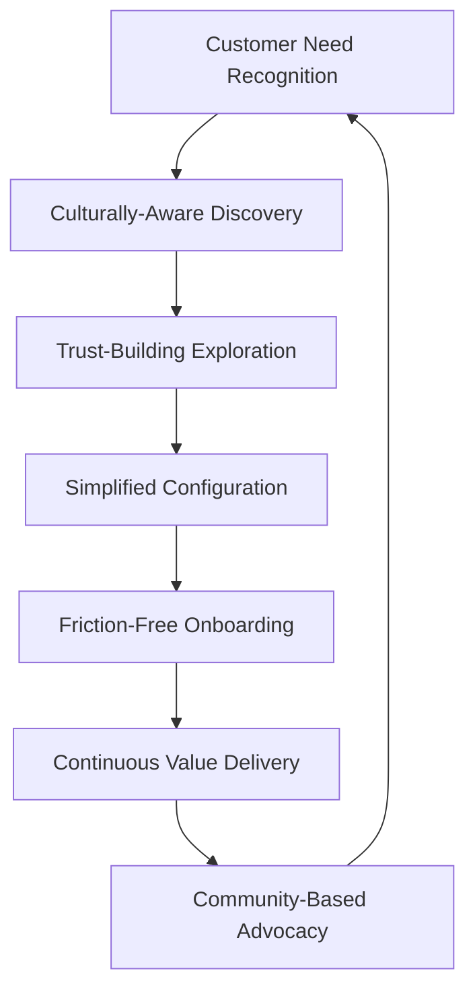

# Sub-Saharan African Bancassurance Platform - Comprehensive UX Strategy

## Executive Summary

This comprehensive UX strategy document provides actionable solutions to transform the identified friction points in Sub-Saharan African bancassurance into competitive advantages. Building upon extensive market analysis, this strategy addresses trust barriers (75% of customers), mobile-first needs (85% Android usage), language barriers (60% prefer local languages), and financial inclusion gaps (70% excluded) through innovative design patterns and cultural adaptation frameworks.

The strategy focuses on practical implementation solutions that generate measurable business outcomes while ensuring genuine financial inclusion across diverse African markets.

## 1. Experience Strategy Framework

### 1.1 Friction-to-Advantage Transformation Matrix

| Friction Point | Current Impact | Transformation Strategy | Competitive Advantage |
|---|---|---|---|
| Trust Concerns (75%) | High abandonment | Radical Transparency UX | Trust Score Leader |
| Mobile Constraints | Low engagement | PWA Excellence | Offline-First Champion |
| Language Barriers | 60% exclusion | Cultural Intelligence | Local Market Intimacy |
| Payment Inflexibility | 70% cannot afford | Micro-Payment Innovation | Financial Inclusion Pioneer |
| Complex Documentation | 40% abandonment | AI-Powered Simplification | Onboarding Speed Leader |

### 1.2 Strategic UX Pillars

#### Pillar 1: Trust-First Design
**Philosophy**: Every interface element must build trust before seeking engagement
**Implementation**: Transparency-driven design patterns with social proof integration

#### Pillar 2: Inclusive Technology
**Philosophy**: Technology should adapt to users, not vice versa
**Implementation**: Progressive enhancement with graceful degradation

#### Pillar 3: Cultural Intelligence
**Philosophy**: Beyond translation to cultural resonance
**Implementation**: Context-aware cultural adaptation engine

#### Pillar 4: Financial Inclusion
**Philosophy**: Insurance for everyone, regardless of economic status
**Implementation**: Flexible value propositions and payment models

### 1.3 Experience Orchestration Model



## 2. Inclusive Design Architecture

### 2.1 Universal Accessibility Framework

#### Visual Accessibility Specifications
```css
/* Core Accessibility Standards */
.primary-text {
  font-size: 18px; /* Base size for African markets */
  line-height: 1.6;
  color: #000000; /* AAA contrast compliance */
  background: #FFFFFF;
  font-family: 'Noto Sans', Arial, sans-serif; /* Multi-script support */
}

.high-contrast-mode {
  filter: contrast(150%);
  background: #000000;
  color: #FFFF00;
}

.touch-target {
  min-width: 48px;
  min-height: 48px;
  padding: 12px;
  margin: 8px;
}
```

#### Motor Accessibility Patterns
- **Single-Thumb Navigation**: All critical actions within 4-inch thumb reach
- **Gesture Alternatives**: Every swipe has tap alternative
- **Voice Input Integration**: Speech-to-text for all form fields
- **Shake-to-Undo**: Physical gesture for error recovery

#### Cognitive Accessibility Design Patterns

**Progressive Disclosure Pattern**:
```javascript
const ProgressiveDisclosure = {
  step1: "Essential information only",
  step2: "Add one additional detail",
  step3: "Complete picture emerges",
  backTrack: "Always allow return to previous step"
}
```

**Error Prevention Framework**:
- Real-time validation with culturally appropriate messaging
- Smart defaults based on user context and location
- Recovery suggestions in local language
- Visual confirmation before irreversible actions

### 2.2 Multi-Sensory Interface Design

#### Visual Communication System
- **Universal Icons**: Tested across 6 African cultures
- **Color-Independent Information**: Never rely on color alone
- **Progressive Image Loading**: Optimize for slow connections
- **Cultural Imagery**: Locally relevant and representative

#### Audio Integration Strategy
```yaml
audio_strategy:
  languages: [English, French, Portuguese, Arabic, Swahili, Hausa, Yoruba, Zulu]
  features:
    - screen_reader_optimization
    - audio_descriptions
    - voice_navigation
    - spoken_confirmations
  compression: adaptive_bitrate_streaming
  offline_storage: essential_audio_cached
```

#### Haptic Feedback Patterns
- **Success Confirmation**: Gentle double-tap vibration
- **Error Alert**: Distinctive triple-pulse pattern
- **Navigation Feedback**: Subtle single pulse
- **Security Actions**: Unique vibration signature

### 2.3 Cultural Sensitivity Integration

#### Communication Style Adaptation Engine
```javascript
const CulturalAdaptation = {
  collectivist_cultures: {
    messaging: "family_and_community_focused",
    decision_making: "group_consultation_encouraged",
    testimonials: "community_leader_endorsements"
  },
  individualist_cultures: {
    messaging: "personal_achievement_focused",
    decision_making: "individual_empowerment",
    testimonials: "peer_success_stories"
  },
  religious_considerations: {
    islamic_markets: "sharia_compliant_messaging",
    christian_markets: "stewardship_concepts",
    traditional_beliefs: "ancestral_protection_themes"
  }
}
```

#### Visual Cultural Intelligence
- **Color Psychology Mapping**: Avoid colors with negative cultural associations
- **Symbolic Representation**: Use culturally positive symbols
- **Photography Guidelines**: Representative, diverse, and aspirational imagery
- **Iconography Localization**: Adapt icons for cultural relevance

## 3. Trust-Building UX Elements

### 3.1 Radical Transparency Design Patterns

#### Trust Score Dashboard
```html
<div class="trust-dashboard">
  <div class="transparency-score">
    <h3>Transparency Score: 98%</h3>
    <div class="score-details">
      <span>✓ All fees disclosed upfront</span>
      <span>✓ Claims process clearly explained</span>
      <span>✓ Customer service response times published</span>
      <span>✓ Regulatory compliance certificates visible</span>
    </div>
  </div>
</div>
```

#### Real-Time Trust Indicators
- **Live Claims Processing**: Show claims being processed in real-time
- **Customer Success Counter**: "X claims paid today in your area"
- **Response Time Promises**: "Your call answered in under 2 minutes"
- **Regulatory Badges**: Prominently display compliance certifications

#### Social Proof Integration System
```yaml
social_proof_framework:
  community_testimonials:
    - local_business_owner_success_stories
    - farmer_crop_protection_testimonials
    - family_health_coverage_experiences
  
  statistical_proof:
    - claims_paid_statistics
    - customer_satisfaction_scores
    - market_penetration_data
  
  expert_endorsements:
    - local_bank_manager_recommendations
    - community_leader_testimonials
    - religious_leader_endorsements
  
  peer_indicators:
    - people_like_you_bought_this
    - popular_in_your_area
    - trending_among_similar_customers
```

### 3.2 Security Transparency Framework

#### Security Communication Design
- **Plain Language Security**: Explain security measures in simple terms
- **Visual Security Indicators**: Lock icons, security badges, encryption visualization
- **Data Usage Transparency**: Clear explanation of data collection and usage
- **Privacy Control Dashboard**: User-controlled privacy settings

#### Trust Recovery Protocols
```javascript
const TrustRecoveryProtocols = {
  service_interruption: {
    immediate_notification: "System down - working on fix",
    progress_updates: "Update every 15 minutes",
    resolution_confirmation: "Service restored - what we learned",
    compensation_offer: "Credit for inconvenience"
  },
  error_occurrence: {
    acknowledgment: "We made a mistake",
    explanation: "Here's what happened",
    correction_steps: "Steps we're taking to fix",
    prevention_measures: "How we'll prevent this"
  }
}
```

## 4. Mobile-First PWA Optimization

### 4.1 Technical Architecture for African Markets

#### Progressive Web App Specifications
```json
{
  "manifest": {
    "name": "Bancassurance Platform",
    "short_name": "BancAssure",
    "start_url": "/",
    "display": "standalone",
    "theme_color": "#1976D2",
    "background_color": "#FFFFFF",
    "icons": [
      {
        "src": "/icons/icon-192x192.png",
        "sizes": "192x192",
        "type": "image/png"
      }
    ]
  },
  "performance_requirements": {
    "first_contentful_paint": "<2s",
    "largest_contentful_paint": "<4s",
    "cumulative_layout_shift": "<0.1",
    "first_input_delay": "<100ms"
  }
}
```

#### Offline-First Architecture
```javascript
// Service Worker Strategy
const OfflineStrategy = {
  critical_paths: {
    policy_viewing: "cache_first",
    claims_submission: "network_first_with_fallback",
    payments: "network_only_with_retry",
    documentation: "stale_while_revalidate"
  },
  
  data_synchronization: {
    priority_queue: ["claims", "payments", "policy_changes"],
    conflict_resolution: "server_wins_with_user_notification",
    retry_mechanism: "exponential_backoff",
    offline_indicator: "clear_visual_feedback"
  }
}
```

#### Low-Bandwidth Optimization
```yaml
bandwidth_optimization:
  image_strategy:
    format: webp_with_jpeg_fallback
    compression: adaptive_quality_80_to_40
    lazy_loading: intersection_observer
    progressive_enhancement: low_res_to_high_res
  
  code_splitting:
    route_based: dynamic_imports
    feature_based: conditional_loading
    vendor_splitting: separate_chunks
  
  caching_strategy:
    static_assets: cache_first_1_year
    api_responses: stale_while_revalidate_5min
    user_data: network_first_with_cache_fallback
```

### 4.2 Android-Specific Optimizations

#### Memory Management
```javascript
const MemoryManagement = {
  lazy_loading: {
    images: "intersection_observer",
    components: "dynamic_imports",
    data: "virtualized_lists"
  },
  
  garbage_collection: {
    event_listeners: "automatic_cleanup",
    dom_nodes: "weak_references",
    cache_management: "lru_with_size_limits"
  },
  
  performance_monitoring: {
    memory_usage: "real_time_tracking",
    frame_rate: "fps_monitoring",
    input_latency: "touch_responsiveness"
  }
}
```

#### Battery Optimization
- **Background Processing Limits**: Minimal background activity
- **Network Request Batching**: Combine API calls
- **Screen Wake Lock**: Prevent sleep during critical operations only
- **GPS Usage Optimization**: Use only when absolutely necessary

### 4.3 Cross-Platform Consistency

#### Design System Implementation
```scss
// Design Token System
$colors: (
  primary: #1976D2,
  secondary: #FFC107,
  success: #4CAF50,
  warning: #FF9800,
  error: #F44336,
  surface: #FFFFFF,
  background: #F5F5F5
);

$typography: (
  heading-1: (font-size: 24px, line-height: 1.4, font-weight: 600),
  heading-2: (font-size: 20px, line-height: 1.4, font-weight: 600),
  body-1: (font-size: 16px, line-height: 1.6, font-weight: 400),
  body-2: (font-size: 14px, line-height: 1.5, font-weight: 400),
  caption: (font-size: 12px, line-height: 1.4, font-weight: 400)
);

$spacing: (
  xs: 4px,
  sm: 8px,
  md: 16px,
  lg: 24px,
  xl: 32px,
  xxl: 48px
);
```

## 5. Cultural Adaptation Strategy

### 5.1 Beyond Translation: Cultural Intelligence Engine

#### Context-Aware Localization Framework
```javascript
const CulturalIntelligence = {
  language_context: {
    formal_situations: {
      yoruba: "honorific_prefixes_required",
      swahili: "respectful_second_person",
      arabic: "formal_verb_conjugations"
    },
    
    family_concepts: {
      extended_family_recognition: "include_aunts_uncles_cousins",
      beneficiary_options: "traditional_inheritance_patterns",
      decision_making: "elder_consultation_process"
    }
  },
  
  cultural_values: {
    collectivist_messaging: {
      emphasis: "community_benefit_over_individual",
      testimonials: "group_success_stories",
      decision_support: "family_consultation_tools"
    },
    
    religious_sensitivity: {
      islamic_regions: "avoid_interest_terminology",
      christian_areas: "stewardship_language",
      traditional_beliefs: "ancestral_protection_concepts"
    }
  }
}
```

#### Regional Customization Matrix
| Region | Primary Languages | Cultural Values | Preferred Communication | Trust Indicators |
|---|---|---|---|---|
| West Africa | English, French, Yoruba, Hausa | Community-focused | Storytelling, Proverbs | Elder endorsements |
| East Africa | Swahili, English, Amharic | Family-centered | Direct, Respectful | Religious leader support |
| Southern Africa | English, Zulu, Afrikaans | Ubuntu philosophy | Consensus-building | Government backing |
| Central Africa | French, Lingala, Sango | Hierarchical respect | Formal, Courteous | Authority figures |

### 5.2 Communication Adaptation Engine

#### Dynamic Messaging System
```yaml
messaging_adaptation:
  personality_matching:
    conservative_users:
      tone: formal_respectful
      language: traditional_terms
      imagery: established_institutions
    
    progressive_users:
      tone: modern_approachable
      language: contemporary_terms
      imagery: innovation_technology
  
  life_stage_adaptation:
    young_professionals:
      focus: career_protection_growth
      channels: social_media_mobile
      testimonials: peer_success_stories
    
    families:
      focus: child_education_security
      channels: community_word_of_mouth
      testimonials: parent_experiences
    
    elderly:
      focus: healthcare_legacy
      channels: traditional_media_personal
      testimonials: respected_elders
```

#### Cultural Metaphor Integration
```javascript
const CulturalMetaphors = {
  insurance_concepts: {
    west_africa: {
      insurance: "ajo_savings_group_for_protection",
      premium: "monthly_contribution_to_family_pot",
      claim: "when_family_needs_help_from_pot"
    },
    
    east_africa: {
      insurance: "harambee_for_unexpected_events",
      premium: "community_contribution",
      claim: "receiving_community_support"
    },
    
    southern_africa: {
      insurance: "ubuntu_mutual_care_system",
      premium: "shared_responsibility_payment",
      claim: "community_assistance_in_need"
    }
  }
}
```

### 5.3 Visual Cultural Adaptation

#### Imagery Guidelines
- **Representation Standards**: Minimum 60% local imagery in each market
- **Family Structures**: Reflect local family compositions and relationships
- **Economic Activities**: Show relevant local economic activities and aspirations
- **Gender Roles**: Respect traditional while promoting progressive values
- **Age Representation**: Include elders as respected decision influencers

#### Color Psychology Mapping
```css
/* Cultural Color Adaptations */
.west-africa-theme {
  --primary: #228B22; /* Green - prosperity, growth */
  --secondary: #FFD700; /* Gold - wealth, success */
  --accent: #FF4500; /* Orange - energy, enthusiasm */
}

.east-africa-theme {
  --primary: #1E90FF; /* Blue - trust, sky, water */
  --secondary: #32CD32; /* Green - agriculture, life */
  --accent: #FF6347; /* Red-orange - warmth, community */
}

.southern-africa-theme {
  --primary: #4169E1; /* Royal blue - dignity, respect */
  --secondary: #228B22; /* Green - ubuntu, growth */
  --accent: #FFD700; /* Gold - minerals, prosperity */
}
```

## 6. Low-Literacy Design Solutions

### 6.1 Visual Communication Patterns

#### Icon-First Interface Design
```html
<!-- Navigation Pattern for Low-Literacy Users -->
<nav class="icon-first-navigation">
  <button class="nav-item">
    <div class="nav-icon">🏠</div>
    <div class="nav-text">Home</div>
    <div class="nav-audio" data-audio="/audio/home-en.mp3">🔊</div>
  </button>
  
  <button class="nav-item">
    <div class="nav-icon">📋</div>
    <div class="nav-text">My Policies</div>
    <div class="nav-audio" data-audio="/audio/policies-en.mp3">🔊</div>
  </button>
  
  <button class="nav-item">
    <div class="nav-icon">💳</div>
    <div class="nav-text">Pay</div>
    <div class="nav-audio" data-audio="/audio/pay-en.mp3">🔊</div>
  </button>
</nav>
```

#### Visual Storytelling Framework
```javascript
const VisualStoryFramework = {
  insurance_explanation: {
    step1: {
      image: "family_happy.jpg",
      narrative: "Your family is safe and happy",
      audio: "family_safety_explanation.mp3"
    },
    step2: {
      image: "unexpected_event.jpg", 
      narrative: "But unexpected things can happen",
      audio: "unexpected_events_explanation.mp3"
    },
    step3: {
      image: "insurance_protection.jpg",
      narrative: "Insurance protects your family",
      audio: "insurance_protection_explanation.mp3"
    },
    step4: {
      image: "family_secure.jpg",
      narrative: "Your family stays secure",
      audio: "family_security_conclusion.mp3"
    }
  }
}
```

#### Infographic Communication System
- **Product Comparison Charts**: Visual comparison with minimal text
- **Process Flow Diagrams**: Step-by-step visual guides
- **Benefit Illustrations**: Picture-based benefit explanations
- **Risk Scenarios**: Visual examples of covered events

### 6.2 Audio-First Interface Elements

#### Comprehensive Audio Strategy
```yaml
audio_interface:
  navigation_audio:
    every_button: spoken_label_and_function
    context_help: detailed_explanation_available
    confirmation: spoken_action_confirmation
  
  content_audio:
    policy_terms: full_audio_explanation
    product_details: spoken_descriptions
    educational_content: audio_tutorials
  
  interaction_audio:
    form_guidance: field_by_field_instructions
    error_messages: clear_spoken_explanations
    success_confirmations: audio_celebrations
```

#### Voice Navigation Implementation
```javascript
const VoiceNavigation = {
  commands: {
    "show my policies": () => navigateToPage("/policies"),
    "make a payment": () => navigateToPage("/payments"),
    "report a claim": () => navigateToPage("/claims"),
    "speak to agent": () => initiateAgentCall(),
    "read this to me": () => readCurrentContent(),
    "go back": () => navigateBack(),
    "help me": () => showContextualHelp()
  },
  
  multilingual_support: {
    english: voice_recognition_engine_en,
    swahili: voice_recognition_engine_sw,
    yoruba: voice_recognition_engine_yo,
    hausa: voice_recognition_engine_ha
  }
}
```

### 6.3 Simplified Interaction Patterns

#### Single-Purpose Screen Design
```html
<!-- Example: Premium Payment Screen -->
<div class="single-purpose-screen">
  <header class="screen-header">
    <h1>Pay Your Premium</h1>
    <button class="audio-help">🔊 Listen</button>
  </header>
  
  <main class="screen-content">
    <div class="policy-card">
      
      <h2>Health Insurance</h2>
      <p class="amount">₦5,000</p>
    </div>
    
    <div class="payment-options">
      <button class="payment-method mobile-money">
        
        <span>Mobile Money</span>
      </button>
      
      <button class="payment-method bank-transfer">
        
        <span>Bank Transfer</span>
      </button>
    </div>
    
    <button class="primary-action">Pay Now</button>
  </main>
</div>
```

#### Gesture-Based Shortcuts
- **Swipe Right**: Next step in process
- **Swipe Left**: Previous step
- **Double Tap**: Confirm action
- **Long Press**: Access audio help
- **Shake Device**: Cancel current action

## 7. Multi-Channel Experience Orchestration

### 7.1 Seamless Channel Transitions

#### Context Preservation System
```javascript
const ChannelOrchestration = {
  session_continuity: {
    mobile_to_branch: {
      qr_code_handoff: "mobile_generates_session_qr",
      agent_scans: "continues_exact_customer_journey",
      data_sync: "real_time_progress_synchronization"
    },
    
    call_to_mobile: {
      sms_link: "send_personalized_app_link",
      session_token: "temporary_authentication_bypass",
      context_restoration: "resume_exact_conversation_point"
    },
    
    agent_to_digital: {
      assisted_onboarding: "agent_helps_download_app",
      guided_setup: "walk_through_first_login",
      ongoing_support: "callback_scheduled_for_questions"
    }
  }
}
```

#### Cross-Channel Data Synchronization
```yaml
data_synchronization:
  real_time_sync:
    - customer_preferences
    - application_progress
    - document_uploads
    - payment_status
  
  conflict_resolution:
    rule: latest_timestamp_wins
    notification: user_informed_of_conflicts
    rollback: allow_user_choice_in_disputes
  
  offline_handling:
    queue_changes: store_locally_when_offline
    sync_on_connect: automatic_background_sync
    user_notification: clear_sync_status_indicators
```

### 7.2 Agent-Assisted Digital Experiences

#### Hybrid Support Model
```html
<!-- Agent Assistance Integration -->
<div class="agent-assistance-widget">
  <button class="quick-help" onclick="requestInstantHelp()">
    <span class="icon">👤</span>
    <span class="text">Need Help?</span>
  </button>
  
  <div class="help-options" id="helpOptions" style="display: none;">
    <button onclick="requestScreenShare()">Let Agent Help Me</button>
    <button onclick="scheduleCallback()">Call Me Back</button>
    <button onclick="requestWhatsAppHelp()">WhatsApp Support</button>
    <button onclick="findNearestBranch()">Visit Branch</button>
  </div>
</div>
```

#### Screen Sharing and Co-browsing
```javascript
const AgentAssistance = {
  screen_sharing: {
    permission_request: "explicit_user_consent",
    data_masking: "hide_sensitive_information",
    session_recording: "consent_based_recording",
    agent_controls: "limited_interaction_permissions"
  },
  
  co_browsing: {
    cursor_sharing: "show_agent_mouse_pointer",
    form_filling: "agent_can_assist_input",
    navigation_help: "agent_guides_through_process",
    privacy_protection: "mask_personal_data_fields"
  }
}
```

### 7.3 Omnichannel Journey Analytics

#### Customer Journey Tracking
```yaml
journey_analytics:
  touchpoint_tracking:
    - channel_entry_points
    - transition_patterns
    - abandonment_points
    - completion_paths
  
  cross_channel_metrics:
    - session_duration_by_channel
    - task_completion_rates
    - channel_preference_patterns
    - satisfaction_by_touchpoint
  
  personalization_insights:
    - preferred_communication_channels
    - optimal_contact_times
    - language_preferences
    - assistance_requirements
```

## 8. Conversion Optimization by Segment

### 8.1 Urban Professionals Optimization

#### Speed-Focused Experience Design
```html
<!-- Urban Professional Dashboard -->
<div class="urban-professional-dashboard">
  <section class="quick-actions">
    <h2>Quick Actions</h2>
    <div class="action-grid">
      <button class="quick-action">
        <span class="time-estimate">2 min</span>
        <span class="action-title">Get Quote</span>
      </button>
      
      <button class="quick-action">
        <span class="time-estimate">30 sec</span>
        <span class="action-title">Pay Premium</span>
      </button>
      
      <button class="quick-action">
        <span class="time-estimate">1 min</span>
        <span class="action-title">File Claim</span>
      </button>
    </div>
  </section>
  
  <section class="smart-recommendations">
    <h2>Recommended for You</h2>
    <div class="recommendation-card">
      <h3>Professional Indemnity</h3>
      <p>Based on your profile as a marketing manager</p>
      <button class="cta">Learn More</button>
    </div>
  </section>
</div>
```

#### Mobile-First Optimization
- **One-Thumb Navigation**: All critical actions within thumb reach
- **Swipe Shortcuts**: Common actions accessible via gestures
- **Quick Compare**: Side-by-side product comparison
- **Smart Forms**: Auto-complete and progressive disclosure

### 8.2 Rural Farmers Segment Optimization

#### Agent-Supported Experience
```javascript
const RuralFarmerExperience = {
  agent_finder: {
    location_based: "find_nearest_agent",
    availability_check: "real_time_agent_status",
    language_matching: "agent_speaks_local_language",
    specialization: "agricultural_insurance_expertise"
  },
  
  assisted_processes: {
    application_help: "agent_fills_forms_with_customer",
    document_assistance: "agent_helps_photo_documents",
    payment_support: "flexible_payment_arrangements",
    claim_guidance: "step_by_step_claim_assistance"
  }
}
```

#### Simplified Visual Interface
- **Large Touch Targets**: Minimum 56px for easy interaction
- **High Contrast**: Enhanced visibility for outdoor use
- **Audio Guidance**: Every action explained verbally
- **Offline Capability**: Core functions work without internet

### 8.3 Small Business Owners Optimization

#### Business-Focused Features
```html
<!-- Small Business Dashboard -->
<div class="small-business-dashboard">
  <section class="business-protection-suite">
    <h2>Protect Your Business</h2>
    <div class="protection-categories">
      <div class="category-card inventory">
        <h3>Inventory Protection</h3>
        <p>Protect your stock and goods</p>
        <span class="starting-price">From ₦2,000/month</span>
      </div>
      
      <div class="category-card liability">
        <h3>Public Liability</h3>
        <p>Customer injury protection</p>
        <span class="starting-price">From ₦1,500/month</span>
      </div>
      
      <div class="category-card business-interruption">
        <h3>Business Interruption</h3>
        <p>Income protection during closures</p>
        <span class="starting-price">From ₦3,000/month</span>
      </div>
    </div>
  </section>
</div>
```

#### WhatsApp Business Integration
```yaml
whatsapp_business_integration:
  customer_support:
    - 24_7_automated_responses
    - business_hours_human_support
    - policy_information_requests
    - claim_status_updates
  
  sales_support:
    - product_recommendations
    - quote_generation_via_chat
    - payment_reminders
    - renewal_notifications
  
  documentation:
    - policy_document_delivery
    - claim_form_distribution
    - payment_receipt_sharing
    - regulatory_updates
```

### 8.4 Youth/Students Optimization

#### Gamified Engagement
```javascript
const YouthEngagement = {
  gamification_elements: {
    onboarding_progress: "completion_badges",
    learning_modules: "knowledge_points",
    referral_program: "friend_invitation_rewards",
    healthy_lifestyle: "premium_discount_challenges"
  },
  
  social_features: {
    peer_comparison: "anonymous_savings_leaderboard",
    group_challenges: "student_insurance_goals",
    social_sharing: "achievement_social_posts",
    friend_recommendations: "peer_product_suggestions"
  }
}
```

#### Social Media Integration
- **Instagram Stories**: Policy milestone celebrations
- **TikTok Content**: Educational insurance content
- **Twitter Integration**: Customer service via social media
- **Facebook Groups**: Student insurance communities

### 8.5 Elderly Segment Optimization

#### Simplified, Personal Experience
```html
<!-- Elderly-Friendly Interface -->
<div class="elderly-interface">
  <nav class="simple-navigation">
    <button class="nav-large-button">
      <span class="large-icon">🏠</span>
      <span class="large-text">Home</span>
    </button>
    
    <button class="nav-large-button">
      <span class="large-icon">📞</span>
      <span class="large-text">Call Help</span>
    </button>
    
    <button class="nav-large-button">
      <span class="large-icon">📋</span>
      <span class="large-text">My Policy</span>
    </button>
  </nav>
  
  <main class="main-content">
    <section class="important-info">
      <h2>Important for You</h2>
      <div class="info-card urgent">
        <h3>Premium Due Soon</h3>
        <p>Your health insurance premium is due in 5 days</p>
        <button class="large-button">Pay Now</button>
        <button class="large-button secondary">Call for Help</button>
      </div>
    </section>
  </main>
</div>
```

#### Family Involvement Features
- **Family Member Access**: Authorized family member dashboards
- **Joint Notifications**: Important updates sent to family
- **Emergency Contacts**: Quick access to family and medical contacts
- **Legacy Planning**: Beneficiary management tools

## 9. Payment Experience Innovation

### 9.1 Mobile Money Integration Excellence

#### Universal Mobile Money Support
```javascript
const MobileMoneyIntegration = {
  supported_providers: {
    west_africa: ["MTN_MoMo", "Orange_Money", "Airtel_Money", "Vodafone_Cash"],
    east_africa: ["M_Pesa", "Airtel_Money", "MTN_MoMo", "Tigocash"],
    southern_africa: ["EcoCash", "MTN_MoMo", "Airtel_Money", "Orange_Money"],
    central_africa: ["Orange_Money", "MTN_MoMo", "Airtel_Money", "Moov_Money"]
  },
  
  payment_flows: {
    instant_payment: "direct_mobile_money_deduction",
    payment_request: "customer_approves_on_phone",
    recurring_payment: "automatic_subscription_with_consent",
    group_payment: "multiple_contributors_to_single_policy"
  }
}
```

#### Micro-Payment Innovation
```yaml
micro_payment_models:
  daily_premium:
    minimum_payment: $0.10
    collection_method: automated_mobile_money
    grace_period: 7_days_missed_payments
    
  weekly_premium:
    minimum_payment: $0.50
    collection_method: mobile_money_or_cash
    market_day_alignment: true
    
  seasonal_payment:
    harvest_time: major_payment_after_harvest
    planting_time: minimal_payment_during_planting
    emergency_fund: small_daily_contributions
```

### 9.2 Flexible Payment Scheduling

#### Income-Aligned Payment Calendar
```html
<!-- Flexible Payment Scheduler -->
<div class="payment-scheduler">
  <h2>Choose Your Payment Schedule</h2>
  
  <div class="schedule-options">
    <div class="schedule-option" data-type="salary">
      <h3>Monthly (Salary Day)</h3>
      <p>Pay on your salary day</p>
      <input type="date" id="salaryDate" />
      <span class="amount">₦5,000/month</span>
    </div>
    
    <div class="schedule-option" data-type="business">
      <h3>Market Days</h3>
      <p>Pay on market days when you sell</p>
      <select id="marketDays">
        <option>Every Wednesday</option>
        <option>Every Saturday</option>
        <option>Both Wed & Sat</option>
      </select>
      <span class="amount">₦1,200/week</span>
    </div>
    
    <div class="schedule-option" data-type="harvest">
      <h3>Seasonal (Farming)</h3>
      <p>Pay after harvest season</p>
      <select id="harvestSeason">
        <option>After Dry Season (March)</option>
        <option>After Wet Season (October)</option>
        <option>Both Seasons</option>
      </select>
      <span class="amount">₦30,000/season</span>
    </div>
  </div>
</div>
```

#### Smart Payment Reminders
```javascript
const PaymentReminderSystem = {
  personalized_timing: {
    salary_earners: "3_days_before_due_date",
    business_owners: "market_day_morning",
    farmers: "after_market_sales_peak",
    students: "after_allowance_receipt"
  },
  
  multi_channel_reminders: {
    sms: "simple_payment_due_message",
    whatsapp: "interactive_payment_options",
    voice_call: "automated_local_language_reminder",
    app_notification: "one_tap_payment_access"
  },
  
  smart_flexibility: {
    economic_hardship: "automatic_grace_period_extension",
    natural_disasters: "payment_pause_with_coverage_continuity",
    seasonal_income: "adjust_schedule_based_on_income_patterns",
    group_payments: "allow_community_contribution_coordination"
  }
}
```

### 9.3 Alternative Payment Methods

#### Cash-to-Digital Bridges
```yaml
cash_payment_integration:
  agent_collection:
    process: customer_pays_cash_to_agent
    confirmation: agent_updates_system_immediately
    receipt: instant_sms_confirmation_to_customer
    
  retail_partnerships:
    grocery_stores: pay_premium_while_shopping
    pharmacies: health_insurance_payment_at_pharmacy
    fuel_stations: vehicle_insurance_at_petrol_station
    
  mobile_agent_network:
    traveling_agents: visit_remote_areas_monthly
    collection_points: designated_community_collection_points
    cash_conversion: immediate_digital_payment_processing
```

#### Cryptocurrency Integration (Future-Ready)
```javascript
const CryptocurrencySupport = {
  supported_currencies: {
    stable_coins: ["USDC", "USDT", "DAI"],
    local_cbdcs: ["eNGN", "Sand_Dollar", "eCFA"], // Central Bank Digital Currencies
    major_cryptos: ["BTC", "ETH"] // For tech-savvy youth segment
  },
  
  payment_processing: {
    instant_conversion: "crypto_to_local_currency",
    volatility_protection: "stable_coin_preference",
    transaction_fees: "optimized_for_micro_payments",
    regulatory_compliance: "full_aml_kyc_compliance"
  }
}
```

## 10. UX Metrics Framework

### 10.1 Trust Metrics Dashboard

#### Trust Score Measurement
```javascript
const TrustMetrics = {
  quantitative_measures: {
    nps_score: "target_above_50",
    trust_survey_score: "target_above_4_2_out_of_5",
    policy_cancellation_rate: "below_10_percent_annually",
    claims_satisfaction: "above_4_5_out_of_5",
    referral_rate: "above_30_percent_customers_refer"
  },
  
  behavioral_indicators: {
    time_to_first_purchase: "median_below_15_minutes",
    policy_upgrade_rate: "above_25_percent_within_year",
    cross_selling_acceptance: "above_40_percent",
    payment_on_time_rate: "above_85_percent",
    voluntary_information_sharing: "above_70_percent"
  },
  
  qualitative_measures: {
    sentiment_analysis: "customer_communication_sentiment",
    testimonial_quality: "depth_and_authenticity_of_reviews",
    community_endorsement: "local_leader_recommendations",
    word_of_mouth_quality: "positive_community_conversations"
  }
}
```

### 10.2 Conversion Funnel Analytics

#### Segment-Specific Conversion Tracking
```yaml
conversion_analytics:
  urban_professionals:
    awareness_to_interest: 
      target: 35%
      measurement: "click_through_on_targeted_ads"
    
    interest_to_consideration:
      target: 50%
      measurement: "quote_request_completion"
    
    consideration_to_purchase:
      target: 25%
      measurement: "application_submission_to_payment"
    
    first_purchase_to_renewal:
      target: 80%
      measurement: "policy_renewal_rate"
  
  rural_farmers:
    agent_contact_to_interest:
      target: 60%
      measurement: "continued_engagement_after_first_meeting"
    
    interest_to_application:
      target: 45%
      measurement: "complete_application_with_agent_help"
    
    application_to_purchase:
      target: 85%
      measurement: "payment_completion_after_application"
```

#### Friction Point Detection
```javascript
const FrictionAnalytics = {
  abandonment_tracking: {
    page_level: "identify_highest_exit_pages",
    field_level: "track_form_field_abandonment",
    process_level: "identify_multi_step_dropoffs",
    channel_level: "track_cross_channel_abandonment"
  },
  
  performance_correlation: {
    load_time_impact: "correlate_speed_with_conversion",
    error_rate_impact: "track_technical_errors_effect",
    complexity_impact: "measure_cognitive_load_effect",
    accessibility_impact: "track_inclusive_design_effectiveness"
  }
}
```

### 10.3 Accessibility Success Metrics

#### Inclusive Design Effectiveness
```yaml
accessibility_metrics:
  wcag_compliance:
    level_aa_conformance: 100%
    automated_testing_score: above_95%
    manual_testing_validation: quarterly_audits
    
  user_group_satisfaction:
    visual_impairment_users: above_4_0_out_of_5
    motor_impairment_users: above_4_0_out_of_5
    cognitive_diversity_users: above_4_2_out_of_5
    elderly_users: above_4_5_out_of_5
    low_literacy_users: above_4_3_out_of_5
  
  assistive_technology_support:
    screen_reader_compatibility: 100%_core_functions
    voice_control_success_rate: above_90%
    keyboard_navigation_completeness: 100%_all_functions
    high_contrast_mode_usability: full_feature_parity
```

### 10.4 Cultural Adaptation Success Measurement

#### Localization Effectiveness Metrics
```javascript
const CulturalMetrics = {
  language_effectiveness: {
    local_language_preference: "percentage_choosing_local_over_english",
    comprehension_scores: "user_understanding_of_insurance_terms",
    completion_rates_by_language: "compare_across_language_options",
    audio_feature_adoption: "usage_of_voice_assistance_features"
  },
  
  cultural_resonance: {
    cultural_imagery_approval: "user_feedback_on_visual_representation",
    messaging_effectiveness: "a_b_test_cultural_vs_generic_messaging",
    community_acceptance: "local_leader_endorsement_rates",
    referral_patterns: "word_of_mouth_within_cultural_groups"
  }
}
```

### 10.5 Mobile Performance Metrics

#### Mobile-Specific Success Indicators
```yaml
mobile_performance:
  technical_metrics:
    first_contentful_paint: below_2_seconds
    largest_contentful_paint: below_4_seconds
    first_input_delay: below_100_milliseconds
    cumulative_layout_shift: below_0_1
    
  user_experience_metrics:
    task_completion_on_mobile: above_85%
    mobile_vs_desktop_satisfaction: parity_or_better
    offline_feature_usage: above_40%_of_users
    pwa_installation_rate: above_20%_of_users
    
  device_performance:
    low_end_device_performance: acceptable_on_android_5_0_1gb_ram
    battery_usage_optimization: minimal_battery_drain
    data_usage_efficiency: below_2mb_per_session
    storage_footprint: below_50mb_initial_install
```

### 10.6 Financial Inclusion Impact Metrics

#### Inclusion Success Measurement
```javascript
const InclusionMetrics = {
  market_penetration: {
    previously_uninsured: "percentage_of_new_to_insurance_customers",
    underserved_segments: "penetration_in_rural_and_low_income_areas",
    youth_adoption: "insurance_uptake_in_18_35_age_group",
    women_participation: "female_policy_holder_percentage"
  },
  
  economic_impact: {
    micro_payment_adoption: "percentage_using_flexible_payment_options",
    premium_affordability: "premium_as_percentage_of_income",
    claims_payout_effectiveness: "average_days_to_settlement",
    economic_resilience: "customer_retention_during_economic_stress"
  }
}
```

## 11. Implementation Roadmap & Action Plan

### 11.1 Phase 1: Foundation & Trust Building (Months 1-3)

#### Immediate Actions (First 30 Days)
```yaml
immediate_priorities:
  user_research_launch:
    - conduct_contextual_interviews_in_3_markets
    - validate_personas_with_local_communities
    - test_current_trust_barriers_and_solutions
    - establish_cultural_adaptation_requirements
  
  technical_foundation:
    - implement_basic_accessibility_standards
    - establish_pwa_architecture
    - integrate_core_mobile_money_apis
    - create_offline_capability_framework
  
  design_system_creation:
    - develop_cultural_color_and_imagery_guidelines
    - create_icon_library_with_local_testing
    - establish_typography_hierarchy_for_multiple_scripts
    - design_trust_building_ui_components
```

#### 90-Day Deliverables
- **Trust-First UI Components**: Transparency dashboard, social proof widgets, security indicators
- **Accessibility-Compliant Design System**: WCAG 2.1 AA compliant component library
- **Cultural Adaptation Framework**: 6 African language support with cultural messaging
- **Mobile-Optimized PWA**: Core functionality working offline on entry-level Android devices

### 11.2 Phase 2: Core Experience & Mobile Excellence (Months 4-6)

#### Mobile-First Development Sprint
```javascript
const Phase2Priorities = {
  pwa_optimization: {
    offline_core_features: ["policy_viewing", "claims_initiation", "payment_history"],
    performance_targets: {
      first_load: "under_3_seconds_on_2g",
      subsequent_loads: "under_1_second",
      offline_functionality: "80_percent_of_core_features"
    }
  },
  
  payment_innovation: {
    mobile_money_integration: "all_major_providers_in_target_markets",
    micro_payment_system: "daily_weekly_monthly_options",
    flexible_scheduling: "income_aligned_payment_dates",
    alternative_methods: "agent_collection_retail_partnerships"
  }
}
```

#### User Experience Refinement
- **Low-Literacy Interface**: Icon-first navigation with audio support
- **Cultural Messaging Engine**: Context-aware content adaptation
- **Multi-Channel Orchestration**: Seamless transitions between digital and human touchpoints
- **Trust Building Elements**: Real-time social proof and transparency indicators

### 11.3 Phase 3: Advanced Features & Optimization (Months 7-9)

#### Personalization & Intelligence
```yaml
advanced_features:
  ai_powered_assistance:
    - multilingual_chatbot_with_local_context
    - predictive_customer_support
    - personalized_product_recommendations
    - automated_cultural_adaptation
  
  advanced_accessibility:
    - voice_navigation_system
    - haptic_feedback_patterns
    - cognitive_load_optimization
    - assistive_technology_integration
  
  community_features:
    - local_community_testimonials
    - peer_comparison_tools
    - group_insurance_options
    - referral_and_reward_systems
```

#### Conversion Optimization
- **A/B Testing Framework**: Continuous optimization of conversion funnels
- **Behavioral Analytics**: Deep insights into user behavior patterns
- **Predictive Modeling**: Churn prevention and upselling opportunities
- **Cultural Resonance Testing**: Ongoing validation of cultural adaptation effectiveness

### 11.4 Phase 4: Scale & Market Expansion (Months 10-12)

#### Platform Scalability
```javascript
const ScalingStrategy = {
  market_expansion: {
    new_countries: ["Ghana", "Tanzania", "Zambia", "Cameroon"],
    language_expansion: ["Twi", "Luganda", "Bemba", "Douala"],
    cultural_adaptation: "country_specific_customization_frameworks",
    regulatory_compliance: "local_insurance_regulation_adaptation"
  },
  
  technology_scaling: {
    performance_optimization: "handle_10x_user_growth",
    infrastructure_scaling: "multi_region_deployment",
    api_enhancement: "third_party_integration_marketplace",
    security_hardening: "enterprise_grade_security_standards"
  }
}
```

#### Success Validation & Metrics
- **Market Penetration Analysis**: Measure inclusion impact across target segments
- **Trust Score Validation**: Achieve target trust metrics across all markets
- **Performance Benchmarking**: Establish industry-leading performance standards
- **Cultural Adaptation Effectiveness**: Validate approach across diverse African markets

## 12. Risk Mitigation & Quality Assurance

### 12.1 Cultural Sensitivity Risk Management

#### Cultural Validation Framework
```yaml
cultural_risk_mitigation:
  local_expert_validation:
    - indigenous_language_speakers_review_all_content
    - cultural_anthropologists_validate_messaging
    - religious_leaders_approve_spiritual_considerations
    - community_elders_endorse_family_related_features
  
  continuous_monitoring:
    - cultural_sensitivity_feedback_channels
    - community_advisory_boards_in_each_market
    - regular_cultural_adaptation_audits
    - social_media_sentiment_monitoring
  
  rapid_response_protocols:
    - 24_hour_response_to_cultural_concerns
    - immediate_content_modification_capabilities
    - community_leader_communication_channels
    - cultural_misunderstanding_resolution_processes
```

### 12.2 Accessibility Compliance Assurance

#### Comprehensive Accessibility Testing
```javascript
const AccessibilityQA = {
  automated_testing: {
    tools: ["axe-core", "WAVE", "Lighthouse_accessibility"],
    frequency: "every_deployment",
    coverage: "100_percent_of_user_interfaces",
    integration: "ci_cd_pipeline_gates"
  },
  
  manual_testing: {
    assistive_technology: ["screen_readers", "voice_control", "switch_navigation"],
    user_groups: ["visually_impaired", "motor_impaired", "cognitively_diverse"],
    frequency: "monthly_comprehensive_audits",
    documentation: "detailed_accessibility_conformance_reports"
  },
  
  user_testing: {
    disability_community_involvement: "regular_usability_sessions",
    accessibility_expert_reviews: "quarterly_comprehensive_audits",
    real_world_testing: "in_context_accessibility_validation",
    feedback_integration: "rapid_accessibility_improvement_cycles"
  }
}
```

### 12.3 Performance & Reliability Assurance

#### Mobile Performance Monitoring
```yaml
performance_monitoring:
  real_user_monitoring:
    - core_web_vitals_tracking_across_devices
    - network_condition_performance_analysis
    - device_specific_performance_metrics
    - geographic_performance_variations
  
  synthetic_testing:
    - continuous_performance_benchmarking
    - cross_device_compatibility_testing
    - network_throttling_simulation
    - stress_testing_under_load
  
  optimization_protocols:
    - automatic_performance_regression_detection
    - performance_budget_enforcement
    - progressive_enhancement_validation
    - offline_functionality_reliability_testing
```

### 12.4 Security & Trust Assurance

#### Multi-Layer Security Framework
```javascript
const SecurityFramework = {
  data_protection: {
    encryption: "aes_256_encryption_at_rest_and_in_transit",
    privacy_controls: "granular_user_privacy_settings",
    data_minimization: "collect_only_necessary_information",
    compliance: "gdpr_ccpa_local_privacy_law_compliance"
  },
  
  authentication_security: {
    multi_factor_authentication: "sms_biometric_app_based_options",
    fraud_detection: "behavioral_analysis_and_pattern_recognition",
    session_management: "secure_session_handling_and_timeout",
    account_protection: "suspicious_activity_monitoring_and_alerts"
  },
  
  trust_validation: {
    transparency_reporting: "regular_security_and_privacy_reports",
    third_party_audits: "annual_security_and_privacy_audits",
    regulatory_compliance: "insurance_and_financial_services_regulations",
    customer_trust_measurement: "ongoing_trust_score_monitoring"
  }
}
```

## 13. Success Measurement & Continuous Improvement

### 13.1 Key Success Indicators

#### Primary Success Metrics
```yaml
success_metrics:
  financial_inclusion_impact:
    new_insurance_customers: target_500k_within_18_months
    previously_uninsured_percentage: above_70_percent
    rural_market_penetration: above_30_percent
    youth_segment_adoption: above_25_percent_of_18_35_age_group
  
  user_experience_excellence:
    nps_score: above_50_across_all_segments
    task_completion_rates: above_85_percent_core_tasks
    accessibility_satisfaction: above_4_2_out_of_5
    cultural_adaptation_approval: above_4_5_out_of_5
  
  business_performance:
    conversion_rate_improvement: 40_percent_increase_from_baseline
    customer_acquisition_cost_reduction: 30_percent_improvement
    policy_retention_rates: above_80_percent_annually
    claims_processing_satisfaction: above_4_5_out_of_5
```

### 13.2 Continuous Improvement Framework

#### Iterative Enhancement Process
```javascript
const ContinuousImprovement = {
  data_driven_optimization: {
    user_behavior_analytics: "weekly_comprehensive_analysis",
    a_b_testing_framework: "continuous_experience_optimization",
    performance_monitoring: "real_time_technical_performance_tracking",
    customer_feedback_integration: "monthly_feedback_analysis_and_implementation"
  },
  
  cultural_adaptation_evolution: {
    local_market_feedback: "quarterly_cultural_adaptation_reviews",
    community_engagement: "ongoing_community_advisory_input",
    linguistic_updates: "annual_language_and_terminology_reviews",
    cultural_trend_monitoring: "adaptation_to_changing_cultural_contexts"
  },
  
  accessibility_advancement: {
    assistive_technology_updates: "adapt_to_new_assistive_technologies",
    user_community_feedback: "quarterly_accessibility_community_sessions",
    regulation_compliance: "proactive_compliance_with_evolving_standards",
    inclusive_design_innovation: "explore_emerging_inclusive_design_patterns"
  }
}
```

### 13.3 Long-Term Vision & Sustainability

#### 5-Year Strategic Vision
```yaml
long_term_vision:
  market_leadership:
    - dominant_bancassurance_platform_across_sub_saharan_africa
    - 5_million_active_users_across_15_countries
    - industry_benchmark_for_inclusive_design_and_cultural_adaptation
    - financial_inclusion_impact_recognized_by_international_development_organizations
  
  technology_innovation:
    - ai_powered_personalization_and_predictive_analytics
    - blockchain_integration_for_transparent_claims_processing
    - iot_integration_for_proactive_risk_management
    - voice_first_interfaces_for_widespread_accessibility
  
  social_impact:
    - 50_percent_reduction_in_insurance_exclusion_across_target_markets
    - established_as_case_study_for_inclusive_fintech_design
    - partnership_with_development_organizations_for_broader_impact
    - recognition_as_leader_in_technology_for_social_good
```

## Conclusion

This comprehensive UX strategy transforms the identified challenges in Sub-Saharan African bancassurance markets into competitive advantages through innovative design solutions, cultural intelligence, and inclusive technology implementation. 

The strategy's success depends on three fundamental principles:

1. **Trust-First Design**: Every interface element builds trust before seeking engagement
2. **Inclusive Technology**: Technology adapts to users across all literacy levels and abilities  
3. **Cultural Intelligence**: Deep cultural understanding drives authentic local resonance

By implementing this strategy, the bancassurance platform will not only achieve business objectives but also deliver genuine financial inclusion impact across diverse African communities. The focus on measurable outcomes, continuous improvement, and cultural sensitivity ensures sustainable growth while maintaining the highest standards of user experience excellence.

The roadmap provides clear implementation phases with specific deliverables, success metrics, and risk mitigation strategies. Success will be measured not just by conversion rates and user satisfaction, but by the platform's contribution to financial inclusion and economic empowerment across Sub-Saharan Africa.

This strategy positions the platform as the definitive solution for inclusive bancassurance in African markets, setting new standards for culturally intelligent design and accessible financial services.