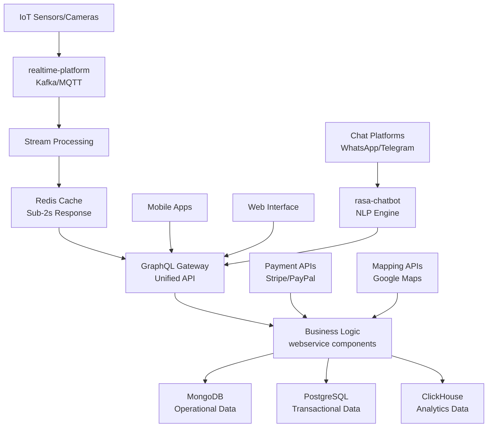

# Smart Parking Platform - Product Requirements Document

**Version**: 1.0  
**Date**: January 27, 2025  
**Project**: Real-time Monitored Parking System  
**Status**: Draft for Review

---

## Overview

The Smart Parking Platform is a comprehensive IoT-enabled solution that transforms traditional parking operations through real-time space monitoring, multi-channel customer engagement, and automated business processes. The platform serves parking lot operators, end users seeking convenient parking, and system administrators managing the infrastructure.

### Problem Statement
Urban parking inefficiency costs drivers an average of 17 hours per year searching for spaces, while parking operators struggle with suboptimal space utilization and limited customer engagement channels. Traditional parking systems lack real-time visibility, modern payment options, and scalable customer service capabilities.

### Solution Overview
Our platform leverages IoT sensors and computer vision for real-time space detection, provides multi-channel chat support (WhatsApp, Telegram, web chat), includes automated onboarding workflows, and offers dynamic pricing with comprehensive analytics. The system targets 99.9% uptime with support for 50,000 concurrent users.

### Business Value
- **For Customers**: Reduce parking search time by 80%, eliminate payment friction, provide predictable availability
- **For Operators**: Increase space utilization by 25-30%, enable dynamic pricing, streamline operations
- **For Administrators**: Real-time operational visibility, automated compliance, comprehensive analytics

---

## Core Features

### 1. Real-Time Parking Space Management
**Purpose**: Maximize parking space utilization through intelligent monitoring and optimization

**Key Capabilities**:
- **IoT Sensor Integration**: Continuous monitoring with 2-5 second update frequency
- **Computer Vision Backup**: Camera-based detection for sensor redundancy  
- **Multi-Level Support**: Both fixed parking lots and multi-level structures
- **Predictive Availability**: Historical pattern analysis for "likely available" indicators
- **Dynamic Allocation**: Intelligent space assignment based on user location and preferences

**Business Impact**: 25-30% increase in space utilization, reduced customer search time

### 2. Multi-Channel Customer Experience
**Purpose**: Provide accessible, convenient customer service across preferred communication channels

**Key Capabilities**:
- **WhatsApp Integration**: Natural language booking and support via WhatsApp Business API
- **Telegram Bot**: Automated reservations and status updates
- **Web Chat Widget**: Browser-based customer service with context retention
- **Mobile App**: Native iOS/Android experience with offline functionality
- **Voice Integration**: Hands-free accessibility via Siri/Google Assistant integration

**Business Impact**: 95% task completion rate, <30 second booking time, 24/7 availability

### 3. Intelligent Payment & Pricing System
**Purpose**: Optimize revenue through flexible pricing while ensuring payment security

**Key Capabilities**:
- **Dynamic Pricing**: Demand-based rates with 3x maximum multiplier during peak periods
- **Multiple Payment Methods**: Credit cards, mobile wallets (Apple Pay/Google Pay), prepaid accounts
- **PCI-DSS Compliance**: Secure payment processing via Stripe (primary) and PayPal (backup)
- **Transparent Pricing**: All-inclusive rates with no hidden fees
- **Automated Billing**: Real-time transaction processing with instant confirmation

**Business Impact**: Revenue optimization, 99.95% payment success rate, fraud prevention

### 4. Automated Onboarding Workflows
**Purpose**: Streamline partner and customer acquisition through efficient onboarding processes

**Key Capabilities**:
- **Operator Onboarding**: 5-7 day automated workflow with compliance verification
- **User Registration**: <3 minute onboarding with social login options
- **Document Management**: Automated document collection and verification
- **Progressive Onboarding**: Step-by-step guidance with context-aware help
- **Approval Workflows**: Automated compliance checks with human oversight

**Business Impact**: Faster time-to-market for operators, improved user conversion rates

### 5. Analytics & Business Intelligence
**Purpose**: Provide actionable insights for operational optimization and business growth

**Key Capabilities**:
- **Real-Time Dashboards**: Live occupancy maps and system health monitoring
- **Historical Analytics**: Usage patterns, revenue trends, customer behavior analysis
- **Predictive Analytics**: Demand forecasting and optimal pricing recommendations
- **Custom Reporting**: Configurable reports for different stakeholder needs
- **Performance Metrics**: SLA monitoring, customer satisfaction tracking

**Business Impact**: Data-driven decision making, operational efficiency improvements

---

## User Experience

### User Personas

**Primary Personas**:

**1. Urban Commuter (40% of users)**
- Demographics: Working professionals, 25-45 years old, smartphone-native
- Goals: Quick parking near workplace, predictable costs, routine optimization
- Pain Points: Time pressure, uncertainty about availability, surge pricing anxiety
- Experience Requirements: <30 seconds from app open to confirmation, predictive availability

**2. Event Attendee (30% of users)**  
- Demographics: Mixed age groups, occasional users, event-driven needs
- Goals: Guaranteed parking near venues, advance booking capability
- Pain Points: Unfamiliar locations, high demand pricing, navigation confusion
- Experience Requirements: Clear pricing transparency, detailed navigation, cancellation flexibility

**3. Shopping/Leisure Visitor (20% of users)**
- Demographics: Families, older adults, flexible schedule users  
- Goals: Convenient parking for extended visits, reasonable pricing
- Pain Points: Complex payment systems, accessibility needs, unclear space sizes
- Experience Requirements: Simple interfaces, accessibility compliance, human support availability

**4. Fleet/Business User (10% of users)**
- Demographics: Delivery drivers, service workers, business accounts
- Goals: Efficient parking for multiple vehicles, expense tracking
- Pain Points: Account management complexity, receipt needs, time constraints
- Experience Requirements: Bulk operations, automated reporting, priority support

### Key User Journeys

**Primary Journey: "Quick Parking Discovery and Booking"**

1. **Space Search** (0-2 seconds): User opens app, views nearby availability with confidence indicators
2. **Selection** (2-15 seconds): Reviews options with transparent pricing, selects preferred space
3. **Reservation** (15-30 seconds): Confirms booking with saved payment method, receives QR code
4. **Navigation** (1-10 minutes): Follows turn-by-turn directions to exact space location  
5. **Validation** (arrival): Scans QR code or uses license plate recognition for entry

**Success Criteria**: <30 seconds total booking time, 95% successful completion rate

### Experience Requirements

**Performance Standards**:
- Space search results: <2 seconds from query to display
- Reservation confirmation: <5 seconds from payment to confirmation  
- Chat response (automated): <1 second for common queries
- System availability: 99.9% uptime across all channels

**Accessibility Compliance (WCAG 2.1 AA)**:
- Color contrast ratio: 4.5:1 minimum for text
- Touch targets: 44px × 44px minimum for interactive elements
- Keyboard navigation: Full functionality accessible without mouse
- Screen reader compatibility: Semantic markup and ARIA labels

**Multi-Channel Consistency**:
- Unified user profiles and preferences across platforms
- Real-time synchronization of booking status
- Consistent terminology and visual branding
- Seamless session continuity between channels

---

## Technical Architecture

### System Architecture Overview

**Event-Driven Microservices Architecture** leveraging existing OAM (Open Application Model) components for rapid deployment and operational efficiency.



### Core Technology Stack

**Application Layer**:
- **Framework**: FastAPI/Python for microservice business logic
- **API Strategy**: GraphQL federation with auto-service discovery
- **Chat/NLP**: Rasa Open Source for multi-channel conversational AI
- **Real-time Processing**: Apache Kafka for IoT event streaming

**Data Architecture**:
- **Operational Database**: MongoDB for flexible schema and horizontal scaling
- **Analytics Database**: ClickHouse for time-series IoT data and reporting
- **Transactional Database**: PostgreSQL for ACID compliance and financial data
- **Cache Layer**: Redis for sub-2-second response times and session management

**Integration Layer**:
- **Payment Processing**: Stripe (primary) and PayPal (backup) for PCI-DSS compliance
- **Mapping Services**: Google Maps API for navigation and geocoding
- **Chat Platforms**: WhatsApp Business API and Telegram Bot API
- **IoT Connectivity**: MQTT broker for lightweight sensor communication

**Infrastructure Layer**:
- **Container Platform**: Kubernetes with Knative serving for serverless scaling
- **Service Mesh**: Istio for security, observability, and traffic management
- **GitOps**: ArgoCD for declarative deployments and configuration management
- **Monitoring**: Prometheus and Grafana for comprehensive observability

### OAM Component Mapping

**Platform Component Utilization**:

1. **realtime-platform**: IoT data streaming, event processing, MQTT/Kafka infrastructure
2. **rasa-chatbot**: Multi-channel NLP chat with WhatsApp/Telegram integration
3. **graphql-gateway**: Auto-discovering API federation and service consolidation
4. **webservice**: Business logic microservices (user management, booking, pricing)
5. **mongodb**: User profiles, reservations, IoT metadata, chat history
6. **clickhouse**: Time-series analytics, reporting, predictive modeling
7. **neon-postgres**: Financial transactions, audit logs, relational data
8. **redis**: Real-time caching, session state, performance optimization
9. **auth0-idp**: Authentication, authorization, operator portal access

### Data Models

**Core Entities**:

```typescript
// User Profile
interface User {
  id: string
  email: string
  profile: UserProfile
  vehicles: Vehicle[]
  paymentMethods: PaymentMethod[]
  preferences: UserPreferences
  createdAt: Date
}

// Parking Space
interface ParkingSpace {
  id: string
  locationId: string
  spaceNumber: string
  type: 'compact' | 'standard' | 'large' | 'accessible'
  status: 'available' | 'occupied' | 'reserved' | 'maintenance'
  sensors: IoTSensor[]
  lastUpdated: Date
}

// Reservation
interface Reservation {
  id: string
  userId: string
  spaceId: string
  startTime: Date
  endTime: Date
  status: 'active' | 'completed' | 'cancelled'
  payment: PaymentRecord
  pricing: DynamicPricing
}

// IoT Sensor Data
interface SensorReading {
  sensorId: string
  spaceId: string
  timestamp: Date
  occupancy: boolean
  confidence: number
  batteryLevel?: number
  signalStrength?: number
}
```

### API Specifications

**GraphQL Unified API**:
```graphql
type Query {
  nearbySpaces(location: LocationInput!, radius: Float!): [ParkingSpace!]!
  spaceAvailability(spaceId: ID!): SpaceAvailability!
  userReservations(userId: ID!): [Reservation!]!
  analytics(query: AnalyticsQuery!): AnalyticsResult!
}

type Mutation {
  createReservation(input: ReservationInput!): Reservation!
  processPayment(input: PaymentInput!): PaymentResult!
  updateUserProfile(input: UserProfileInput!): User!
}

type Subscription {
  spaceStatusUpdates(spaceIds: [ID!]!): SpaceStatusUpdate!
  reservationUpdates(userId: ID!): ReservationUpdate!
}
```

**REST API Endpoints**:
- `GET /api/v1/spaces/search` - Space availability search
- `POST /api/v1/reservations` - Create new reservation
- `POST /api/v1/payments/process` - Process payment
- `GET /api/v1/users/profile` - User profile management
- `POST /api/v1/chat/webhook` - Chat platform webhooks

### Security Architecture

**Authentication & Authorization**:
- OAuth 2.0/OpenID Connect via Auth0 integration
- JWT tokens for stateless authentication
- Role-based access control (RBAC) for different user types
- API key authentication for IoT devices and external integrations

**Data Protection**:
- AES-256 encryption for data at rest
- TLS 1.3 for all data in transit
- PCI-DSS compliant payment data handling via external processors
- GDPR-compliant data retention and deletion policies

**Network Security**:
- Istio service mesh for zero-trust networking
- Web Application Firewall (WAF) for API protection
- DDoS protection for high availability
- Network segmentation for payment, IoT, and user data

---

## Development Roadmap

### Phase 1: Foundation MVP (4-6 weeks)
**Scope**: Core booking functionality with basic payment integration

**Components to Deploy**:
- application-infrastructure: Complete environment bootstrap
- neon-postgres: Primary transactional database
- redis: Caching and session management
- webservice instances: user-management, space-management, booking services

**Key Features**:
- User registration and authentication
- Basic space availability display (simulated IoT data)
- Reservation flow with Stripe payment integration
- Web interface and mobile app foundations

**Success Criteria**:
- User onboarding: <3 minutes from registration to first booking
- Space search response: <2 seconds
- Payment success rate: >99%
- Basic system availability: >99.5%

### Phase 2: Real-time & Multi-Channel (6-8 weeks)  
**Scope**: IoT integration and conversational AI implementation

**Additional Components**:
- realtime-platform: IoT data streaming infrastructure
- rasa-chatbot: Multi-channel NLP customer service
- mongodb: IoT data storage and chat history

**Key Features**:
- Real-time space status updates (2-5 second latency)
- WhatsApp and Telegram booking interfaces
- IoT sensor integration with pilot parking locations
- Automated customer service with human escalation

**Success Criteria**:
- Real-time update latency: <5 seconds
- Chat response time: <1 second (automated)
- System availability: 99.9%
- Customer satisfaction: >4.0/5.0

### Phase 3: Intelligence & Scale (8-10 weeks)
**Scope**: Advanced analytics, dynamic pricing, and full platform capabilities

**Final Components**:
- clickhouse: Advanced analytics and reporting
- graphql-gateway: Unified API federation  
- auth0-idp: Enhanced authentication for operator portals

**Key Features**:
- Dynamic pricing based on demand patterns
- Predictive space availability
- Comprehensive operator dashboard and analytics
- Advanced reporting and business intelligence
- Full compliance audit trails

**Success Criteria**:
- Concurrent user support: 50,000 users
- Dynamic pricing operational with revenue optimization
- Operator onboarding: <7 business days
- Advanced analytics dashboard with real-time insights

### Logical Dependency Chain

**Critical Path Dependencies**:

1. **Infrastructure Foundation** → **Business Logic** → **User Experience**
   - Deploy core OAM components before business services
   - Establish data layer before application layer
   - Implement authentication before user-facing features

2. **Static Data Management** → **Real-time Processing** → **Predictive Analytics**
   - Master data (users, spaces, operators) before real-time updates
   - Real-time streaming before intelligent automation
   - Historical data collection before predictive features

3. **Individual Services** → **Service Integration** → **Unified Experience**
   - Individual microservices before GraphQL federation
   - Service-to-service integration before unified customer APIs
   - Component functionality before cross-component workflows

**Parallel Development Opportunities**:
- Chat integration can develop in parallel with core booking (separate teams)
- Analytics components can be built while core features are being refined
- Operator portal development can proceed alongside customer experience
- Documentation and compliance work can happen throughout all phases

**Quality Gates**:
- Phase 1: Functional core booking with manual testing
- Phase 2: Automated testing suite with performance validation  
- Phase 3: Full compliance audit and load testing certification

---

## Risks and Mitigations

### Technical Risks

**Risk 1: Real-time Performance Requirements (High Impact, Medium Probability)**
- **Challenge**: Achieving 2-5 second space status updates with 50,000 concurrent users
- **Mitigation Strategy**: 
  - Multi-layer caching with Redis for sub-second read performance
  - Event-driven architecture with Kafka for async processing
  - CDN implementation for static content and API response caching
  - Comprehensive load testing before each phase deployment

**Risk 2: IoT Sensor Reliability and Data Quality (High Impact, Medium Probability)**
- **Challenge**: Inconsistent sensor data affecting space availability accuracy
- **Mitigation Strategy**:
  - Dual sensor approach (IoT sensors + computer vision backup)
  - Data quality validation and anomaly detection algorithms
  - Confidence indicators shown to users with data freshness timestamps
  - Manual override capabilities for operators during sensor failures

**Risk 3: Payment Processing Integration Complexity (Critical Impact, Low Probability)**
- **Challenge**: Payment failures directly impact revenue and user trust
- **Mitigation Strategy**:
  - Multi-provider approach (Stripe primary, PayPal backup, additional regional)
  - Circuit breaker patterns with automatic failover
  - Asynchronous payment processing with retry mechanisms
  - Real-time payment monitoring with immediate alerting

### Business Risks

**Risk 4: Market Adoption and User Behavior (Medium Impact, High Probability)**
- **Challenge**: Users may be reluctant to adopt app-based parking solutions
- **Mitigation Strategy**:
  - Gradual rollout starting with tech-forward metropolitan areas  
  - Incentive programs for early adopters (discounted parking, loyalty rewards)
  - Multiple access channels (app, web, chat) to accommodate different preferences
  - Partnership with major parking operators for credibility and reach

**Risk 5: Regulatory Compliance and Municipal Approval (High Impact, Medium Probability)**  
- **Challenge**: Municipal parking regulations may change or restrict smart parking implementation
- **Mitigation Strategy**:
  - Early engagement with municipal authorities and regulatory compliance
  - Flexible system architecture to accommodate varying local requirements
  - Legal review of all terms of service and privacy policies
  - Regular monitoring of regulatory changes in target markets

**Risk 6: Competitive Response (Medium Impact, High Probability)**
- **Challenge**: Established parking companies or tech giants may enter the market
- **Mitigation Strategy**:
  - Focus on superior user experience and real-time capabilities
  - Build strong partnerships with parking operators for market defensibility
  - Continuous innovation in AI/ML capabilities for predictive features
  - Patent protection for key technological innovations

### Operational Risks

**Risk 7: Platform Component Dependencies (Medium Impact, Low Probability)**
- **Challenge**: OAM component updates or failures could impact system stability
- **Mitigation Strategy**:
  - Version pinning for all OAM components with controlled upgrade cycles
  - Comprehensive staging environment for testing all changes
  - Disaster recovery procedures with backup deployment strategies
  - Service mesh resilience patterns for graceful degradation

**Risk 8: Scaling Infrastructure Costs (Medium Impact, Medium Probability)**
- **Challenge**: Rapid user growth may lead to unexpectedly high infrastructure costs
- **Mitigation Strategy**:
  - Knative serverless scaling with aggressive scale-to-zero policies
  - Usage-based cost monitoring with automated alerting thresholds
  - Data tiering strategy for historical data (hot/warm/cold storage)
  - Revenue-based scaling to ensure positive unit economics

### Success Metrics and Monitoring

**Business KPIs**:
- Monthly Active Users: Target 100,000+ by end of Phase 3
- Booking Conversion Rate: >85% from space selection to payment
- Customer Lifetime Value: Target $500+ annual revenue per active user
- Net Promoter Score (NPS): >50 indicating strong user satisfaction

**Technical KPIs**:
- System Availability: >99.9% uptime (SLA requirement)
- API Response Time: 95th percentile <500ms, 99th percentile <2s
- Payment Success Rate: >99.95% for all payment transactions
- Real-time Update Latency: 95th percentile <3s, 99th percentile <5s

**Operational KPIs**:
- Incident Response: Mean Time to Resolution <15 minutes for critical issues
- Deployment Frequency: Daily deployments with zero-downtime capability
- Security Posture: Zero critical vulnerabilities in production
- Compliance Audit: 100% compliance with GDPR, PCI-DSS, and accessibility standards

---

## Appendix

### Cost Considerations

**Development Costs (Estimated)**:
- Phase 1 (4-6 weeks): $200,000-300,000 (team of 6-8 developers)
- Phase 2 (6-8 weeks): $300,000-400,000 (expanded team, IoT integration)
- Phase 3 (8-10 weeks): $400,000-500,000 (full platform, analytics)
- **Total Development**: $900,000-1,200,000

**Operational Costs (Monthly, at scale)**:
- Infrastructure (Kubernetes, databases, caching): $15,000-25,000
- External Services (Stripe fees, mapping APIs, Auth0): $10,000-20,000
- Third-party Integrations (WhatsApp Business, Telegram): $2,000-5,000  
- Monitoring and Observability: $3,000-5,000
- **Total Monthly Operating**: $30,000-55,000

**Revenue Model**:
- Transaction fees: 3-5% of parking payments
- Subscription fees for premium operator features: $500-2,000/month per operator
- Data analytics and insights: $10,000-50,000/month for enterprise clients
- **Target**: Break-even at 10,000 monthly transactions

### Technical Specifications

**Performance Requirements**:
- Concurrent Users: 50,000 simultaneous active users
- Database Performance: 10,000 reads/second, 2,000 writes/second
- Cache Performance: 100,000 operations/second via Redis
- API Rate Limits: 1,000 requests/minute per user, 10,000/minute per operator

**Integration Specifications**:
- IoT Protocols: MQTT 3.1.1, CoAP, HTTP/HTTPS webhooks
- Chat Platform APIs: WhatsApp Business API 2.0, Telegram Bot API 6.0+
- Payment APIs: Stripe v2023-10-16, PayPal REST API v2
- Mapping APIs: Google Maps Platform (Places, Directions, Geocoding)

**Compliance Certifications**:
- PCI-DSS Level 1 (via Stripe/PayPal integration)
- SOC 2 Type II (planned for Year 2)
- ISO 27001 (target certification within 18 months)
- GDPR Article 25 (Privacy by Design implementation)

---

**Document Control**:
- **Version**: 1.0 (Initial Draft)
- **Approved By**: [Pending]
- **Next Review**: February 15, 2025
- **Classification**: Internal Use - Business Confidential

This Product Requirements Document represents the consolidated analysis of business architecture, user experience design, technology strategy, and compliance requirements. It provides a comprehensive blueprint for implementing a market-leading smart parking platform using modern cloud-native technologies and proven architectural patterns.