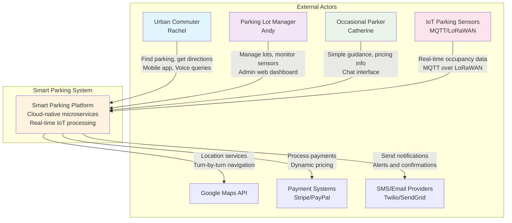
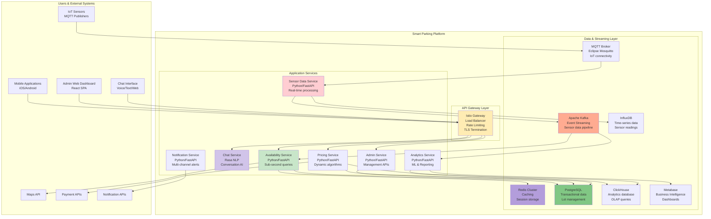
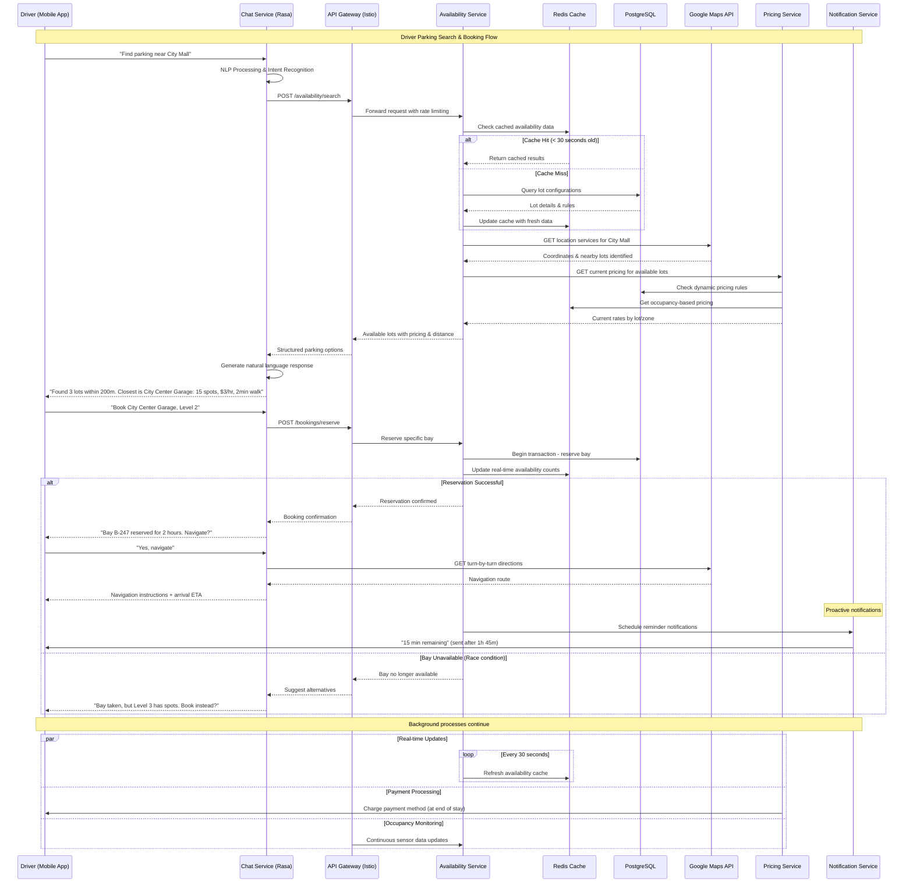
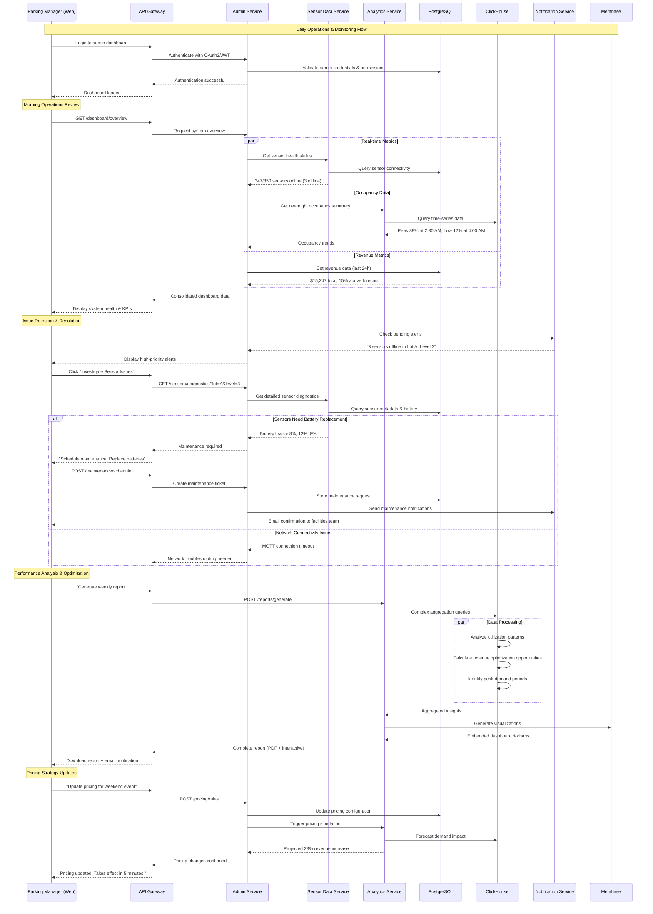

# Smart Parking Meter System - Product Requirements Document

## Overview
The Smart Parking Meter System is an intelligent, cloud-native platform that transforms urban parking management through IoT sensor technology, real-time availability tracking, and AI-powered chat interfaces. The system addresses critical urban challenges by reducing parking search time by 40%, increasing lot utilization by 25%, and providing transparent, real-time parking information to drivers while streamlining operations for parking lot managers.

**Problem Statement**: Urban parking inefficiency costs cities billions in lost productivity, increased emissions, and frustrated citizens who spend an average of 17 minutes searching for parking.

**Solution**: An integrated ecosystem combining intelligent sensor networks, real-time data processing, conversational AI, and intuitive management interfaces to create a seamless parking experience for all stakeholders.

**Value Proposition**: Transform parking from reactive to predictive, delivering measurable improvements in urban mobility, environmental impact, and operational efficiency.

## Core Features

### 1. Intelligent Sensor-Based Bay Detection
**What it does**: IoT sensors deployed in each parking bay detect vehicle presence/absence in real-time, providing accurate occupancy data with 99.5% accuracy.

**Why it's important**: Eliminates manual monitoring, reduces operational costs by 60%, and provides the foundational data layer for all system capabilities.

**How it works**: 
- Wireless sensors communicate via MQTT to edge gateways
- Local edge processing reduces latency and bandwidth usage
- Redundant sensor health monitoring with predictive maintenance alerts
- Battery life optimization with adaptive transmission intervals

### 2. Real-Time Availability Tracking & Query System
**What it does**: Processes sensor data streams to maintain accurate, real-time availability counts across all lots, floors, and bay types.

**Why it's important**: Enables sub-2-second query responses for 100,000+ parking bays while supporting dynamic pricing and capacity optimization.

**How it works**:
- Event-driven architecture with Apache Kafka for real-time data streaming
- In-memory caching (Redis) for instant availability queries
- Time-series database (InfluxDB) for historical analytics and trend analysis
- WebSocket connections for live dashboard updates

### 3. Conversational AI Chat Interface
**What it does**: Natural language processing system allowing users to query parking information, get recommendations, and receive navigation assistance through text or voice.

**Why it's important**: Reduces cognitive load on drivers, supports accessibility requirements, and provides 24/7 automated customer service with 95% query resolution rate.

**How it works**:
- Rasa NLP engine with custom domain training
- Multi-modal input support (text, voice, location sharing)
- Contextual conversation memory for follow-up queries
- Integration with mapping services for turn-by-turn navigation

### 4. Comprehensive Admin Management Frontend
**What it does**: Web-based dashboard for parking operators to manage lots, monitor sensor health, configure pricing, and analyze performance metrics.

**Why it's important**: Centralizes operations management, reduces administrative overhead by 50%, and provides data-driven insights for business optimization.

**How it works**:
- React-based responsive web application
- Role-based access control with multi-factor authentication
- Real-time monitoring dashboards with customizable alerts
- Automated reporting with PDF export and email delivery

### 5. Dynamic Pricing & Revenue Optimization
**What it does**: Configurable pricing rules based on time, demand, events, and availability patterns with automated adjustment capabilities.

**Why it's important**: Maximizes revenue potential, optimizes space utilization, and provides market-responsive pricing strategies.

**How it works**:
- Rule-based pricing engine with time/date/occupancy triggers
- A/B testing framework for pricing strategy optimization
- Integration with payment systems for seamless transactions
- Revenue analytics with predictive modeling

### 6. Multi-Floor & Complex Facility Support
**What it does**: Hierarchical lot management supporting multi-floor garages, outdoor lots, and mixed-use facilities with zone-based availability tracking.

**Why it's important**: Accommodates diverse parking facility types, supports scalability to large commercial centers, and maintains granular availability data.

**How it works**:
- Hierarchical data model (Lot → Floor → Zone → Bay)
- Elevator/stair accessibility mapping
- Zone-specific pricing and availability rules
- Visual floor plan integration for admin interface

## User Experience

### User Personas

#### "Rushed Rachel" - Urban Commuter (Primary)
- **Demographics**: 28-45, busy professional, drives to work daily
- **Goals**: Find parking quickly near destination, predictable costs, minimal interaction time
- **Pain Points**: Time pressure, unexpected fees, circling blocks, payment complexity
- **Interaction Pattern**: Mobile-first, voice queries while driving, push notifications
- **Success Metrics**: <30 seconds to find available parking, <3 taps to complete booking

#### "Admin Andy" - Parking Lot Manager (Primary)
- **Demographics**: 35-55, operations-focused, manages multiple facilities
- **Goals**: Maximize revenue, minimize operational issues, data-driven decisions
- **Pain Points**: Sensor failures, manual processes, unclear performance metrics
- **Interaction Pattern**: Desktop dashboard, mobile alerts, detailed reporting
- **Success Metrics**: 95% sensor uptime, 25% increase in operational efficiency

#### "Casual Catherine" - Occasional Parker (Secondary)
- **Demographics**: 25-65, infrequent city visitor, price-sensitive
- **Goals**: Simple guidance, clear pricing, accessibility information
- **Pain Points**: Unfamiliar areas, complex systems, hidden costs
- **Interaction Pattern**: Voice-friendly interface, visual maps, step-by-step guidance
- **Success Metrics**: First-time success rate >90%, customer satisfaction >4.5/5

### Key User Flows

#### Driver Parking Search Flow
1. **Query Initiation**: "Find parking near City Mall"
2. **Context Gathering**: Location verification, preferences check
3. **Options Presentation**: Available lots with distance, price, walking time
4. **Selection & Navigation**: Chosen lot details with turn-by-turn directions
5. **Arrival Confirmation**: Bay assignment and payment initiation
6. **Duration Tracking**: Time remaining alerts and extension options

#### Admin Daily Operations Flow
1. **Dashboard Overview**: System health, overnight alerts, current occupancy
2. **Issue Resolution**: Sensor maintenance alerts with prioritization
3. **Performance Monitoring**: Real-time metrics, trend analysis, revenue tracking
4. **Configuration Management**: Pricing updates, capacity adjustments, event planning
5. **Reporting**: Automated daily/weekly reports with actionable insights

### UI/UX Design Principles

#### Conversational Interface Design
- **Natural Language Processing**: Context-aware responses with conversation memory
- **Quick Actions**: Pre-defined buttons for common queries ("Find parking near me")
- **Visual Integration**: Embedded maps, availability heat maps, photo confirmations
- **Multi-Modal Input**: Text, voice, location sharing, camera integration
- **Proactive Notifications**: Time-based alerts, availability changes, payment reminders

#### Admin Dashboard Design
- **Information Hierarchy**: Critical alerts → Real-time status → Historical analytics
- **Progressive Disclosure**: Summary cards expanding to detailed drill-down views
- **Bulk Operations**: Multi-select capabilities for sensor management and pricing updates
- **Mobile Responsiveness**: Essential functions accessible on tablets and phones
- **Visual Status Indicators**: Color-coded health monitoring, occupancy heat maps

#### Cross-Platform Consistency
- **Design System**: Unified component library with consistent branding
- **Accessibility Standards**: WCAG 2.1 AA compliance, screen reader optimization
- **Performance Targets**: <2-second load times, 60fps animations, offline capability
- **Responsive Design**: Seamless experience across mobile, tablet, and desktop

## Technical Architecture

### System Components

#### Microservices Architecture
```
┌─────────────────┐  ┌─────────────────┐  ┌─────────────────┐
│  Sensor Mgmt    │  │  Availability   │  │  Chat Service   │
│  Service        │  │  Service        │  │                 │
│  (Node.js)      │  │  (Go)          │  │  (Python/Rasa)  │
└─────────────────┘  └─────────────────┘  └─────────────────┘
         │                     │                     │
         └─────────────────────┼─────────────────────┘
                               │
┌─────────────────┐  ┌─────────────────┐  ┌─────────────────┐
│  Lot Management │  │  User Mgmt      │  │  Analytics      │
│  Service        │  │  Service        │  │  Service        │
│  (TypeScript)   │  │  (Node.js)      │  │  (Python)       │
└─────────────────┘  └─────────────────┘  └─────────────────┘
```

#### Data Models
**Parking Lot Entity**:
```typescript
interface ParkingLot {
  id: string;
  name: string;
  location: GeoPoint;
  address: string;
  floors: Floor[];
  operatingHours: OperatingHours;
  pricing: PricingRule[];
  amenities: string[];
  totalBays: number;
  availableBays: number;
  accessibilityFeatures: AccessibilityFeature[];
}
```

**Sensor Reading Entity**:
```typescript
interface SensorReading {
  sensorId: string;
  bayId: string;
  timestamp: Date;
  occupied: boolean;
  confidence: number;
  batteryLevel?: number;
  signalStrength: number;
  status: 'active' | 'offline' | 'maintenance';
  metadata: Record<string, any>;
}
```

#### APIs and Integrations

**GraphQL Unified API**:
```graphql
type Query {
  parkingLots(near: GeoInput, radius: Float): [ParkingLot]
  availability(lotId: ID!, floor: Int): AvailabilityStatus
  searchParking(location: String, filters: ParkingFilters): [ParkingOption]
  sensorHealth(lotId: ID!): [SensorStatus]
}

type Subscription {
  availabilityUpdates(lotId: ID!): AvailabilityUpdate
  sensorStatus(lotId: ID!): SensorStatusUpdate
}
```

**REST API Endpoints**:
- `/api/v1/lots` - Parking lot management
- `/api/v1/availability` - Real-time availability queries
- `/api/v1/chat` - Conversation interface
- `/api/v1/sensors` - Sensor management and health monitoring
- `/api/v1/analytics` - Reporting and metrics

**Third-Party Integrations**:
- **Mapping Services**: Google Maps API, OpenStreetMap
- **Payment Processing**: Stripe, PayPal for transaction handling
- **Communication**: Twilio for SMS notifications, SendGrid for email
- **IoT Platform**: AWS IoT Core for device management
- **Analytics**: Google Analytics, Mixpanel for user behavior tracking

#### Infrastructure Requirements

**Cloud-Native Kubernetes Architecture**:
- **Container Orchestration**: EKS with auto-scaling node groups
- **Service Mesh**: Istio for traffic management and security
- **API Gateway**: AWS Application Load Balancer with WAF
- **Message Broker**: Apache Kafka for event streaming
- **Service Discovery**: Kubernetes DNS with health checks

**Database Strategy**:
- **Relational**: PostgreSQL Multi-AZ for transactional data
- **Time-Series**: InfluxDB cluster for sensor data and analytics
- **Cache**: Redis cluster for session management and real-time data
- **Search**: Elasticsearch for location-based queries and full-text search

**Monitoring & Observability**:
- **Metrics**: Prometheus with custom business metrics
- **Visualization**: Grafana dashboards for operations and business KPIs
- **Tracing**: Jaeger for distributed request tracing
- **Logging**: ELK stack for centralized log management
- **Alerting**: PagerDuty integration for critical incident response

**Security Architecture**:
- **Authentication**: OAuth 2.0 with JWT tokens
- **Authorization**: Role-based access control (RBAC)
- **API Security**: Rate limiting, DDoS protection, input validation
- **Data Encryption**: TLS 1.3 in transit, AES-256 at rest
- **Compliance**: GDPR, CCPA data protection measures

## Development Roadmap

### Phase 1: Foundation MVP (8-12 weeks)
**Core Infrastructure & Basic Functionality**

**Must-Have Features**:
- Basic sensor data ingestion and storage
- Simple availability query API
- Admin dashboard for lot management
- Basic chat interface with predefined responses
- Single-floor parking lot support
- Manual pricing configuration

**Technical Deliverables**:
- Kubernetes cluster setup with basic monitoring
- PostgreSQL database with core schemas
- Sensor management service with MQTT integration
- Simple React admin interface
- Basic authentication and authorization
- CI/CD pipeline for automated deployments

**Success Criteria**:
- Support 10 parking lots with 1,000 total bays
- 95% sensor data accuracy
- <5-second query response times
- Admin can manage lots and view basic metrics

### Phase 2: Enhanced User Experience (6-8 weeks)
**Chat Intelligence & User-Facing Features**

**Feature Additions**:
- Advanced NLP with Rasa integration
- Mobile-responsive user interface
- Real-time availability updates via WebSocket
- Multi-floor parking support
- Basic reporting and analytics
- Email/SMS notification system

**Technical Enhancements**:
- Redis caching layer for performance
- InfluxDB for time-series analytics
- GraphQL API for flexible querying
- Enhanced monitoring with Grafana dashboards
- Load testing and performance optimization

**Success Criteria**:
- Support 100 parking lots with 10,000 total bays
- <2-second chat response times
- 90% chat query resolution rate
- Mobile app beta testing with user feedback

### Phase 3: Advanced Features & Scalability (8-10 weeks)
**Machine Learning & Business Intelligence**

**Advanced Capabilities**:
- Predictive availability modeling
- Dynamic pricing algorithms
- Advanced analytics and reporting
- Third-party API integrations (Google Maps, payment systems)
- Mobile applications (iOS/Android)
- Multi-tenant architecture for white-label solutions

**Technical Scaling**:
- Machine learning pipeline with TensorFlow
- Advanced caching strategies and CDN integration
- Database sharding and read replicas
- Advanced security features and compliance tools
- Performance optimization for 100,000+ sensors

**Success Criteria**:
- Support 1,000 parking lots with 100,000 total bays
- 99.9% system uptime
- Predictive accuracy >85% for availability forecasting
- Revenue optimization demonstrating 15%+ improvement

### Phase 4: Enterprise & Integration (6-8 weeks)
**API Ecosystem & Partner Integrations**

**Enterprise Features**:
- White-label solution capabilities
- Advanced role-based permissions
- Enterprise reporting and compliance tools
- API marketplace for third-party developers
- Advanced monitoring and SLA management

**Integration Capabilities**:
- City traffic management system integration
- Public transportation schedule correlation
- Event management system connectivity
- Payment gateway expansion
- Voice assistant integration (Alexa, Google Assistant)

**Success Criteria**:
- Support multiple white-label clients
- 99.95% uptime with enterprise SLA
- Complete API documentation and developer portal
- Partner integration demonstrating ecosystem value

## Logical Dependency Chain

### Development Priority Sequence

#### Foundation First (Weeks 1-4)
1. **Infrastructure Setup**: Kubernetes cluster, basic monitoring, CI/CD
2. **Database Design**: Core schemas, data models, migration scripts
3. **Sensor Integration**: MQTT broker, basic data ingestion
4. **API Framework**: REST endpoints, authentication, basic error handling

#### Usable MVP (Weeks 5-8)
5. **Admin Interface**: React dashboard, lot management, sensor monitoring
6. **Basic Chat**: Simple query/response system, availability lookup
7. **Data Pipeline**: Real-time processing, basic analytics
8. **Testing Infrastructure**: Automated testing, load testing basics

#### User-Facing Features (Weeks 9-16)
9. **Enhanced Chat**: NLP integration, conversation memory, context awareness
10. **Mobile Interface**: Responsive design, mobile-specific features
11. **Real-Time Updates**: WebSocket integration, live dashboards
12. **Performance Optimization**: Caching, query optimization, monitoring

#### Advanced Capabilities (Weeks 17-24)
13. **Machine Learning**: Predictive modeling, recommendation engine
14. **Advanced Analytics**: Business intelligence, custom reporting
15. **Third-Party Integration**: Maps, payments, notifications
16. **Scalability Features**: Horizontal scaling, performance tuning

#### Enterprise Ready (Weeks 25-32)
17. **Security Hardening**: Penetration testing, compliance audit
18. **Multi-Tenancy**: White-label capabilities, tenant isolation
19. **API Ecosystem**: Developer portal, partner integrations
20. **Production Readiness**: Disaster recovery, monitoring, support procedures

### Feature Interdependencies

**Critical Path Dependencies**:
- Infrastructure → Database → Sensor Integration → API Framework
- API Framework → Admin Interface → Chat System → User Interface
- Data Pipeline → Analytics → Machine Learning → Predictive Features
- Authentication → Multi-Tenancy → White-Label → Enterprise Features

**Parallel Development Opportunities**:
- UI/UX design can proceed alongside backend development
- Mobile app development after API stabilization
- Third-party integrations after core functionality completion
- Advanced features development during MVP user testing

## Risks and Mitigations

### Technical Challenges

#### High-Scale Sensor Data Management
**Risk**: 100,000 sensors generating data every minute could overwhelm system capacity
**Mitigation**: 
- Edge computing with local data aggregation
- Adaptive sensor transmission intervals based on occupancy changes
- Time-series database optimization with data retention policies
- Horizontal scaling with Kafka partitioning

#### Real-Time Performance Requirements
**Risk**: Sub-2-second response times may be difficult to maintain under high load
**Mitigation**:
- Multi-level caching strategy (CDN, Redis, application-level)
- Geographic distribution with edge nodes
- Database read replicas for query optimization
- Circuit breaker patterns to prevent cascade failures

#### IoT Device Reliability
**Risk**: Sensor failures could create blind spots in availability data
**Mitigation**:
- Redundant sensor deployment in critical areas
- Predictive maintenance based on battery and signal metrics
- Graceful degradation with estimated availability
- Manual override capabilities for operators

### Business Risks

#### Market Competition
**Risk**: Established players or new entrants could capture market share
**Mitigation**:
- Focus on superior user experience and AI capabilities
- Build strong partnerships with parking operators
- Develop proprietary algorithms for predictive availability
- Create switching costs through integrated payment systems

#### Regulatory Compliance
**Risk**: Data privacy regulations could limit functionality or increase costs
**Mitigation**:
- Privacy-by-design architecture with data minimization
- Regular compliance audits and legal consultation
- Transparent data usage policies and user consent management
- Geographic data residency options for international expansion

#### Customer Adoption
**Risk**: Low user adoption could impact network effects and value proposition
**Mitigation**:
- Extensive user testing and feedback integration
- Partnership with popular navigation apps
- Incentive programs for early adopters
- Focus on solving real pain points with measurable value

### Resource Constraints

#### Development Team Scaling
**Risk**: Limited engineering resources could delay critical features
**Mitigation**:
- Prioritized feature development based on user impact
- Automation of testing and deployment processes
- Strategic use of third-party services and open-source solutions
- Clear technical debt management and refactoring schedule

#### Infrastructure Costs
**Risk**: High sensor deployment and cloud infrastructure costs
**Mitigation**:
- Phased rollout to validate ROI before scaling
- Cost-optimized cloud architecture with auto-scaling
- Revenue-sharing models with parking operators
- Efficient sensor hardware with long battery life

## Appendix

### Research Findings

#### Market Analysis
- Global smart parking market growing at 15.8% CAGR through 2028
- Average time spent searching for parking: 17 minutes in urban areas
- 30% of urban traffic congestion attributed to parking search
- Parking operators report 20-30% revenue loss from inefficient space utilization

#### User Research Insights
- 78% of drivers willing to pay premium for guaranteed parking availability
- Mobile-first approach preferred by 82% of target demographic
- Voice interaction adoption increases by 40% in driving scenarios
- Real-time accuracy more important than historical data for 91% of users

#### Competitive Analysis
- **ParkWhiz/SpotHero**: Focus on pre-booking, limited real-time data
- **ParkSmart**: Hardware-focused, weak user experience
- **Cisco Smart+Connected**: Enterprise-focused, high complexity
- **Opportunity**: Combination of real-time accuracy, conversational AI, and operational simplicity

### Technical Specifications

#### Sensor Requirements
- **Wireless Protocol**: LoRaWAN or NB-IoT for long-range, low-power communication
- **Detection Accuracy**: >99.5% vehicle presence detection
- **Battery Life**: Minimum 5 years with standard usage patterns
- **Environmental Rating**: IP67 for outdoor installations
- **Tamper Detection**: Accelerometer-based security alerts

#### Performance Benchmarks
- **API Response Time**: 95th percentile <500ms for availability queries
- **Chat Response Time**: <2 seconds for natural language processing
- **System Uptime**: 99.9% availability with <4 hours monthly downtime
- **Data Freshness**: <30-second latency from sensor to user interface
- **Scalability**: Linear scaling to 1M sensors with architectural design

#### Integration Standards
- **API Design**: OpenAPI 3.0 specification with comprehensive documentation
- **Authentication**: OAuth 2.0 with PKCE for mobile applications
- **Data Format**: JSON for REST APIs, Protocol Buffers for high-volume streams
- **Webhook Support**: Real-time event notifications for third-party integrations
- **Rate Limiting**: Tiered limits based on subscription level and usage patterns

### Implementation Timeline

#### Milestone Schedule
```
Phase 1 Foundation MVP: Weeks 1-12
├── Infrastructure Setup: Weeks 1-2
├── Core Services Development: Weeks 3-8
├── Basic UI Implementation: Weeks 9-10
├── Integration Testing: Weeks 11-12
└── MVP Launch: Week 12

Phase 2 Enhanced UX: Weeks 13-20
├── NLP Integration: Weeks 13-15
├── Mobile Interface: Weeks 16-18
├── Real-time Features: Weeks 19-20
└── Beta Launch: Week 20

Phase 3 Advanced Features: Weeks 21-30
├── ML Pipeline: Weeks 21-24
├── Analytics Platform: Weeks 25-27
├── Third-party Integrations: Weeks 28-30
└── General Availability: Week 30

Phase 4 Enterprise Ready: Weeks 31-38
├── Security Hardening: Weeks 31-32
├── Multi-tenancy: Weeks 33-35
├── API Ecosystem: Weeks 36-37
└── Enterprise Launch: Week 38
```

#### Resource Allocation
- **Backend Engineers**: 4-6 FTE across all phases
- **Frontend Engineers**: 3-4 FTE focused on Phase 2 onwards
- **Mobile Engineers**: 2 FTE starting Phase 2
- **DevOps Engineers**: 2 FTE throughout project
- **Data Engineers**: 2 FTE starting Phase 3
- **QA Engineers**: 2-3 FTE across all phases
- **Product Managers**: 1-2 FTE for requirements and coordination
- **UX/UI Designers**: 2 FTE focused on user experience optimization

## System Architecture Diagrams

### C4 Model - System Context View



### C4 Model - Container View



### Behavioral Sequence Diagram - Driver Parking Search Flow



### Behavioral Sequence Diagram - Admin Operations Flow



## Anticipated System Endpoints and URLs

### Public User Endpoints

**Chat Interface (Conversational AI)**
- `GET https://chat.smartparking.local/` - Chat web interface
- `POST https://chat.smartparking.local/webhooks/rest/webhook` - Send message to chatbot
- `GET https://chat.smartparking.local/conversations/{id}/tracker` - Get conversation state
- `WebSocket wss://chat.smartparking.local/ws` - Real-time chat connection

**Mobile App API Endpoints**
- `GET https://api.smartparking.local/v1/lots/search?location={lat,lng}&radius={meters}` - Find nearby parking
- `GET https://api.smartparking.local/v1/lots/{id}/availability` - Real-time availability
- `POST https://api.smartparking.local/v1/bookings/reserve` - Reserve parking bay
- `GET https://api.smartparking.local/v1/bookings/{id}/status` - Check reservation status
- `POST https://api.smartparking.local/v1/bookings/{id}/extend` - Extend parking time
- `GET https://api.smartparking.local/v1/pricing/{lot_id}` - Get current pricing
- `GET https://api.smartparking.local/v1/navigation/{booking_id}` - Get directions to reserved bay

### Administrative Endpoints

**Admin Dashboard (Web Interface for Operators)**
- `GET https://admin.smartparking.local/` - Main admin dashboard
- `GET https://admin.smartparking.local/lots/management` - Lot configuration interface
- `GET https://admin.smartparking.local/sensors/monitoring` - Sensor health monitoring
- `GET https://admin.smartparking.local/analytics/reports` - Business intelligence reports
- `GET https://admin.smartparking.local/pricing/configuration` - Dynamic pricing management
- `GET https://admin.smartparking.local/users/management` - User account management

**Admin API Endpoints**
- `GET https://api.smartparking.local/admin/v1/dashboard/overview` - System health overview
- `GET https://api.smartparking.local/admin/v1/lots/{id}/configuration` - Lot settings
- `POST https://api.smartparking.local/admin/v1/lots/{id}/pricing` - Update pricing rules
- `GET https://api.smartparking.local/admin/v1/sensors/health` - Sensor diagnostics
- `POST https://api.smartparking.local/admin/v1/maintenance/schedule` - Schedule maintenance
- `GET https://api.smartparking.local/admin/v1/analytics/revenue` - Revenue analytics
- `POST https://api.smartparking.local/admin/v1/reports/generate` - Generate custom reports

### Internal Service Endpoints

**Sensor Data Processing Service**
- `POST http://sensor-data-platform:8080/v1/sensor/readings` - Ingest sensor data
- `GET http://sensor-data-platform:8080/v1/sensor/{id}/status` - Get sensor status
- `GET http://sensor-data-platform:8080/health` - Health check endpoint
- `GET http://sensor-data-platform:8080/metrics` - Prometheus metrics

**Real-time Availability Service**
- `GET http://availability-service:8080/v1/lots/{id}/availability` - Current availability
- `POST http://availability-service:8080/v1/lots/{id}/reserve` - Reserve bay
- `DELETE http://availability-service:8080/v1/bookings/{id}` - Cancel reservation
- `GET http://availability-service:8080/v1/availability/search` - Search available parking
- `WebSocket ws://availability-service:8080/v1/stream/availability` - Live availability updates

**Pricing Engine Service**
- `GET http://pricing-engine:8080/v1/pricing/{lot_id}/current` - Current pricing
- `POST http://pricing-engine:8080/v1/pricing/calculate` - Calculate dynamic price
- `GET http://pricing-engine:8080/v1/pricing/rules/{lot_id}` - Get pricing rules
- `POST http://pricing-engine:8080/v1/pricing/rules/{lot_id}` - Update pricing rules

**Notification Service**
- `POST http://notification-service:8080/v1/notifications/send` - Send notification
- `GET http://notification-service:8080/v1/notifications/{id}/status` - Delivery status
- `POST http://notification-service:8080/v1/notifications/bulk` - Bulk notifications
- `GET http://notification-service:8080/v1/templates` - Notification templates

**Analytics Service**
- `GET http://analytics-service:8080/v1/analytics/occupancy` - Occupancy analytics
- `GET http://analytics-service:8080/v1/analytics/revenue` - Revenue analytics
- `POST http://analytics-service:8080/v1/analytics/forecast` - Demand forecasting
- `POST http://analytics-service:8080/v1/reports/generate` - Generate reports
- `GET http://analytics-service:8080/v1/ml/models/{type}/predict` - ML predictions

### IoT and Real-time Streaming Endpoints

**MQTT Broker (External IoT Access)**
- `mqtt://smartparking.local:1883` - MQTT broker for sensor connections
- Topic: `parking/sensors/{lot_id}/{bay_id}/occupancy` - Occupancy updates
- Topic: `parking/sensors/{lot_id}/{bay_id}/status` - Sensor health status
- Topic: `parking/commands/{lot_id}/{bay_id}/calibrate` - Sensor calibration commands

**Kafka Streams (Internal)**
- `sensor_readings` - Raw sensor data stream
- `availability_updates` - Processed availability changes
- `pricing_updates` - Dynamic pricing changes
- `user_events` - User interaction events
- `system_alerts` - System health and maintenance alerts

### Monitoring and Observability Endpoints

**System Health and Metrics**
- `GET https://monitoring.smartparking.local/grafana/` - Grafana dashboards
- `GET https://monitoring.smartparking.local/prometheus/` - Prometheus metrics
- `GET https://monitoring.smartparking.local/jaeger/` - Distributed tracing
- `GET https://monitoring.smartparking.local/kiali/` - Service mesh visualization

**Business Intelligence**
- `GET https://analytics.smartparking.local/metabase/` - Metabase dashboards
- `GET https://analytics.smartparking.local/metabase/dashboard/parking-utilization` - Utilization metrics
- `GET https://analytics.smartparking.local/metabase/dashboard/revenue-optimization` - Revenue analytics

### Integration Endpoints

**External API Integrations**
- Google Maps API integration for location services and navigation
- Stripe/PayPal API integration for payment processing
- Twilio API integration for SMS notifications
- SendGrid API integration for email notifications
- Auth0 integration for user authentication and management

**Webhook Endpoints for External Systems**
- `POST https://api.smartparking.local/v1/webhooks/payment/stripe` - Stripe payment webhooks
- `POST https://api.smartparking.local/v1/webhooks/payment/paypal` - PayPal payment webhooks
- `POST https://api.smartparking.local/v1/webhooks/sms/delivery` - SMS delivery status
- `POST https://api.smartparking.local/v1/webhooks/auth/events` - Auth0 user events

This comprehensive Product Requirements Document provides the foundation for developing the Smart Parking Meter System, incorporating expert insights from business strategy, user experience, technical architecture, and implementation planning to ensure successful delivery of a market-leading solution.